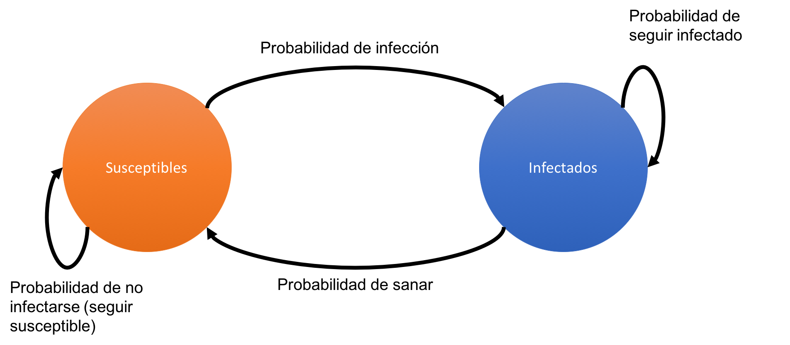
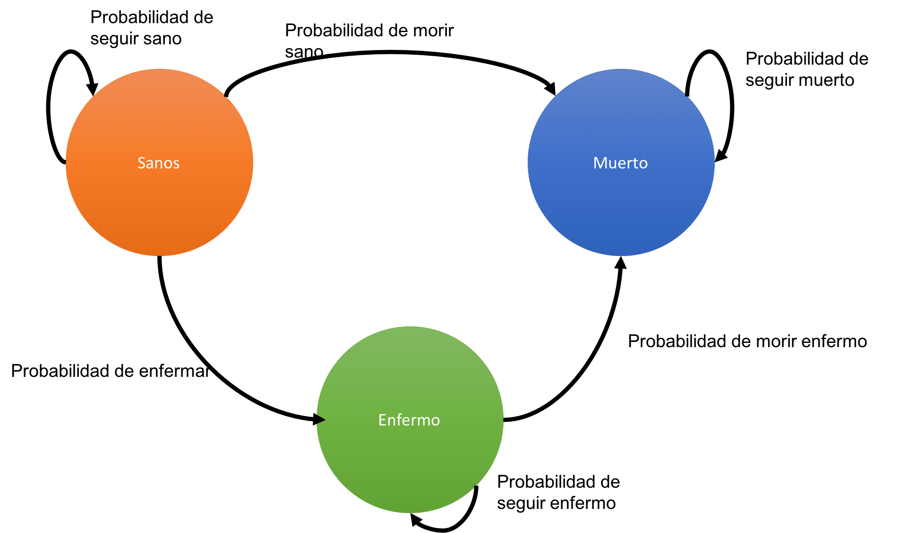

```{r setup, include=FALSE, message = FALSE, warnign = FALSE}
library("ggplot2")
library("gridExtra")
library("cowplot")

filedir <- "~/Dropbox/CURSO_INSP_2019/course_files/"
options(tinytex.verbose = TRUE)
knitr::opts_chunk$set(tidy = FALSE, cache.extra = packageVersion('tufte'), error = TRUE)
options(htmltools.dir.version = FALSE)
```

Un modelo estocástico es una herramienta que se puede usar para estimar probables resultados, cuando una o más variables del modelo se cambian al azar. Una cadena de Markov, también conocida como cadena de Markov de tiempo discreto, es un proceso estocástico que actúa como un método matemático para "encadenar" una serie de variables generadas aleatoriamente que representan el estado actual, para modelar cómo los cambios en esas variables afectan a los estados futuros.

En resumen, las cadenas de Markov se componen de: 

1. Estados 
2. Probabilidades de pasar de un estado a otro. 

Algunos ejemplos de cadenas de Markov son los siguientes modelos:

##Modelos SIS
El modelo SIS divide a la población en suceptibles e infectados. Para ello hay una probabilidad (diaria) de infección y una probabilidad (diaria) de mejorarse. Esquemáticamente, el modelo se ve así:

```{r,  cache=TRUE, echo = FALSE,  message=FALSE}

```


##Modelo SIR
El modelo SIR es una mejora sobre el SIS. Aquí se permite que la gente se recupere y no le vuelva a dar la enfermedad.

```{r,  cache=TRUE, echo = FALSE,  message=FALSE}

```


##Modelo DISMOD
DISMOD es un modelo para enfermedades crónicas. En él se asumen tres estados: sano, enfermo y muerto.
```{r,  cache=TRUE, echo = FALSE,  message=FALSE}

```


Todo el chiste de la cadena de Markov en R es obtener esas probabilidades, lo demás R lo hace solito.
Para esto utilizaremos el paquete `markovchain`

```{r, message= FALSE}
#No olvides instalarlo primero
library(markovchain)
```
Supongamos que las probabilidades de pasar de un estado a otro en un modelo SIS son las siguientes:

1. P(Seguir susceptible) = 0.73 
2. P(Susceptible a infectado) = 0.27 
3. P(Infectados a susceptible) = 0.11 
4. P(Seguir infectado) = 0.89

Con estos datos podemos construír una `matríz de transición`. Una matríz es un arreglo de datos (del mismo tipo) que se compone de filas y columnas. Nosotros queremos que nuestra matríz de transición se vea así:
$$
\begin{array}{cccc} 
& Susceptibles & Infectados\\
Susceptibles   & 0.73 & 0.27 \\
Infectados     & 0.11 & 0.89
\end{array}
$$

Para construír la matríz en R usamos el comando matrix(), que básicamente funciona asi:

$$
\text{matrix}(\underbrace{datos}_{vector},\overbrace{nrow}^{filas \ deseadas}, \underbrace{ncol}_{columnas \ deseadas},\overbrace{byrow}^{como \ quiero\ rellenar})
$$
Entonces para construír nuestra matríz de transición necesitamos el vector de probabilidades, 2 filas y 2 columnas

```{r}
#Vector de probabilidades
probs <- c(0.73, 0.27, 0.11, 0.89)

#Matríz de 2x2
matriz <- matrix(probs, nrow = 2, ncol= 2, byrow= TRUE) 
```

Para crear una cadena de Markov en R usando esas probabilidades hacemos:
```{r}
cadena1 <- new("markovchain", 
               states = c("Susceptible", "Infectado"),
               transitionMatrix = matriz)
cadena1
```
Ahora simulemos la cadena para alguien que empieza `Susceptible` durante 100 días:
```{r}
#Nos devuelve el estado del individuo
sim1 <- rmarkovchain(100, cadena1, "Susceptible")
sim1
```
Y para alguien que empieza `Infectado` durante 73 días:
```{r}

sim2 <- rmarkovchain(73, cadena1, "Infectado")
sim2
```
Ahora creemos una cadena de Markov para un modelo DISMOD, donde suponemos que las probabilidades son las siguientes:

1. P(Seguir sano) = 0.73
2. P(De sano a enfermo) = 0.26 
3. P(De sano a muerto) = 0.01 
4. P(Enfermo a sano) = 0.00 
5. P(Seguir enfermo) = 0.92 
6. P(Enfermo a muerto) = 0.08 
7. P(Muerto a sano) = 0.00
8. P(Muerto a enfermo) = 0.00 
9. P(Seguir muerto) = 1.00

Numericamente, la matríz se vería así:
$$
\begin{array}{ccccc} 
         & Sanos  & Enfermos & Muertos    \\
Sanos    &  0.73  & 0.26     & 0.01       \\
Enfermos &  0.00  & 0.62     & 0.98        \\
Muertos  &  0.00  & 0.00     & 1.00
\end{array}
$$
La matríz en R es:
```{r}
 probs2 <- matrix(c(0.73, 0.26, 0.01, 0.00, 0.92, 0.08, 0.00, 0.00, 1.00),
                          byrow = TRUE, nrow = 3)
```
Creamos la cadena:
```{r}
 cadena2 <- new("markovchain",
               states = c("Sano", "Enfermo","Muerto"),
               transitionMatrix = probs2)
```
Simulamos la cadena para alguien que empieza `Sano` durante 100 días
```{r}
sim1 <- rmarkovchain(100, cadena2, "Sano")
sim1
```
Para alguien que empieza `Enfermo` 121 días
```{r}
sim2 <- rmarkovchain(121, cadena2, "Enfermo")
sim2

```
Y para alguien que empieza `Muerto` 100 días
```{r}
sim3 <- rmarkovchain(107, cadena2, "Muerto")
sim3
```
¿Notas cómo todos acaban eventualmente muertos? A este tipo de estados se les conoce como `absorbentes`: a la larga te absorben y acabas en ellos. La instrucción `summary` indica, entre otras cosas, cuáles estados absorbentes tienes:
```{r}
summary(cadena2)
```
Por otro lado, la instrucción plot muestra la cadena:
```{r}
plot(cadena2)
```
Ya sabemos hacer una cadena de Markov. Para simular varias necesitamos almacenar los resultados. Haremos un for y almacenaremos los datos en una matriz así:

```{r}
nsim <- 100 #Número de simulaciones 
dias <- 77 #Número de días simulados

sim <- matrix(NA, nrow = dias, ncol = nsim) #Matríz vacía que vamos a rellenar

#Simulamos nsim individuos con la cadena1
for (i in 1:nsim){

  #Asumimos que inicialmente estamos en "Suceptible"
inicial <- "Suceptible"

#Guardamos la simulación en una columna de la matriz
sim[,i] <- rmarkovchain(dias, cadena1, inicial) }
```
Una vez simulado, requerimos contar cuántas personas cayeron en qué lugar para obtener el promedio. Para ello usaremos un `for` dentro de un `for`

```{r}
media_markov <- function(estados, markov_matriz){
# media_markov
#
# Función que estima el número promedio de individuos que estuvieron
# en cada estado para una cadena de Makov. La matríz markov_matriz contiene 
# las simulaciones para cada individuo
#
# INPUT:
# estados = Estados de la cadena de Markov
# markov_matriz = Simulaciones de la cadena de Markov
#
# OUTPUT
# suma = Matriz con la media por cada estado por día
#Creamos una matriz donde guardamos la cantidad de estados 
#en el modelo

suma           <- matrix(0, nrow = nrow(markov_matriz),
                         ncol = length(estados))

colnames(suma) <- estados
#Loop a través de todos los estados
for (edo in estados){
#Loop a través de los individuos
  for( dia in 1:nrow(markov_matriz)){ 
#Loop a través de cada simulación
    for (scol in 1:ncol(markov_matriz)){
    
      if(markov_matriz[dia,scol] == edo){
     
        suma[dia,edo] <- suma[dia,edo] + 1
      
        } 
      
      }
   
    } 

  }


#Dividimos entre el total de individuos para obtener %
suma <- suma/ncol(markov_matriz)

#Retorna el promedio:
return(suma)
}


```
Calculamos
```{r}

datos <- media_markov(c("Susceptible", "Infectado"),sim)
```
Graficamos
```{r}
library(ggplot2) #Convertimos en data frame
datos_1 <- as.data.frame(cbind(dia = 1:nrow(datos),datos))
#Gráfica
ggplot(datos_1) +
  geom_step(aes(x = dia, y = Susceptible), col = "firebrick") +
  theme_bw()
```

##Ejercicio
1. Programa el modelo SIR y simúlalo. Considera la matríz de probabilidades:
$$
\begin{array}{ccccc} 
         & Sanos  & Enfermos & Recuperados    \\
Sanos    &  0.98  & 0.02     & 0.00       \\
Enfermos &  0.00  & 0.88     & 0.12        \\
Recuperados  &  0.00  & 0.00     & 1.00
\end{array}
$$
2. Una vez simulado, agrega ahora una vacuna a dicho modelo. ¿Cómo cambian las simulaciones?¿Cómo se ve el modelo? 

##Nota: Recuerda que tus probabilidades deben de sumar 1 no más ni menos.


3. Simula 177 simulaciones del modelo DISMOD considerando inicialmente todos empiezan en Sano.
4. Usando el comando sample selecciona como valor inicial “Susceptible” con 0,99 de probabilidad e “Infectado” con 0,01 de probabilidad.
5. Genera una función `varianza_markov` parecida a la `media_markov` que estime la varianza. Recuerda que la fórmula de la varianza de un vector X es:

$$
\begin{equation}
\textrm{Var(X)} = \textrm{Media}(X^2) - \Big(\textrm{Media}(X)\Big)^2 
\end{equation}
$$


