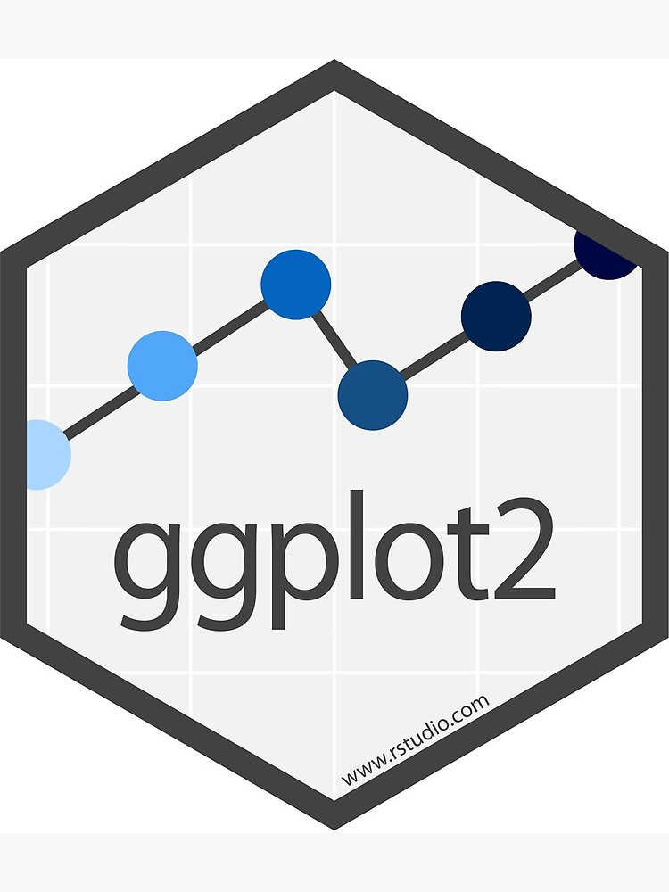
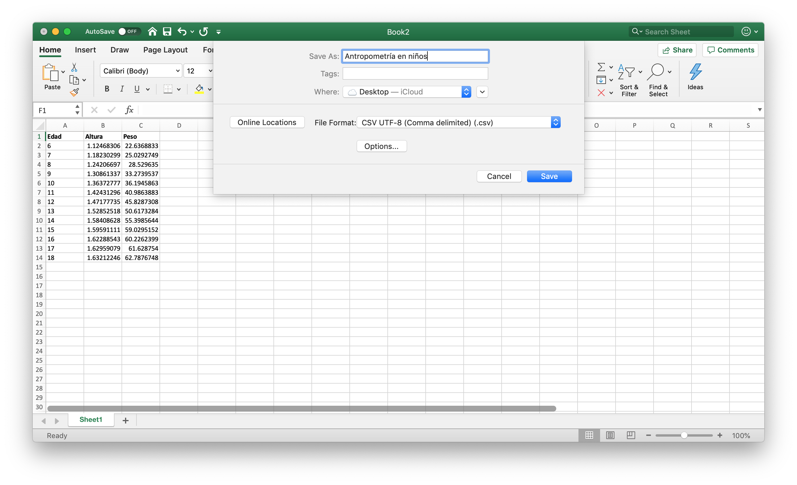
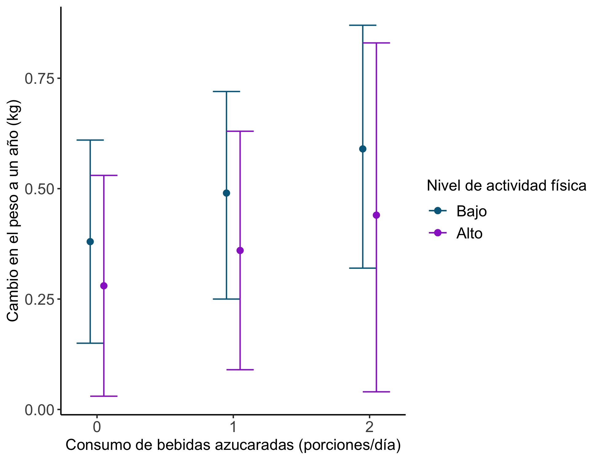
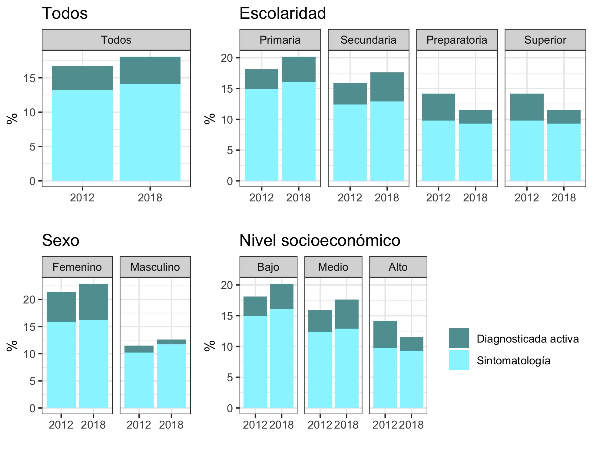

```{r setup, include=FALSE, message = FALSE, warnign = FALSE}
library("ggplot2")
library("gridExtra")
library("cowplot")
filedir <- "~/Dropbox/CURSO_INSP_2019/course_files/"
options(tinytex.verbose = TRUE)
knitr::opts_chunk$set(tidy = FALSE, cache.extra = packageVersion('tufte'), error = TRUE)
options(htmltools.dir.version = FALSE)
```

# ggplot2 
`R` cuenta con su propia forma de hacer gráficas mediante el comando `plot`. Sin embargo, las gráficas que puedes hacer con plot son, salvo en el caso de regresiones, mucho más sencillas que las producidas por el paquete `ggplot`. Dicho paquete fue desarrollado inicialmente por [Hadley Wickham](http://hadley.nz) y actualmente [continúa en desarrollo](https://github.com/tidyverse/ggplot2) por más de 198 colaboradores distintos. Por su belleza y facilidad, nosotros nos enfocaremos en gráficas con `ggplot2`. Otros excelentes tutoriales los puedes hallar en el [libro de ggplot2 aún en construcción](https://ggplot2-book.org) o en [r-statistics.co](http://r-statistics.co/ggplot2-Tutorial-With-R.html). 

```{r, fig.margin = TRUE, fig.cap = "ggplot2 es el mejor paquete para graficar.", fig.width=3.5, fig.height=3.5, cache=TRUE, echo = FALSE,  message=FALSE}

```

Empecemos por instalar el paquete. Recuerda que la instalación es un proceso que sólo se requiere una vez:
```{r, eval = FALSE}
install.packages("ggplot2")
```

(No olvides limpiar todo tu ambiente de `R` con `rm(list = ls())` antes de iniciar; tampoco olvides que estaremos trabajando un nuevo script con `Ctrl+Shift+N` si estás en `RStudio`). 

Para ello, llama al paquete utilizando el comando `library`:
```{r}
#Librería para graficar
library(ggplot2)
```

`ggplot` trabaja con `dataframes`; los `dataframes` son el formato preferido para tener tablas de datos. Probemos leer los datos de `Ejemplo1.csv`. Para ello, leeremos el archivo en [`.csv`](https://es.wikipedia.org/wiki/Valores_separados_por_comas). Hay dos formas, 1) si estás en `RStudio` puedes irte a `Import Dataset > From text (base)` y elegir las opciones de archivo adecuadas. Eso te escribirá un código como el siguiente: 

```{r, fig.margin = TRUE, fig.cap = "Hadley Wickham, el creador de ggplot2.", fig.width=3.5, fig.height=3.5, cache=TRUE, echo = FALSE,  message=FALSE}

```

```{r, echo = FALSE}
setwd(filedir)
Example1 <- read.csv(paste0(filedir,"Example1.csv"), header = TRUE, sep = ",", dec = ".")
```


```{r, eval = FALSE}
#Leemos el archivo
#header = TRUE indica que tiene encabezado
#sep = "," indica que está separado por comas
#dec = "." indica que usamos punto decimal y no coma decimal
Example1 <- read.csv("Tu/directorio/Example1.csv", 
                      header = TRUE, sep = ",", dec = ".")
```

2) la segunda forma es aprendiendo directamente que el comando es `read.csv` seguido del nombre del archivo. ¡Siempre puedes guardar cualquier archivo de `Excel` en `.csv` y leerlo con `R` así! 

```{r,  fig.cap = "Para guardar un archivo de `Excel` en formato `csv` puedes utilizar ` F12` (`Shift+Command+S` en Mac) o bien, ir a `File > Save As...` y luego seleccionar `File Format`. ", cache=TRUE, echo = FALSE,  message=FALSE}

```


`Ejemplo1` es una base con datos simulados. Ésta, después de leerse, se encuentra en un formato listo para ser graficado por lo que no necesitamos limpiar la base (que veremos en otra sección). 

## Gráfica de puntos

Para graficar el comando `ggplot(tus_datos)` coloca la capa inicial el cual es un lienzo vacío:
```{r}
#Creación de un lienzo de puntos
ggplot(Example1)
```

Probemos agregar puntos con `geom_point` especificando mediante el comando `aes` las variables de la base que vamos a graficar en cada uno de los ejes.

```{r}
#Gráfica de puntos
ggplot(Example1) + 
  geom_point(aes(x = Alturas, y = Peso))
```

¡No olvides el `+`!
Podemos agregar color con el comando `color`:

```{r}
#Gráfica de la base de datos de Example
ggplot(Example1) + 
  geom_point(aes(x = Alturas, y = Peso), color = "tomato3")
```

Una lista completa de los colores posibles [está aquí.](http://www.stat.columbia.edu/~tzheng/files/Rcolor.pdf). También puedes usar colores RGB o en formato HEX. 

Podemos cambiar los títulos de los ejes mediante `ggtitle`, `xlab` y `ylab`:

```{r}
#Agregamos etiquetas
ggplot(Example1) + 
  geom_point(aes(x = Alturas, y = Peso), color = "tomato3") +
  xlab("Altura en metros") + 
  ylab("Peso en kilogramos") +
  ggtitle("Peso y altura simulados para el modelo")
```

Las gráficas cuentan con varios temas (`themes`) con diseños predefinidos para cambiar su imagen. Prueba los distintos: `theme_classic`, `theme_bw`, `theme_gray`, `theme_linedraw`, `theme_light`, `theme_minimal`, `theme_dark` y `theme_void`.^[Puedes tener aún más temas si descargas el paquete (`ggthemes`)[https://yutannihilation.github.io/allYourFigureAreBelongToUs/ggthemes/]. ]  

```{r}
#Agregamos etiquetas
ggplot(Example1) + 
  geom_point(aes(x = Alturas, y = Peso), color = "tomato3") +
  xlab("Altura en metros") + 
  ylab("Peso en kilogramos") +
  ggtitle("Peso y altura simulados para el modelo") + 
  theme_minimal() #Agrega un tema
```

Para incrementar el tamaño de los puntos podemos usar el comando `size`:
```{r}
#Agregamos etiquetas
ggplot(Example1) + 
  geom_point(aes(x = Alturas, y = Peso), color = "tomato3", 
             size = 3) +
  xlab("Altura en metros") + 
  ylab("Peso en kilogramos") +
  ggtitle("Peso y altura simulados para el modelo") + 
  theme_minimal() #Agrega un tema
```

## Ejercicio
Imita la siguiente gráfica de altura contra peso de la base de datos `Example1.csv` donde utilizamos un tema y los puntos son naranjas de tamaño $0.5$:

```{r, echo = FALSE}
ggplot(Example1) + geom_point(aes(x = Peso, y = Alturas), color = "orange", size = 0.5) + xlab("Peso (kg)") + ylab("Altura (m)") + ggtitle("Gráfica de peso contra altura") + theme_classic()
```

Para guardar tu gráfica utiliza `ggsave`:
```{r, eval = FALSE}
ggsave("Grafica_de_puntos.pdf", width = 6, height = 10)
```

## Histogramas, densidades y múltiples gráficas a la vez

El comando `geom_histogram` sirve para crear histogramas. Para ello es sólo necesario especificar una variable en el `aes`:

```{r}
#Graficación de un histograma
ggplot(Example1) + geom_histogram(aes(x = Peso))
```

```{marginfigure}
Según [Ioannidis](http://www.madgik.di.uoa.gr/sites/default/files/vldb03_pp19-30.pdf) histograma viene del griego _histos_ (mástil) y _gram-ma_ (algo escrito). Por lo que literalmente sería algo escrito en mástiles. A pesar de que éstos se atribuyen a Karl Pearson, los histogramas fueron inventados desde antes. Él fue quien les puso nombre. 
```

Para especificar el número de barras hay dos formas: utilizando el comando `bins`:

```{r}
#Graficación de un histograma con 20 barras
ggplot(Example1) + geom_histogram(aes(x = Peso), bins = 20)
```

O bien especificando el ancho de cada barra y dejando a `R` decidir:
```{r}
#Graficación con barras de ancho 0.5
ggplot(Example1) + geom_histogram(aes(x = Peso), binwidth = 0.5)
```

El comando `fill` cambia el color interno de las barras. Los colores también pueden especificarse en formato [Hex](https://es.wikipedia.org/wiki/Colores_web): 
```{r}
#El comando fill cambia el color
ggplot(Example1) + 
  geom_histogram(aes(x = Peso), binwidth = 0.5, fill = "#EC4D37")
```

Mientras que el comando `color` cambia el color del borde de la misma:
```{r}
#Color cambia el borde
ggplot(Example1) + 
  geom_histogram(aes(x = Peso), binwidth = 0.5, 
                 fill = "#EC4D37",  color = "#1D1B1B")
```

FInalmente, podemos hacer que el histograma muestre no el número de casos totales en la base sino la proporción de los casos mediante `..density..`. 

```{r}
#..density.. nos da el % de casos de manera normalizada
ggplot(Example1) + 
  geom_histogram(aes(x = Peso, y = ..density..), bins = 30, 
                 fill = "#EC4D37",  color = "#1D1B1B")
```

Podemos agregar, además, una densidad kernel que nos dé una idea de cómo se ve la distribución ajustada. Como veremos más adelante, la densidad kernel (aunque puede ser manipulable) es más fácil que no nos dé errores de distribución incorrecta. 

```{r}
#Gráfica de histograma con densidad kernel
ggplot(Example1) + 
  geom_histogram(aes(x = Peso, y = ..density..), bins = 30, 
                 fill = "#EC4D37",  color = "#1D1B1B") + 
  geom_density(aes(x = Peso))
```

Podemos cambiar los parámetros de `color` y `size` de la distribución para ajustar su color y tamaño. Así mismo, [`linetype` nos da una línea discontinua](https://ggplot2.tidyverse.org/reference/aes_linetype_size_shape.html): 

```{r}
#Cambio de color y tipo de línea a la densidad
ggplot(Example1) + 
  geom_histogram(aes(x = Peso, y = ..density..), bins = 30, 
                 fill = "#EC4D37",  color = "#1D1B1B") + 
  geom_density(aes(x = Peso), color = "orange",
               linetype = "dotted", size = 1)
```

Finalmente, modificamos los temas:

```{r}
#Graficación con barras de ancho 0.05
ggplot(Example1) + 
  geom_histogram(aes(x = Peso, y = ..density..), bins = 30, 
                 fill = "#EC4D37",  color = "#1D1B1B") + 
  geom_density(aes(x = Peso), color = "orange", 
               linetype = "dotted", size = 1) +
  xlab("Peso (kg)") + 
  ylab("Densidad") +
  ggtitle("Histograma y densidad ajustada de peso") +
  theme_bw()
```

La función `mean` calcula la media de una columna dentro de una base de datos. Podemos calcular la media de la columna de `Peso` dentro de `Example1`:
```{r}
#Media de la columna de peso
mean(Example1[,"Peso"])
```

Y agregamos una línea vertical a la gráfica exactamente en la media:
```{r}
#Graficación con barras de ancho 0.05
ggplot(Example1) + 
  geom_histogram(aes(x = Peso, y = ..density..), bins = 30, 
                 fill = "#EC4D37",  color = "#1D1B1B") + 
  geom_density(aes(x = Peso), color = "orange", 
               linetype = "dotted", size = 1) +
  xlab("Peso (kg)") + 
  ylab("Densidad") +
  ggtitle("Histograma y densidad ajustada de peso") +
  theme_bw() + 
  geom_vline(aes(xintercept = mean(Example1[ , "Peso" ])))
```

Podemos cambiar el color de la línea así como el tipo:
```{r}
#Graficación con barras de ancho 0.05
ggplot(Example1) + 
  geom_histogram(aes(x = Peso, y = ..density..), bins = 30, 
                 fill = "#EC4D37",  color = "#1D1B1B") + 
  geom_density(aes(x = Peso), color = "orange", 
               linetype = "dotted", size = 1) +
  xlab("Peso (kg)") + 
  ylab("Densidad") +
  ggtitle("Histograma y densidad ajustada de peso") +
  theme_bw() + 
  geom_vline(aes(xintercept = mean(Example1[ , "Peso" ])), 
             color = "dimgrey", linetype = "dotted", size = 1)
```

Finalmente, podemos agregar una anotación junto a la media que nos indique que dicha es la media. Para ello usamos el comando `annotate` indicando que agregaremos un texto (`"text"`) y las coordenadas del mismo.  

```{r}
#Graficación con barras de ancho 0.05
ggplot(Example1) + 
  geom_histogram(aes(x = Peso, y = ..density..), bins = 30, 
                 fill = "#EC4D37",  color = "#1D1B1B") + 
  geom_density(aes(x = Peso), color = "orange", 
               linetype = "dotted", size = 1) +
  xlab("Peso (kg)") + 
  ylab("Densidad") +
  ggtitle("Histograma y densidad ajustada de peso") +
  theme_bw() + 
  geom_vline(aes(xintercept = mean(Example1[ , "Peso" ])), 
             color = "dimgrey", linetype = "dotted", size = 1) + 
  annotate("text", x = 80.5, y = 0.55, label = "Media = 80", 
           color = "dimgrey")
```

## Ejercicio

Imita la siguiente gráfica de altura con color `red` donde se usó el comando `fill` para colorear el interior de la densidad en azul (`deepskyblue4`) y el tema `theme_linedraw`. 

```{r, echo = FALSE}
#Graficación con barras de ancho 0.05
ggplot(Example1) + 
  geom_density(aes(x = Alturas), color = "red",
               fill = "deepskyblue3") +
  xlab("Altura (m)") + 
  ylab("Densidad") +
  ggtitle("Histograma y densidad ajustada de altura") +
  theme_linedraw() + 
  theme(plot.background = element_rect(fill = "#fffff8"),
        panel.background = element_rect(fill = "#fffff8"))
```

## Ejercicio 
Utiliza `geom_vline` y `annotate` para, una vez identificado el 25\% de mayor peso en la población mediante `quantile(Example1[,"Peso"], 0.75)` agregar una barra vertical al histograma de Peso:

```{r, eval = FALSE}
#Es necesario agregarle una barra vertical
#para que se vea como la gráfica de abajo
ggplot(Example1) + 
  geom_histogram(aes(x = Peso, y = ..density..), bins = 30, 
                 fill = "#EC4D37",  color = "#1D1B1B")  +
  xlab("Peso (kg)") + ylab("Densidad") +
  ggtitle("Histograma y densidad ajustada de peso") +
  theme_bw() 
```

```{r, echo = FALSE}
qpeso <- quantile(Example1[ , "Peso" ], 0.75)
ggplot(Example1) + 
  geom_histogram(aes(x = Peso, y = ..density..), bins = 30, 
                 fill = "#EC4D37",  color = "#1D1B1B")  +
  xlab("Peso (kg)") + ylab("Densidad") +
  ggtitle("Histograma y densidad ajustada de peso") +
  theme_bw() +
  geom_vline(aes(xintercept = qpeso), 
             color = "dimgrey", linetype = "dotted", size = 1) + 
  annotate("text", x = qpeso + 0.75, y = 0.55, label = paste0("75% en ", round(qpeso,2)), 
           color = "dimgrey") +
  theme(plot.background = element_rect(fill = "#fffff8"),
        panel.background = element_rect(fill = "#fffff8"))
```

## Ejercicio 

Considera la siguiente base de datos:
```{r}
mis.datos <- data.frame(
  x = c(1.03, 1.24, 1.47, 1.52, 1.92, 1.93, 1.94, 1.95, 1.96, 1.97,
       1.98, 1.99, 2.72, 2.75, 2.78, 2.81, 2.84, 2.87, 2.90, 2.93,
       2.96, 2.99, 3.60, 3.64, 3.66, 3.72, 3.77, 3.88, 3.91, 4.14,
       4.54, 4.77, 4.81, 5.62)
)
```

Realiza un histograma de la variable `x` dentro de  `mis.datos` con `binwidth` a `0.75`:
```{r, eval = TRUE, echo = FALSE}
ggplot(mis.datos) + geom_histogram(aes(x = x, y = ..density..), fill = "tomato3", color = "black", binwidth = 0.75) +   theme(plot.background = element_rect(fill = "#fffff8"),
        panel.background = element_rect(fill = "#fffff8"))
```

¿Podemos concluir la forma de la distribución a partir del histograma? Es decir ¿está centrada?

```{marginfigure}
Minitab tiene un [blog](https://blog.minitab.com/blog/3-things-a-histogram-can-tell-you) sobre cuándo usar histogramas. ¿Puedes descubrir todos sus errores?
```

Realiza el mismo histograma pero ahora con un ancho de banda de `1.2`. ¿Y ahora?

```{r, echo = FALSE, eval = FALSE}
ggplot(mis.datos) + geom_histogram(aes(x = x, y = ..density..), fill = "tomato3", color = "black", binwidth = 1.2) +   theme(plot.background = element_rect(fill = "#fffff8"),
        panel.background = element_rect(fill = "#fffff8"))
```


## Ejercicio
Considera la siguiente [base de datos](https://stats.stackexchange.com/questions/51718/assessing-approximate-distribution-of-data-based-on-a-histogram):
```{r}
mis.datos <- data.frame(
  A =  c(3.15, 5.46, 3.28, 4.20, 1.98, 2.28, 3.12, 4.10, 3.42, 3.91, 
         2.06, 5.53, 5.19, 2.39, 1.88, 3.43, 5.51, 2.54, 3.64, 4.33, 
         4.85, 5.56, 1.89, 4.84, 5.74, 3.22, 5.52, 1.84, 4.31, 2.01, 
         4.01, 5.31, 2.56, 5.11, 2.58, 4.43, 4.96, 1.90, 5.60, 1.92),
  B =  c(2.90, 5.21, 3.03, 3.95, 1.73, 2.03, 2.87, 3.85, 3.17, 3.66,
         1.81, 5.28, 4.94, 2.14, 1.63, 3.18, 5.26, 2.29, 3.39, 4.08,
         4.60, 5.31, 1.64, 4.59, 5.49, 2.97, 5.27, 1.59, 4.06, 1.76, 
         3.76, 5.06, 2.31, 4.86, 2.33, 4.18, 4.71, 1.65, 5.35, 1.67),
  C =  c(2.65, 4.96, 2.78, 3.70, 1.48, 1.78, 2.62, 3.60, 2.92, 3.41,
         1.56, 5.03, 4.69, 1.89, 1.38, 2.93, 5.01, 2.04, 3.14, 3.83,
         4.35, 5.06, 1.39, 4.34, 5.24, 2.72, 5.02, 1.34, 3.81, 1.51, 
         3.51, 4.81, 2.06, 4.61, 2.08, 3.93, 4.46, 1.4, 5.1, 1.42),
  D =  c(2.40, 4.71, 2.53, 3.45, 1.23, 1.53, 2.37, 3.35, 2.67, 3.16,
         1.31, 4.78, 4.44, 1.64, 1.13, 2.68, 4.76, 1.79, 2.89, 3.58,
         4.10, 4.81, 1.14, 4.09, 4.99, 2.47, 4.77, 1.09, 3.56, 1.26, 
         3.26, 4.56, 1.81, 4.36, 1.83, 3.68, 4.21, 1.15, 4.85, 1.17)
)
```

Grafica un histograma de las variables `A`, `B`, `C` y `D` de dicha base con un ancho de banda (`binwidth`) igual a `1`:
```{r, echo = FALSE}
bw <- 1

plotA <- ggplot(mis.datos) + geom_histogram(aes(x = A, y = ..density..), fill = "tomato3", color = "black", binwidth = bw) +
  ylab("Proporción") +   theme(plot.background = element_rect(fill = "#fffff8"),
        panel.background = element_rect(fill = "#fffff8"))

plotB <- ggplot(mis.datos) + geom_histogram(aes(x = B, y = ..density..), fill = "forestgreen", color = "black", binwidth = bw) +   theme(plot.background = element_rect(fill = "#fffff8"),
        panel.background = element_rect(fill = "#fffff8")) +
  ylab("Proporción")

plotC <- ggplot(mis.datos) + geom_histogram(aes(x = C, y = ..density..), fill = "purple", color = "black", binwidth = bw) +
  ylab("Proporción") +   theme(plot.background = element_rect(fill = "#fffff8"),
        panel.background = element_rect(fill = "#fffff8"))

plotD <- ggplot(mis.datos) + geom_histogram(aes(x = D, y = ..density..), fill = "deepskyblue3", color = "black", binwidth = bw) +
  ylab("Proporción") +   
  theme(plot.background = element_rect(fill = "#fffff8"),
        panel.background = element_rect(fill = "#fffff8"))

```

```{r, echo = FALSE}
#SI no lo haces así imprime a lo tonto
ggdraw(arrangeGrob(plotA, plotB, plotC, plotD, top = "Todos los histogramas que requieres")) +
  theme(plot.background = 
          element_rect(fill="#fffff8", color = NA))
```

¿Podemos concluir la forma de la distribución a partir del histograma? Es decir ¿hay distribuciones sesgadas a la izquierda, a la derecha, uniformes, centradas o con colas pesadas?

Realiza el mismo histograma pero ahora con un ancho de banda de `0.25` ¿por qué hubo cambios? Analiza la base de datos (los valores en función de la columna `A`) y concluye. 


## Gráficas de barras

El archivo `Poblacion_Aflilada_Seguro_Popular_INEGI.csv` ([datos reales obtenidos de INEGI](https://datos.gob.mx/busca/dataset/porcentaje-de-la-poblacion-afiliada-al-seguro-popular-derecho-a-la-salud-recepcion-del-derecho)) contiene información del número de personas afiliadas al seguro popular por entidad federativa en 2010 y 2015. Graficaremos ambos años. Para ello, leamos el archivo:

```{r, echo = FALSE}
seguro.pop <- read.csv(paste0(filedir,"Poblacion_Aflilada_Seguro_Popular_INEGI.csv"),  header = TRUE, sep = ",", dec = ".")
```

```{r, eval = FALSE}
#No olvides tu directorio
seguro.pop <- read.csv("Poblacion_Aflilada_Seguro_Popular_INEGI.csv",
                        header = TRUE, sep = ",", dec = ".")
```

Podemos graficar los datos que aparecen en gráfica de barras mediante el comando `geom_bar`:

```{r}
#Gráfica encimada
ggplot(seguro.pop) + 
  geom_bar(aes(x = Entidad, weight = PorcentajeAfiliada))
```

Nota que hay gráficas donde el porcentaje supera el 100% esto es porque `R`, de inicio, combina los años `2010` y `2015` sumando los valores. Podemos ver esto con el comando `fill` diciéndole a `R` que `Periodo` no lo lea como número sino como caracter `char` (de otra forma buscará colorearlo con el color `2010` y `2015` los cuales no se distinguen):

```{r}
#Gráfica encimada
ggplot(seguro.pop) + 
  geom_bar(aes(x = Entidad, weight = PorcentajeAfiliada, 
               fill = as.character(Periodo)))
```

Mediante `coord_flip()` podemos rotar las coordenadas: 

```{r}
#Gráfica encimada
ggplot(seguro.pop) + 
  geom_bar(aes(x = Entidad, weight = PorcentajeAfiliada, 
               fill = as.character(Periodo))) +
  coord_flip()
```

Existen dos formas de separar los años: mediante `facet_wrap()` en dos gráficas distintas o mediante `position` dentro de la misma gráfica. Veamos sus diferencias: 

```{r}
#Gráfica con facet_wrap()
ggplot(seguro.pop) + 
  geom_bar(aes(x = Entidad, weight = PorcentajeAfiliada, 
               fill = as.character(Periodo))) +
  coord_flip() + 
  facet_wrap(~as.character(Periodo))
```

```{r}
#Gráfica con position
ggplot(seguro.pop) + 
  geom_bar(aes(x = Entidad, weight = PorcentajeAfiliada, 
               fill = as.character(Periodo)), position = "dodge") +
  coord_flip() 
```

```{marginfigure}
Según [su propia página de Internet](http://www.seguropopular.org):
  
<<El seguro popular se encarga de brindar servicios de salud a todos las personas que estén inscritas en el sistema de protección social en salud, y tiene la capacidad de trabajar con distintos proveedores de servicios de salud tanto pública como privada en todos los estados de la República mexicana. El seguro popular en el DF, Puebla y Estado de México cumplen con una cobertura enorme de familias mexicanas.

El principal objetivo del seguro popular es proteger a toda la población que no cuente ya con un seguro social de gastos médicos, buscando de este modo que todos los integrantes de las familias afiliadas al seguro popular tengan acceso a los servicios de salud, médicos, hospitalarios, farmacéuticos y quirúrgicos.>>
```
A mí me gusta más el de `facet_wrap()` así que continuaré trabajando con él. Podemos mejorar la leyenda mediante el `scale_fill_manual` (`scale_color_manual` respectivamente si nos interesa cambiar sólo el color de las barras)

```{r}
#Gráfica colores mediante "scale_fill_manual"
ggplot(seguro.pop) + 
  geom_bar(aes(x = Entidad, weight = PorcentajeAfiliada, 
               fill = as.character(Periodo))) +
  coord_flip() + 
  facet_wrap(~as.character(Periodo)) + 
  scale_fill_manual("Año", 
                    values = c("2010" = "#EB2188",
                               "2015" = "#080A52")) 
```

Podemos reordenar el eje para que `Aguascalientes` quede hasta arriba. Para ello es necesario utilizar `scale_x_discrete` en conjunto con `rev` para especificar que los límites van al revés. Veamos, antes de graficar, qué hace `rev`:
```{r}
#Creamos un vector del 1 al 10
x <- 1:10
x

#Utilizamos rev
rev(x)
```

Por otro lado, `levels` aplicado a nuestra columna nos da los datos únicos de la columna: 
```{r}
#Todo lo que está en seguro popular
seguro.pop[,"Entidad"]

#Mediciones únicas dentro de seguro popular:
levels(seguro.pop[,"Entidad"])

#Mismas mediciones pero al revés:
rev(levels(seguro.pop[,"Entidad"]))
```

```{r}
#Gráfica colores mediante "scale_fill_manual"
ggplot(seguro.pop) + 
  geom_bar(aes(x = Entidad, weight = PorcentajeAfiliada, 
               fill = as.character(Periodo))) +
  coord_flip() + 
  facet_wrap(~as.character(Periodo)) + 
  scale_fill_manual("Año", 
                    values = c("2010" = "#EB2188",
                               "2015" = "#080A52")) +
  scale_x_discrete(limits = rev(levels(seguro.pop[,"Entidad"])))
```

Finalmente, podemos agregar los formatos de etiquetas usuales:
```{r}
#Gráfica colores mediante "scale_fill_manual"
ggplot(seguro.pop) + 
  geom_bar(aes(x = Entidad, weight = PorcentajeAfiliada, 
               fill = as.character(Periodo))) +
  coord_flip() + 
  facet_wrap(~as.character(Periodo)) + 
  scale_fill_manual("Año", 
                    values = c("2010" = "#EB2188",
                               "2015" = "#080A52")) +
  scale_x_discrete(limits = rev(levels(seguro.pop[,"Entidad"]))) +
  ggtitle("Población afiliada al Seguro Popular\npor entidad federativa (INEGI)") +
  ylab("Proporción de la población") +
  xlab("Entidad federativa") +
  theme_bw()
```

# Gráficas de trayectorias
```{r, fig.margin = TRUE, fig.cap = "En ggplot2 puedes graficar lo que quieras. Hasta puedes declarar tu amor. Este próximo 14 de febrero usa ggplot2.", fig.width=3.5, fig.height=3.5, cache=TRUE, echo = FALSE, message=FALSE}
dat <- data.frame(t = seq(0, 2*pi, by = 0.01))
x <-  function(t) 16 * sin(t)^3
y <- function(t) 13*cos(t) - 5*cos(2*t) - 2*cos(3*t) - cos(4*t)

dat$y <- y(dat$t)
dat$x <- x(dat$t)

heart <- ggplot(dat, aes(x,y)) +
  geom_polygon(fill = "red", col = "firebrick", alpha = 0.9) +
  theme_bw() + ggtitle("El amor según ggplot2") + xlab("") + ylab("")

heart +  theme(plot.background = element_rect(fill = "#fffff8"),
        panel.background = element_rect(fill = "#fffff8"))
```
La base de datos `Zika.csv` contiene datos sobre la cantidad de casos sospechados y confirmados de Zika en Latinoamérica del 15 de febrero al 20 de septiembre de 2016. Leamos la base:

```{r, echo = FALSE}
zika <- read.csv(paste0(filedir,"Zika.csv"), header = T, 
                 sep = ",", dec = ".")
```

```{r, eval = FALSE}
zika <- read.csv("Tu/Directorio/Zika.csv", header = T, 
                 sep = ",", dec = ".")
```

Crearemos tres bases de datos correspondientes a las mediciones para México, Brasil y Colombia. Para ello podemos utilizar el comando `subset`:

```{r}
zika.brasil   <- subset(zika, Country == "Brazil")
zika.colombia <- subset(zika, Country == "Colombia")
```

Grafiquemos la cantidad de casos totales en Colombia (`zika.colombia`) de acuerdo a una gráfica de líneas:
```{r}
ggplot(zika.colombia) + 
  geom_path(aes(x = as.Date(Date), y = Cases)) 
```

El comando `as.Date` le dice a `R` que la columna `Date` de nuestra base de datos es una fecha. Esto le permite a `R` ordenarla. Podemos establecer el tipo de la línea de acuerdo a si está o no confirmado el caso. 

```{r}
ggplot(zika.colombia) + 
  geom_path(aes(x = as.Date(Date), y = Cases, linetype = FDF)) 
```

También es posible agregar puntos en la línea:
```{r}
ggplot(zika.colombia) + 
  geom_path(aes(x = as.Date(Date), y = Cases, linetype = FDF)) 
```

Podemos combinar varias bases de datos en un mismo `ggplot` agregando los `geom_paths` y especificando la base de datos. Por ejemplo, agregamos la información de Brasil (`zika.brasil`):

```{r}
ggplot(zika.colombia) + 
  geom_path(aes(x = as.Date(Date), y = Cases, linetype = FDF)) +
  geom_path(aes(x = as.Date(Date), y = Cases, linetype = FDF),
            data = zika.brasil) 
```

Podemos agregar colores especificando dentro del `aes` el mensaje que queremos tenga el color: 

```{r}
ggplot(zika.colombia) + 
  geom_path(aes(x = as.Date(Date), y = Cases, color = FDF,
                linetype = "Colombia")) +
  geom_path(aes(x = as.Date(Date), y = Cases, color = FDF,
            linetype = "Brasil"), data = zika.brasil) 
```

Finalmente, editamos los ejes de tipo de línea con `scale_linetype_manual`:

```{r}
ggplot(zika.colombia) + 
  geom_path(aes(x = as.Date(Date), y = Cases, color = FDF,
                linetype = "Colombia")) +
  geom_path(aes(x = as.Date(Date), y = Cases, color = FDF,
            linetype = "Brasil"), data = zika.brasil) +
  scale_linetype_manual("País", 
                        values = c("Brasil" = "solid",
                                   "Colombia" = "dashed"))
```

Los colores de la clasificación del caso se cambian con `scale_color_manual`:

```{r}
ggplot(zika.colombia) + 
  geom_path(aes(x = as.Date(Date), y = Cases, color = FDF,
                linetype = "Colombia")) +
  geom_path(aes(x = as.Date(Date), y = Cases, color = FDF,
            linetype = "Brasil"), data = zika.brasil) +
  scale_linetype_manual("País", 
                        values = c("Brasil" = "solid",
                                   "Colombia" = "dashed")) +
  scale_color_manual("Clasificación",
                     values = c("Confirmed" = "#FD151B",
                                "Deaths" = "#F6AE2D",
                                "Suspected" = "#849324"))
```

Finalmente, podemos escalar los ejes dividiendo entre $1,000$:

```{r}
ggplot(zika.colombia) + 
  geom_path(aes(x = as.Date(Date), y = Cases/1000, color = FDF,
                linetype = "Colombia")) +
  geom_path(aes(x = as.Date(Date), y = Cases/1000, color = FDF,
            linetype = "Brasil"), data = zika.brasil) +
  scale_linetype_manual("País", 
                        values = c("Brasil" = "solid",
                                   "Colombia" = "dashed")) +
  scale_color_manual("Clasificación",
                     values = c("Confirmed" = "#FD151B",
                                "Deaths" = "#849324",
                                "Suspected" = "#F6AE2D"))
```

Como sólo aparecen dos meses nos interesa hacer más grande la escala en el eje horizontal por lo que utilizamos el comando `scale_day_breaks`:

```{r}
ggplot(zika.colombia) + 
  geom_path(aes(x = as.Date(Date), y = Cases/1000, color = FDF,
                linetype = "Colombia")) +
  geom_path(aes(x = as.Date(Date), y = Cases/1000, color = FDF,
            linetype = "Brasil"), data = zika.brasil) +
  scale_linetype_manual("País", 
                        values = c("Brasil" = "solid",
                                   "Colombia" = "dashed")) +
  scale_color_manual("Clasificación",
                     values = c("Confirmed" = "#FD151B",
                                "Deaths" = "#849324",
                                "Suspected" = "#F6AE2D")) +
  scale_x_date(date_breaks = "1 month", date_labels = "%b %d")
```


Editamos las etiquetas y el tema:

```{r}
ggplot(zika.colombia) + 
  geom_path(aes(x = as.Date(Date), y = Cases/1000, color = FDF,
                linetype = "Colombia")) +
  geom_path(aes(x = as.Date(Date), y = Cases/1000, color = FDF,
            linetype = "Brasil"), data = zika.brasil) +
  scale_linetype_manual("País", 
                        values = c("Brasil" = "solid",
                                   "Colombia" = "dashed")) +
  scale_color_manual("Clasificación",
                     values = c("Confirmed" = "#FD151B",
                                "Deaths" = "#849324",
                                "Suspected" = "#F6AE2D")) +
  scale_x_date(date_breaks = "1 month", date_labels = "%b %d") +
  xlab("Semana") +
  ylab("Casos de Zika (miles de personas)") +
  ggtitle("Prevalencia de Zika en Brasil y Colombia, OMS 2016") +
  theme_classic() 
```

## Ejercicio
Utiliza los datos de `zika` para graficar la prevalencia de la enfermedad en Guatemala, Nicaragua y México y generar una gráfica como esta: 

```{r, echo = FALSE}
zika.nicaragua <- subset(zika, zika[,"Country"] == "Nicaragua")
zika.guatemala <- subset(zika, zika[,"Country"] == "Guatemala")
zika.mexico    <- subset(zika, zika[,"Country"] == "Mexico")

ggplot() + 
  geom_path(aes(x = as.Date(Date), y = Cases, 
                color = Country, linetype = FDF), 
            data = zika.guatemala) +
  geom_path(aes(x = as.Date(Date), y = Cases, 
              color = Country, linetype = FDF), 
            data = zika.nicaragua) + 
  geom_path(aes(x = as.Date(Date), y = Cases, 
            color = Country, linetype = FDF), 
          data = zika.mexico) + 
  scale_linetype_manual("Clasificación", 
                        values = c("Confirmed" = "solid",
                                   "Suspected" = "dashed",
                                   "Deaths" = "dotted")) +
  scale_color_manual("País",
                     values = c("Mexico" = "#375E97",
                                "Nicaragua" = "#FB6542",
                                "Guatemala" = "#3F681C")) +
  scale_x_date(date_breaks = "1 month", date_labels = "%b") +
  xlab("Semana") +
  ylab("Prevalencia") +
  ggtitle("Prevalencia de Zika en México, Guatemala y Nicaragua, OMS 2016") +
  theme_classic()  + 
  theme(plot.background = element_rect(fill = "#fffff8"),
        panel.background = element_rect(fill = "#fffff8"))
```

# Ajuste de líneas de predicción
Continuaremos con los datos de `Zika` pero esta vez utilizaremos los datos de Colombia y sólo casos confirmados:

```{r}
zika.colombia <- subset(zika, Country == "Colombia" & 
                          FDF == "Confirmed")
```

Grafiquemos puntos de las observaciones:
```{r}
ggplot(zika.colombia) + 
  geom_point(aes(x = as.Date(Date), y = Cases))
```

El comando [`shape` te permite cambiar la forma de los puntos](https://cran.r-project.org/web/packages/ggplot2/vignettes/ggplot2-specs.html): 
```{r}
ggplot(zika.colombia) + 
  geom_point(aes(x = as.Date(Date), y = Cases), 
             shape = "diamond filled", fill = "#087E8B", 
             color = "#0B3954", size = 2)
```

Podemos, dentro del mismo `ggplot` ajustar una regresión loess:

```{r}
ggplot(zika.colombia) + 
  geom_point(aes(x = as.Date(Date), y = Cases), 
             shape = "diamond filled", fill = "#087E8B", 
             color = "#0B3954", size = 2) +
  geom_smooth(aes(x = as.Date(Date), y = Cases), method = "loess")
```

El comando `geom_smooth` ajusta [una regresión `Loess`](https://en.wikipedia.org/wiki/Local_regression) la cual es un excelente método para eliminar ruido de los datos. Podemos cambiar el color del intervalo de ajuste así como de la línea:

```{r}
ggplot(zika.colombia) + 
  geom_point(aes(x = as.Date(Date), y = Cases), 
             shape = "diamond filled", fill = "#087E8B", 
             color = "#0B3954", size = 2) +
  geom_smooth(aes(x = as.Date(Date), y = Cases), 
              color = "#F56960", fill = "#BFD7EA",
              method = "loess")
```

Podemos colocar los puntos ajustados _por delante_ de la línea de ajuste. Para ello cambiamos el orden poniendo el `geom_smooth` antes que los `geom_point`:  

```{r}
ggplot(zika.colombia) + 
  geom_smooth(aes(x = as.Date(Date), y = Cases), 
              color = "#F56960", fill = "#BFD7EA",
              method = "loess") + 
  geom_point(aes(x = as.Date(Date), y = Cases), 
             shape = "diamond filled", fill = "#087E8B", 
             color = "#0B3954", size = 2) 
```

Finalmente podemos ajustar el tema:

```{r}
ggplot(zika.colombia) + 
  geom_smooth(aes(x = as.Date(Date), y = Cases), 
              color = "#F56960", fill = "#BFD7EA", 
              method = "loess") + 
  geom_point(aes(x = as.Date(Date), y = Cases), 
             shape = "diamond filled", fill = "#087E8B", 
             color = "#0B3954", size = 2) +
  xlab("Fecha") + 
  ylab("Prevalencia de casos de Zika") +
  scale_x_date(date_breaks = "1 month", date_labels = "%B") +
  ggtitle("Prevalencia de casos de Zika en Colombia\nAjuste mediante Loess") +
  theme_minimal()
```

## Ejercicio
Dentro de `geom_smooth` ajusta un [modelo aditivo generalizado](https://en.wikipedia.org/wiki/Generalized_additive_model) mediante la especificación de las siguientes opciones: `method = "gam", formula = y ~ s(x, bs = "cs")` para los casos confirmados en México. Utiliza círculos en tu gráfica de puntos para obtener un resultado como éste:

```{r, echo = FALSE}
ggplot(subset(zika, Country == "Mexico" & 
                          FDF == "Confirmed")) + 
  geom_smooth(aes(x = as.Date(Date), y = Cases), 
              color = "#7DCBD4", fill = "#3EBBB3", 
              method = "gam", formula = y ~ s(x, bs = "cs")) + 
  geom_point(aes(x = as.Date(Date), y = Cases), 
             shape = "circle", color = "purple", size = 2) +
  xlab("Fecha") + 
  ylab("Prevalencia de casos de Zika") +
  scale_x_date(date_breaks = "1 month", date_labels = "%B") +
  ggtitle("Prevalencia de casos de Zika en México\nAjuste mediante un Modelo Aditivo Generalizado") +
  theme_linedraw() + theme(plot.background = element_rect(fill = "#fffff8"),
        panel.background = element_rect(fill = "#fffff8"))
```

## Personalización de las gráficas

En esta sección trabajaremos con la base de datos `CancerCervicoUterino.csv` la cual contiene registros de casos detectados de [Cáncer Cervicouterino](http://www.imss.gob.mx/salud-en-linea/cancer-cervico-uterino) en cada una de las delegaciones del IMSS. Leamos la base:

```{r, echo = FALSE}
cancer <- read.csv(paste0(filedir,"CancerCervicoUterino.csv"))
```

```{r, eval = FALSE}
cancer <- read.csv("Tu/directorio/CancerCervicoUterino.csv")
```

Grafiquemos, pero esta vez guardaremos la gráfica como una variable. 

```{r}
#Gráfica de casos de cáncer
grafica.cancer <- ggplot(cancer) + 
  geom_line(aes(x = variable, y = value/100000, color = Delegaciones))

#Mostramos la gráfica
grafica.cancer 
```

Podemos actualizar la gráfica sumando otras capas:
```{r}
#Agregamos título y etiquetas
grafica.cancer <- grafica.cancer + 
        ggtitle("Registro anual (IMSS)")

grafica.cancer 
```

Agregamos las etiquetas de los ejes y el formato:
```{r}
grafica.cancer <- grafica.cancer + 
  xlab("Año") + 
  ylab("Casos detectados (100 mil)") +
  theme_light() 

grafica.cancer
```

El comando [`theme` nos permite personalizar cada parte de la gráfica](https://ggplot2.tidyverse.org/reference/theme.html). Podemos cambiar la posición de la leyenda:

```{r}
grafica.cancer <- grafica.cancer + 
  theme(legend.position = "bottom")

grafica.cancer
```

Podemos agrandar los límites graficados para que éstos lleguen en altura hasta $5000$ y en base hasta $2016$:

```{r}
grafica.cancer <- grafica.cancer +
  xlim(c(2000, 2016)) + 
  ylim(c(0, 5))
```

Podemos cambiar el fondo de la imagen para que coincida con el fondo de estas notas:

```{r}
grafica.cancer <- grafica.cancer + 
  theme(plot.background = element_rect(fill = "#fffff8"),
        panel.background = element_rect(fill = "#fffff8"),
        legend.background = element_rect(fill = "#fffff8"))

grafica.cancer
```

Podemos cambiar el tamaño del texto del título de la leyenda así como el del texto:

```{r}
grafica.cancer <- grafica.cancer + 
  theme(legend.title=element_text(size=9),
        legend.text = element_text(size = 6))

grafica.cancer
```

Podemos cambiar las líneas guía, eliminar los bordes de la gráfica:
```{r}
grafica.cancer <- grafica.cancer + 
  theme(panel.grid.major.y = 
          element_line(color = "gray", linetype = "dashed", size = 0.5),
        panel.grid.major.x = element_blank(), 
        panel.grid.minor.x = element_blank())

grafica.cancer
```

Finalmente, desaparecemos los bordes de la gráfica:
```{r}
grafica.cancer <- grafica.cancer + 
  theme(panel.border = element_blank())

grafica.cancer
```

Cambiamos el color de los ejes:
```{r}
grafica.cancer <- grafica.cancer + 
  theme(axis.line = element_line(color = "black"))

grafica.cancer
```

Por último agregaremos una gráfica de barras para graficar lado a lado la gráfica de evolución de todos los años así como la evolución de 2016. Para esto, generamos la gráfica con el siguiente código (el cual, ya podemos entender sin problema):

```{r}
#Obtenemos los datos de 2016
cancer.2016 <- subset(cancer, variable == 2016)

#Realizamos una gráfica de barras por colores para dicho año:
barras.2016 <- ggplot(cancer.2016) + 
  geom_bar(aes(x = Delegaciones, weight = value/100000, 
               fill = Delegaciones)) + 
  theme_light() +
  theme(plot.background = element_rect(fill = "#fffff8"),
        panel.background = element_rect(fill = "#fffff8"),
        legend.background = element_rect(fill = "#fffff8"),
        panel.grid.major.x = element_blank(), 
        panel.grid.minor.x = element_blank(),
        panel.border = element_blank(),
        axis.line = element_line(color = "black"),
        panel.grid.major.y = element_line(color = "gray", 
                                          linetype = "dashed",
                                          size = 0.5),
        legend.position = "none") +
  ggtitle("Incidencia en 2016") +
  ylab("") +
  ylim(c(0, 5))

barras.2016
```

Rotaremos los ejes para legibilidad:
```{r}
barras.2016 <- barras.2016 + 
  theme(axis.text.x = element_text(angle = 90, hjust = 1, 
                                   size = 6))

barras.2016
```

Finalmente usaremos las librerías `gridExtra` y `cowplot` para poner una gráfica al lado de la otra. Para ello, instala la librería:
```{r, eval = FALSE}
install.packages("gridExtra")
install.packages("cowplot")
```

Y ¡no olvides llamarla! 

```{r}
library("gridExtra")
library("cowplot")
```

```{r}
#Extraemos la leyenda común 
legend <- get_legend(grafica.cancer)

#La quitamos de la gráfica
grafica.cancer <- grafica.cancer + theme(legend.position = "none")
 
#Convertimos ambas gráficas en el formato adecuado
grafica.format <- ggplot_gtable(ggplot_build(grafica.cancer))
barras.format <- ggplot_gtable(ggplot_build(barras.2016))
 
#Asignams la misma altura del eje y a ambas
grafica.format$heights <- barras.format$heights
 
#Graficamos
ambos <- grid.arrange(grafica.format,barras.format, 
                      legend, ncol=2,
                      layout_matrix=rbind(c(1,2), c(1,2), c(1,2), c(3,3)))

#Agregamos el fondo:
ggdraw(ambos) + 
  theme(plot.background = 
          element_rect(fill="#fffff8", color = NA))

```

Para más información, Baptiste Augié tiene una [excelentes](https://cran.r-project.org/web/packages/egg/vignettes/Ecosystem.html) [explicaciones](https://cran.r-project.org/web/packages/gridExtra/vignettes/arrangeGrob.html) de los `layouts` posibles para gráficos. 

## Mapas de México

En esta sección elaboraremos un [mapa cloropléctico](https://en.wikipedia.org/wiki/Choropleth_map) de México donde coloreemos cada estado según los datos para `2010` obtenidos en `seguro.pop` para el seguro popular. Para ello, trabajaremos sólo con la base de `2010`:

```{r}
seguro.pop.2010 <- subset(seguro.pop, Periodo == 2010 & 
                            Entidad != "Estados Unidos Mexicanos")
```

Para ello instala `XCode` en Mac (de la App Store), [`Rtools`](https://cran.r-project.org/bin/windows/Rtools/) si en Windows o bien `build-essential libcurl4-gnutls-dev libxml2-dev libssl-dev` en Ubuntu. Finalmente, en `R`:

```{r, eval = FALSE}
install.packages('devtools')
```

Una vez que hayas instalado `devtools` utiliza dicho paquete para descargar `mxmaps` en `R`:

```{r, eval = FALSE}
devtools::install_github("diegovalle/mxmaps")
```

Finalmente, probemos agregar nuestras mediciones a los estados usando la librería:
```{r}
library("mxmaps")
df_mxstate$value <- seguro.pop.2010[ ,"PorcentajeAfiliada"]
mxstate_choropleth(df_mxstate,
                   title = "Porcentaje de población afiliada al Seguro Popular") 
```

##Ejercicios
####NIVEL 1

El siguiente código fue diseñado para ilustrar el cambio en el peso de los consumidores de
bebidas azucaradas, de acuerdo a su nivel de actividad física.


```{r, eval = FALSE,  message=FALSE}
rm(list = ls())
library(ggplot2)

datos <- data.frame(Porciones = 0:2, 
                    Bajo = c(0.38, 0.49, 0.59),
                    BCIlow = c(0.15, 0.25, 0.32),
                    BCIhigh = c(0.61, 0.72, 0.87), 
                    Alto = c(0.28,0.36,0.44),
                    ACIlow = c(0.03, 0.09, 0.04),
                    ACIhigh = c(0.53, 0.63, 0.83))
ggplot(datos) + 
  
  theme_classic()+
  
  geom_errorbar(aes(x = Porciones - 0.05, ymin = BCIlow, 
                    ymax = BCIhigh, color = "Bajo"), 
                    width = 0.2, size = 0.5) +
  
  geom_errorbar(aes(x = Porciones +0.05, ymin = ACIlow, 
                    ymax = ACIhigh, color = "Alto"), 
                    width = 0.2, size = 0.5) +
  
  geom_point(aes(x = Porciones -0.05, y = Bajo, 
                 color = "Bajo"), stat="identity", 
                 size = 2) +
 
  geom_point(aes(x = Porciones +0.05, y = Alto, 
                 color = "Alto"), stat="identity", 
                 size = 2) +
  
  scale_x_continuous(name= "Consumo de bebidas 
                     azucaradas (porciones/día)", 
                     breaks = seq(0, 2, 1)) 
  
  scale_color_manual("Nivel de actividad física", 
                     values = c( "Alto" = "darkorchid3", 
                     "Bajo"="deepskyblue4"),
                     breaks = c("Bajo","Alto")) +
  
  ylab("Cambio en el peso a un año (kg)") + 
  
  theme(axis.text=element_text(family="Arial", 
                               face = "plain", size=12),
        axis.title=element_text(family="Arial", 
                                face = "plain", size=12),
        legend.title=element_text(family="Arial", 
                                  face = "plain", size=12), 
        legend.text=element_text(family="Arial", 
                                 face = "plain", size=12),
        plot.title=element_text(family="Arial", 
                                face="bold", size=12, hjust = 0.5)) 
```
1. ¿Qué significa el error? 

```{r, eval = TRUE, echo= FALSE , message= TRUE, results= 'hide', fig.show='hide'}
rm(list = ls())
library(ggplot2)

datos <- data.frame(Porciones = 0:2, 
                    Bajo = c(0.38, 0.49, 0.59),
                    BCIlow = c(0.15, 0.25, 0.32),
                    BCIhigh = c(0.61, 0.72, 0.87), 
                    Alto = c(0.28,0.36,0.44),
                    ACIlow = c(0.03, 0.09, 0.04),
                    ACIhigh = c(0.53, 0.63, 0.83))
ggplot(datos) + 
  
  theme_classic()+
  
  geom_errorbar(aes(x = Porciones - 0.05, ymin = BCIlow, 
                    ymax = BCIhigh, color = "Bajo"), 
                    width = 0.2, size = 0.5) +
  
  geom_errorbar(aes(x = Porciones +0.05, ymin = ACIlow, 
                    ymax = ACIhigh, color = "Alto"), 
                    width = 0.2, size = 0.5) +
  
  geom_point(aes(x = Porciones -0.05, y = Bajo, 
                 color = "Bajo"), stat="identity", 
                 size = 2) +
 
  geom_point(aes(x = Porciones +0.05, y = Alto, 
                 color = "Alto"), stat="identity", 
                 size = 2) +
  
  scale_x_continuous(name= "Consumo de bebidas 
                     azucaradas (porciones/día)", 
                     breaks = seq(0, 2, 1)) 
  
  scale_color_manual("Nivel de actividad física", 
                     values = c( "Alto" = "darkorchid3", 
                     "Bajo"="deepskyblue4"),
                     breaks = c("Bajo","Alto")) +
  
  ylab("Cambio en el peso a un año (kg)") + 
  
  theme(axis.text=element_text(family="Arial", 
                               face = "plain", size=12),
        axis.title=element_text(family="Arial", 
                                face = "plain", size=12),
        legend.title=element_text(family="Arial", 
                                  face = "plain", size=12), 
        legend.text=element_text(family="Arial", 
                                 face = "plain", size=12),
        plot.title=element_text(family="Arial", 
                                face="bold", size=12, hjust = 0.5)) 
```


2. Arregla el código. La gráfica que debes obtener se ve así:

```{r,  cache=TRUE, echo = FALSE,  message=FALSE}

```

2. Al agregar la siguiente línea al código nos aparecen los siguientes mensajes:

```{r, eval = FALSE}
 ylim(min= 0, max=0.50) 
```

```{r, eval = TRUE, echo= FALSE , message= TRUE, results= 'hide', fig.show='hide'}
rm(list = ls())
library(ggplot2)

datos <- data.frame(Porciones = 0:2, 
                    Bajo = c(0.38, 0.49, 0.59),
                    BCIlow = c(0.15, 0.25, 0.32),
                    BCIhigh = c(0.61, 0.72, 0.87), 
                    Alto = c(0.28,0.36,0.44),
                    ACIlow = c(0.03, 0.09, 0.04),
                    ACIhigh = c(0.53, 0.63, 0.83))
ggplot(datos) + 
  
  theme_classic()+
  
  geom_errorbar(aes(x = Porciones - 0.05, ymin = BCIlow, 
                    ymax = BCIhigh, color = "Bajo"), 
                    width = 0.2, size = 0.5) +
  
  geom_errorbar(aes(x = Porciones +0.05, ymin = ACIlow, 
                    ymax = ACIhigh, color = "Alto"), 
                    width = 0.2, size = 0.5) +
  
  geom_point(aes(x = Porciones -0.05, y = Bajo, 
                 color = "Bajo"), stat="identity", 
                 size = 2) +
 
  geom_point(aes(x = Porciones +0.05, y = Alto, 
                 color = "Alto"), stat="identity", 
                 size = 2) +
  
  scale_x_continuous(name= "Consumo de bebidas 
                     azucaradas (porciones/día)", 
                     breaks = seq(0, 2, 1)) +
  
  scale_color_manual("Nivel de actividad física", 
                     values = c( "Alto" = "darkorchid3", 
                     "Bajo"="deepskyblue4"),
                     breaks = c("Bajo","Alto")) +
  
  ylab("Cambio en el peso a un año (kg)") + 
  
  theme(axis.text=element_text(family="Arial", 
                               face = "plain", size=12),
        axis.title=element_text(family="Arial", 
                                face = "plain", size=12),
        legend.title=element_text(family="Arial", 
                                  face = "plain", size=12), 
        legend.text=element_text(family="Arial", 
                                 face = "plain", size=12),
        plot.title=element_text(family="Arial", 
                                face="bold", size=12, hjust = 0.5)) +
        ylim(min= 0, max=0.50) 
```


¿Qué es lo que está mal?

###NIVEL 2
El código `Prevalencia_Depresión.R` contiene datos y gráficas sobre la prevalencia de depresión diagnosticada y no diagnosticada en México, por sexo, escolaridad y nivel socioeconómico. 

1. Basándote en el código, genera también las gráficas por sexo y escolaridad.
2. Obten un arreglo de gráficas que se vea así:

```{r,  cache=TRUE, echo = FALSE,  message=FALSE}

```
