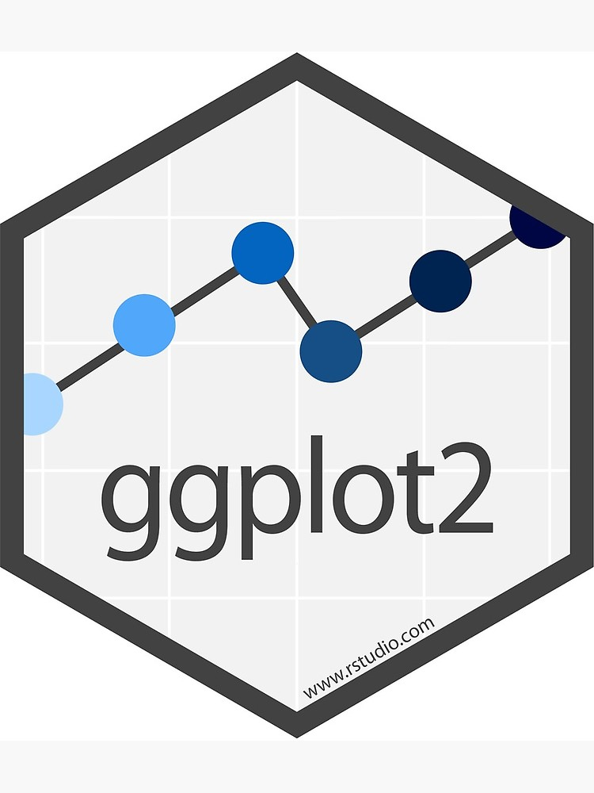
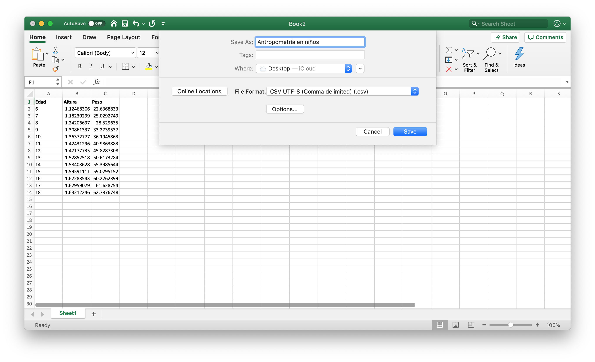

```{r setup, include=FALSE, message = FALSE, warnign = FALSE}
library("ggplot2")
library("gridExtra")
library("cowplot")
library("tidyverse")
library("kableExtra")

options(tinytex.verbose = TRUE)
knitr::opts_chunk$set(tidy = FALSE, cache.extra = packageVersion('tufte'), error = TRUE)
options(htmltools.dir.version = FALSE)
```

# ggplot2 
`R` cuenta con su propia forma de hacer gráficas mediante el comando `plot`. Sin embargo, las gráficas que puedes hacer con plot son, salvo en el caso de regresiones, mucho más sencillas que las producidas por el paquete `ggplot`. Dicho paquete fue desarrollado inicialmente por [Hadley Wickham](http://hadley.nz) y actualmente [continúa en desarrollo](https://github.com/tidyverse/ggplot2) por más de 198 colaboradores distintos. Por su belleza y facilidad, nosotros nos enfocaremos en gráficas con `ggplot2`. Otros excelentes tutoriales los puedes hallar en el [libro de ggplot2](https://ggplot2-book.org) o en [r-statistics.co](http://r-statistics.co/ggplot2-Tutorial-With-R.html). 

```{r, fig.margin = TRUE, fig.cap = "ggplot2 es el mejor paquete para graficar.", fig.width=3.5, fig.height=3.5, cache=TRUE, echo = FALSE,  message=FALSE}

```

Empecemos por instalar el paquete. Recuerda que la instalación es un proceso que sólo se requiere una vez:
```{r, eval = FALSE}
install.packages("ggplot2")
```

Aprovecharemos para también instalar dos paquetes que se encargan de leer bases de datos:
```{r, eval = FALSE}
install.packages("readxl")    #Para leer archivos de excel
install.packages("readr")     #Para leer archivos en csv 
install.packages("ggformula") #Para suavizar datos en gráficas (splines)
```


(No olvides limpiar todo tu ambiente de `R` con `rm(list = ls())` antes de iniciar; tampoco olvides que estaremos trabajando un nuevo script con `Ctrl+Shift+N` si estás en `RStudio`). 

Para ello, llama al paquete utilizando el comando `library`:
```{r}
#Librería para graficar
library(ggplot2)

#Librería para leer los datos en csv
library(readr)
```

```{r, fig.margin = TRUE, fig.cap = "Hadley Wickham, el creador de ggplot2.", fig.width=3.5, fig.height=3.5, cache=TRUE, echo = FALSE,  message=FALSE}
knitr::include_graphics('images/hadleywickham.jpg')
```

`ggplot` trabaja con `dataframes`; los `dataframes` son el formato preferido para tener tablas de datos. Probemos leer los datos de `diabetes` los cuales consisten en una muestra obtenida en Virginia EEUU en población afroamericana con el objetivo de determinar la prevalencia de obesidad, diabetes y otros factores de riesgo cardiovascular y proviene de la colección de bases de datos de [bioestadística de Vanderbilt](https://hbiostat.org/data/). 

```{marginfigure}
Puedes encontrar más información de la investgación en los artículos [Prevalence of coronary heart disease risk factors among rural blacks: A community-based study.](https://pubmed.ncbi.nlm.nih.gov/9258308/) y [A trial of church-based smoking cessation interventions for rural African Americans.](https://pubmed.ncbi.nlm.nih.gov/9010903/)
```

Para ello, leeremos desde Excel. Hay dos formas: 

  1. Si estás en `RStudio` puedes irte al panel derecho superior e `Import Dataset > From text (readr)` Eso te escribirá un código como el siguiente: 

```{r, eval = FALSE}
setwd("tu/directorio")
datos_diabetes <- read_csv("datasets/diabetes.csv")
```

2) la segunda forma es aprendiendo directamente que el comando es `read_csv` seguido del nombre del archivo. ¡Siempre puedes guardar cualquier archivo de `Excel` en `.csv` y leerlo con `R` así! 

```{r,  fig.cap = "Para guardar un archivo de `Excel` en formato `csv` puedes utilizar ` F12` (`Shift+Command+S` en Mac) o bien, ir a `File > Save As...` y luego seleccionar `File Format`. ", cache=TRUE, echo = FALSE,  message=FALSE}

```


```{r, echo = FALSE}
datos_diabetes <- read_csv("datasets/diabetes.csv")
```

La base de datos se ve más o menos así: 

```{r, echo =FALSE}
datos_diabetes %>% head() %>% kable() %>%
  kable_styling()
``` 

Por ahora nos enfocaremos en los niveles de colesterol `chol` y la edad `age` de las personas (cada `id` es un individuo distinto). 

## Gráfica de puntos

Para graficar el comando `ggplot(tus_datos)` coloca la capa inicial el cual es un lienzo vacío:
```{r}
#Creación de un lienzo de puntos
ggplot(datos_diabetes)
```

Probemos agregar puntos con `geom_point` especificando mediante el comando `aes` las variables de la base que vamos a graficar en cada uno de los ejes.

```{r, warning = FALSE}
#Gráfica de puntos
ggplot(datos_diabetes) + 
  geom_point(aes(x = age, y = chol))
```

```{marginfigure}
Te darás cuenta que `R` arroja un `warning` indicando que quitó una fila por valores faltantes. Esto es porque en la base de datos el `id = 1281` no cuenta con mediciones de colesterol por lo cual esa fila se remueve de la gráfica (de otra forma ¿cómo graficar algo que no medimos?).  
```

¡No olvides el `+`!

Podemos agregar color con el comando `color`:

```{r}
#Gráfica de la base de datos de Example
ggplot(datos_diabetes) + 
  geom_point(aes(x = age, y = chol), color = "tomato3")
```

Una lista completa de los colores posibles [está aquí.](http://www.stat.columbia.edu/~tzheng/files/Rcolor.pdf). También puedes usar colores RGB o en formato HEX. Por ejemplo el [Manual de Identidad Gráfica del Gobierno de México](https://www.gob.mx/wikiguias/articulos/manual-de-identidad-grafica-2018-2024) establece que el tono de verde institucional es el `#235B4E` el cual se puede colocar tal cual. 

```{r}
#Gráfica de la base de datos de Example
ggplot(datos_diabetes) + 
  geom_point(aes(x = age, y = chol), color = "#235B4E")
```

Podemos cambiar los títulos de los ejes, el subtítulo y el caption mediante `labs`:

```{r}
#Agregamos etiquetas
ggplot(datos_diabetes) + 
  geom_point(aes(x = age, y = chol), color = "#235B4E") +
  labs(
    x        = "Edad (años)",
    y        = "Niveles de colesterol (mg/dl)",
    title    = "Edad contra niveles de colesterol en la población afroamericana de Virginia",
    subtitle = "University of Virginia School of Medicine.",
    caption  = "Fuente: https://hbiostat.org/data/"
  )
```

Las gráficas cuentan con varios temas (`themes`) con diseños predefinidos para cambiar su imagen. Prueba los distintos: `theme_classic`, `theme_bw`, `theme_gray`, `theme_linedraw`, `theme_light`, `theme_minimal`, `theme_dark` y `theme_void`.^[Puedes tener aún más temas si descargas el paquete (`ggthemes`)[https://yutannihilation.github.io/allYourFigureAreBelongToUs/ggthemes/]. ]  

```{r}
ggplot(datos_diabetes) + 
  geom_point(aes(x = age, y = chol), color = "#235B4E") +
  labs(
    x        = "Edad (años)",
    y        = "Niveles de colesterol (mg/dl)",
    title    = "Edad contra niveles de colesterol en la población afroamericana de Virginia",
    subtitle = "University of Virginia School of Medicine.",
    caption  = "Fuente: https://hbiostat.org/data/"
  ) + 
  theme_minimal() #Agrega un tema
```

Para incrementar el tamaño de los puntos podemos usar el comando `size`:
```{r}
#Agregamos etiquetas
ggplot(datos_diabetes) + 
  geom_point(aes(x = age, y = chol), color = "#235B4E", size = 2.5) +
  labs(
    x        = "Edad (años)",
    y        = "Niveles de colesterol (mg/dl)",
    title    = "Edad contra niveles de colesterol en la población afroamericana de Virginia",
    subtitle = "University of Virginia School of Medicine.",
    caption  = "Fuente: https://hbiostat.org/data/"
  ) + 
  theme_minimal() #Agrega un tema
```

Y si se empalman podemos hacer unos más transparentes que otros usando `alpha`

```{r}
#Agregamos etiquetas
ggplot(datos_diabetes) + 
  geom_point(aes(x = age, y = chol), color = "#235B4E", size = 2.5, alpha = 0.5) +
  labs(
    x        = "Edad (años)",
    y        = "Niveles de colesterol (mg/dl)",
    title    = "Edad contra niveles de colesterol en la población afroamericana de Virginia",
    subtitle = "University of Virginia School of Medicine.",
    caption  = "Fuente: https://hbiostat.org/data/"
  ) + 
  theme_minimal()
```

Finalmente, para guardar tu gráfica escribe `ggsave` con el nombre (sea en `pdf` o en `png` y las medidas de ancho y alto deseadas en pulgadas)

```{r, echo = FALSE}
#width: ancho
#height: alto
ggsave("Edad_vs_colesterol.pdf", width = 8, height = 5)
```

## Ejercicio

### R Básico 
1. Imita la siguiente gráfica de altura (`height`) contra peso (`weight`) de la base de datos de diabetes. En esta usamos otro tema distinto y los puntos son naranjas de tamaño $0.5$:

```{r, echo = FALSE, warning=FALSE}
ggplot(datos_diabetes) + geom_point(aes(x = weight, y = height), color = "orange", size = 0.5) + xlab("Peso (libras)") + ylab("Altura (pulgadas)") + ggtitle("Gráfica de peso contra altura") + theme_classic()
```

2. Dentro del `aes` puedes también aplicar funciones a las variables. Por ejemplo si queremos graficar índice de masa corporal ($\text{peso} / (\text{altura}^2)$) podemos calcular el IMC en el mismo `aes` haciendo: `... aes(x = weight/(height^2), ...) ...`. Grafica en la variable x el índice de masa corporal (IMC) y en la variable `y` el radio de colesterol definido como el nivel de colesterol `chol` entre el colesterol de alta densidad `hdl`. Obtén una gráfica como esta:  


```{r, echo = FALSE, warning=FALSE}
ggplot(datos_diabetes) + geom_point(aes(x = weight/height^2, y = chol/hdl), color = "purple", size = 0.5) + xlab("IMC") + ylab("Radio de colesterol") + ggtitle("Relación entre IMC y colesterol") + theme_bw()
```

### R Intermedio 
Utiliza `scale_y_continuous` en particular la opción de `sec.axis` para agregar un segundo eje `y` del lado derecho donde la altura esté en metros (no pulgadas). Repite el proceso con `scale_x_continuous` para agregar un eje `x` en la parte superior con el peso en kilogramos.

```{r, echo = FALSE}
ggplot(datos_diabetes) + 
  geom_point(aes(x = weight, y = height), color = "orange", size = 0.5) + 
  ggtitle("Gráfica de peso contra altura") + 
  theme_classic() +
  scale_y_continuous("Altura (pulgadas)", 
                     sec.axis = sec_axis(~ . * 0.0254, name = "Altura (metros)")) +
  scale_x_continuous("Peso (libras)", 
                     sec.axis = sec_axis(~ . * 0.453592, name = "Peso (kilogramos)"))
```


## Histogramas, densidades y múltiples gráficas a la vez

El comando `geom_histogram` sirve para crear histogramas. Para ello es sólo necesario especificar una variable en el `aes`:

```{r}
#Graficación de un histograma
ggplot(datos_diabetes) + geom_histogram(aes(x = chol))
```

```{marginfigure}
Según [Ioannidis](http://www.madgik.di.uoa.gr/sites/default/files/vldb03_pp19-30.pdf) histograma viene del griego _histos_ (mástil) y _gram-ma_ (algo escrito). Por lo que literalmente sería algo escrito en mástiles. A pesar de que éstos se atribuyen a Karl Pearson, los histogramas fueron inventados desde antes. Él fue quien les puso nombre. 
```

Para especificar el número de barras hay dos formas: utilizando el comando `bins`:

```{r}
#Graficación de un histograma con 50 barras
ggplot(datos_diabetes) + geom_histogram(aes(x = chol), bins = 50)
```

O bien especificando el ancho de cada barra y dejando a `R` decidir:
```{r}
#Graficación con barras de ancho 10
ggplot(datos_diabetes) + 
  geom_histogram(aes(x = chol), binwidth = 10)
```

El comando `fill` cambia el color interno de las barras. 
```{r}
#El comando fill cambia el color
ggplot(datos_diabetes) + 
  geom_histogram(aes(x = chol), binwidth = 10, fill = "#cef0ff")
```

Mientras que el comando `color` cambia el color del borde de la misma:
```{r}
ggplot(datos_diabetes) + 
  geom_histogram(aes(x = chol), binwidth = 10, fill = "#cef0ff",  color = "#1D1B1B")
```

FInalmente, podemos hacer que el histograma muestre no el número de casos totales en la base sino la proporción de los casos mediante `..density..`. 

```{r}
#..density.. nos da el % de casos de manera normalizada
ggplot(datos_diabetes) + 
  geom_histogram(aes(x = chol, y = ..density..), 
                 binwidth = 10, fill = "#cef0ff",  color = "#1D1B1B")
```

Podemos agregar, además, una densidad kernel que nos dé una idea de cómo se ve la distribución ajustada. Como veremos más adelante, la densidad kernel (aunque puede ser manipulable) es más fácil que no nos dé errores de distribución incorrecta. 

```{r}
#Gráfica de histograma con densidad kernel
ggplot(datos_diabetes) + 
  geom_histogram(aes(x = chol, y = ..density..), binwidth = 10,
                 fill = "#cef0ff",  color = "#1D1B1B") + 
  geom_density(aes(x = chol))
```

**Ojo** `ggplot2` funciona por capas por lo cual el orden en el que se agrega cada capa (`geom`) sí afecta el cómo se ve. Si ponemos el `geom_density` antes del `geom_histogram` nos queda la línea _detrás_ del histograma:

```{r}
#Gráfica de histograma con densidad kernel
ggplot(datos_diabetes) + 
  geom_density(aes(x = chol)) +
  geom_histogram(aes(x = chol, y = ..density..), binwidth = 10,
                 fill = "#cef0ff",  color = "#1D1B1B")  
```

Continuando con la edición podemos cambiar los parámetros de `color` y `size` de la distribución para ajustar su color y tamaño. Así mismo, [`linetype` nos da una línea discontinua](https://ggplot2.tidyverse.org/reference/aes_linetype_size_shape.html): 

```{r}
#Cambio de color y tipo de línea a la densidad
ggplot(datos_diabetes) + 
  geom_histogram(aes(x = chol, y = ..density..), binwidth = 10,
                 fill = "#cef0ff",  color = "#1D1B1B") + 
  geom_density(aes(x = chol), color = "deepskyblue4",
               linetype = "dotted", size = 1)
```

Finalmente, modificamos los temas:

```{r}
#Graficación con barras de ancho 0.05
ggplot(datos_diabetes) + 
  geom_histogram(aes(x = chol, y = ..density..), binwidth = 10,
                 fill = "#cef0ff",  color = "#1D1B1B") + 
  geom_density(aes(x = chol), color = "deepskyblue4",
               linetype = "dotted", size = 1) +
  labs(
    x        = "Colesterol",
    y        = "",
    title    = "Distribución observada de los niveles de colesterol",
    subtitle = "Población afroamericana de Virginia"
  ) + 
  theme_bw()
```

La función `mean` calcula la media de una columna dentro de una base de datos. Podemos calcular la media de la columna de `chol` dentro de `datos_diabetes`:
```{r}
#Media de la columna de colesterol
#la opción na.rm = T es para no considerar los valores missing

promedio_colesterol <- mean(datos_diabetes$chol) #No funciona pues tiene un missing
promedio_colesterol

#Acá le decimos que ignore el missing con na.rm = T
promedio_colesterol <- mean(datos_diabetes$chol, na.rm = T)
promedio_colesterol
```

Y agregamos una línea vertical a la gráfica exactamente en la media:
```{r}
#Agregamos indicadora del promedio
ggplot(datos_diabetes) + 
  geom_histogram(aes(x = chol, y = ..density..), binwidth = 10,
                 fill = "#cef0ff",  color = "#1D1B1B") + 
  geom_density(aes(x = chol), color = "deepskyblue4",
               linetype = "dotted", size = 1) +
  labs(
    x        = "Colesterol",
    y        = "",
    title    = "Distribución observada de los niveles de colesterol",
    subtitle = "Población afroamericana de Virginia"
  ) + 
  theme_bw() +
  geom_vline(aes(xintercept = promedio_colesterol))
```

Podemos cambiar el color de la línea así como el tipo:
```{r}
#Agregamos indicadora del promedio
ggplot(datos_diabetes) + 
  geom_histogram(aes(x = chol, y = ..density..), binwidth = 10,
                 fill = "#cef0ff",  color = "#1D1B1B") + 
  geom_density(aes(x = chol), color = "deepskyblue4",
               linetype = "dotted", size = 1) +
  labs(
    x        = "Colesterol",
    y        = "",
    title    = "Distribución observada de los niveles de colesterol",
    subtitle = "Población afroamericana de Virginia"
  ) + 
  theme_bw() +
  geom_vline(aes(xintercept = promedio_colesterol),
             color = "tomato3", linetype = "dashed", size = 1)
```

Finalmente, podemos agregar una anotación junto a la media que nos indique que dicha es la media. Para ello usamos el comando `annotate` indicando que agregaremos un texto (`"text"`) y las coordenadas del mismo.  

```{r}
#Agregamos indicadora del promedio
ggplot(datos_diabetes) + 
  geom_histogram(aes(x = chol, y = ..density..), binwidth = 10,
                 fill = "#cef0ff",  color = "#1D1B1B") + 
  geom_density(aes(x = chol), color = "deepskyblue4",
               linetype = "dotted", size = 1) +
  labs(
    x        = "Colesterol",
    y        = "",
    title    = "Distribución observada de los niveles de colesterol",
    subtitle = "Población afroamericana de Virginia"
  ) + 
  theme_bw() +
  geom_vline(aes(xintercept = promedio_colesterol),
             color = "tomato3", linetype = "dashed", size = 1) +
  annotate("label", x = promedio_colesterol, 
           y = 0.0001, label = "Media = 208", color = "tomato3")
```

La función de `scale_y_continuous` permite agregar etiquetas al eje vertical (`scale_x_continuous` si fuera el horizontal). En este caso podemos usar porcentajes para mejor representar los datos:

```{r}
#Agregamos indicadora del promedio
ggplot(datos_diabetes) + 
  geom_histogram(aes(x = chol, y = ..density..), binwidth = 10,
                 fill = "#cef0ff",  color = "#1D1B1B") + 
  geom_density(aes(x = chol), color = "deepskyblue4",
               linetype = "dotted", size = 1) +
  labs(
    x        = "Colesterol",
    y        = "",
    title    = "Distribución observada de los niveles de colesterol",
    subtitle = "Población afroamericana de Virginia"
  ) + 
  theme_bw() +
  geom_vline(aes(xintercept = promedio_colesterol),
             color = "tomato3", linetype = "dashed", size = 1) +
  annotate("label", x = promedio_colesterol, 
           y = 0.0001, label = "Media = 208",  color = "tomato3") +
  scale_y_continuous(labels = scales::label_percent())
```

## Ejercicios

### R Básico

1. Utiliza la función `quantile` (con la opción `na.rm = T`)  para calcular los cuantiles `0.975` y `0.025` y agrega dos líneas verticales a la gráfica anterior indicando los valores de los cuantiles junto con sus etiquetas:

```{r}
#Agregamos indicadora del promedio
q025 <- quantile(datos_diabetes$chol, 0.025, na.rm = T)
q975 <- quantile(datos_diabetes$chol, 0.975, na.rm = T)
ggplot(datos_diabetes) + 
  geom_histogram(aes(x = chol, y = ..density..), binwidth = 10,
                 fill = "#cef0ff",  color = "#1D1B1B") + 
  geom_density(aes(x = chol), color = "deepskyblue4",
               linetype = "dotted", size = 1) +
  labs(
    x        = "Colesterol",
    y        = "",
    title    = "Distribución observada de los niveles de colesterol",
    subtitle = "Población afroamericana de Virginia"
  ) + 
  theme_bw() +
  geom_vline(aes(xintercept = promedio_colesterol),
             color = "tomato3", linetype = "dashed", size = 1) +
  geom_vline(aes(xintercept = q025),
             color = "tomato3", linetype = "dashed", size = 1) +
  geom_vline(aes(xintercept = q975),
             color = "tomato3", linetype = "dashed", size = 1) +
  annotate("label", x = promedio_colesterol, y = 0.0001, label = "Media = 208", 
           color = "tomato3") +
  annotate("label", x = q025, y = 0.0001, label = "2.5% = ???", 
           color = "tomato3") +
  annotate("label", x = q975, y = 0.0001, label = "97.5% = ???", 
           color = "tomato3") +
  scale_y_continuous(labels = scales::label_percent())
```


2. Imita la siguiente gráfica de altura en pulgadas (`height`) con color `red` donde se usó el comando `fill` para colorear el interior de la densidad en azul (`deepskyblue4`) y el tema `theme_linedraw`. 

```{r, echo = FALSE}
#Graficación con barras de ancho 0.05
ggplot(datos_diabetes) + 
  geom_histogram(aes(x = height, y = ..density..), color = "black",
               fill = "#fffff8", bins = 10) +
  geom_density(aes(x = height), color = "red",
               fill = "deepskyblue3", alpha = 0.5) +
  xlab("Altura (pulgadas)") + 
  ylab("Densidad") +
  ggtitle("Histograma y densidad ajustada de altura") +
  theme_linedraw() + 
  theme(plot.background = element_rect(fill = "#fffff8"),
        panel.background = element_rect(fill = "#fffff8")) + 
  scale_y_continuous(labels = scales::label_percent())
```


3. Considera la siguiente base de datos:
```{r}
mis.datos <- data.frame(
  x = c(1.03, 1.24, 1.47, 1.52, 1.92, 1.93, 1.94, 1.95, 1.96, 1.97,
       1.98, 1.99, 2.72, 2.75, 2.78, 2.81, 2.84, 2.87, 2.90, 2.93,
       2.96, 2.99, 3.60, 3.64, 3.66, 3.72, 3.77, 3.88, 3.91, 4.14,
       4.54, 4.77, 4.81, 5.62)
)
```

Realiza un histograma de la variable `x` dentro de  `mis.datos` con `binwidth` a `0.75`:

  a. ¿Podemos concluir la forma de la distribución a partir del histograma? Es decir ¿está centrada?

```{marginfigure}
Minitab tiene un [blog](https://blog.minitab.com/blog/3-things-a-histogram-can-tell-you) sobre cuándo usar histogramas. ¿Puedes descubrir todos sus errores?
```

  b. Realiza el mismo histograma pero ahora con un ancho de banda de `1.2`.  ¿Y ahora?


4. Considera la siguiente [base de datos](https://stats.stackexchange.com/questions/51718/assessing-approximate-distribution-of-data-based-on-a-histogram):
```{r}
mis.datos <- data.frame(
  A =  c(3.15, 5.46, 3.28, 4.20, 1.98, 2.28, 3.12, 4.10, 3.42, 3.91, 
         2.06, 5.53, 5.19, 2.39, 1.88, 3.43, 5.51, 2.54, 3.64, 4.33, 
         4.85, 5.56, 1.89, 4.84, 5.74, 3.22, 5.52, 1.84, 4.31, 2.01, 
         4.01, 5.31, 2.56, 5.11, 2.58, 4.43, 4.96, 1.90, 5.60, 1.92),
  B =  c(2.90, 5.21, 3.03, 3.95, 1.73, 2.03, 2.87, 3.85, 3.17, 3.66,
         1.81, 5.28, 4.94, 2.14, 1.63, 3.18, 5.26, 2.29, 3.39, 4.08,
         4.60, 5.31, 1.64, 4.59, 5.49, 2.97, 5.27, 1.59, 4.06, 1.76, 
         3.76, 5.06, 2.31, 4.86, 2.33, 4.18, 4.71, 1.65, 5.35, 1.67),
  C =  c(2.65, 4.96, 2.78, 3.70, 1.48, 1.78, 2.62, 3.60, 2.92, 3.41,
         1.56, 5.03, 4.69, 1.89, 1.38, 2.93, 5.01, 2.04, 3.14, 3.83,
         4.35, 5.06, 1.39, 4.34, 5.24, 2.72, 5.02, 1.34, 3.81, 1.51, 
         3.51, 4.81, 2.06, 4.61, 2.08, 3.93, 4.46, 1.4, 5.1, 1.42),
  D =  c(2.40, 4.71, 2.53, 3.45, 1.23, 1.53, 2.37, 3.35, 2.67, 3.16,
         1.31, 4.78, 4.44, 1.64, 1.13, 2.68, 4.76, 1.79, 2.89, 3.58,
         4.10, 4.81, 1.14, 4.09, 4.99, 2.47, 4.77, 1.09, 3.56, 1.26, 
         3.26, 4.56, 1.81, 4.36, 1.83, 3.68, 4.21, 1.15, 4.85, 1.17)
)
```

Grafica un histograma de las variables `A`, `B`, `C` y `D` de dicha base con un ancho de banda (`binwidth`) igual a `1`:
```{r, echo = FALSE}
bw <- 1

plotA <- ggplot(mis.datos) + geom_histogram(aes(x = A, y = ..density..), fill = "tomato3", color = "black", binwidth = bw) +
  ylab("Proporción") +   theme(plot.background = element_rect(fill = "#fffff8"),
        panel.background = element_rect(fill = "#fffff8"))

plotB <- ggplot(mis.datos) + geom_histogram(aes(x = B, y = ..density..), fill = "forestgreen", color = "black", binwidth = bw) +   theme(plot.background = element_rect(fill = "#fffff8"),
        panel.background = element_rect(fill = "#fffff8")) +
  ylab("Proporción")

plotC <- ggplot(mis.datos) + geom_histogram(aes(x = C, y = ..density..), fill = "purple", color = "black", binwidth = bw) +
  ylab("Proporción") +   theme(plot.background = element_rect(fill = "#fffff8"),
        panel.background = element_rect(fill = "#fffff8"))

plotD <- ggplot(mis.datos) + geom_histogram(aes(x = D, y = ..density..), fill = "deepskyblue3", color = "black", binwidth = bw) +
  ylab("Proporción") +   
  theme(plot.background = element_rect(fill = "#fffff8"),
        panel.background = element_rect(fill = "#fffff8"))

```

```{r, echo = FALSE}
#SI no lo haces así imprime a lo tonto
ggdraw(arrangeGrob(plotA, plotB, plotC, plotD, 
                   top = "Son 4 gráficas separadas no intentes hacer una sola (como en esta que es para las notas)")) +
  theme(plot.background = 
          element_rect(fill="#fffff8", color = NA))
```

¿Podemos concluir la forma de la distribución a partir del histograma? Es decir ¿hay distribuciones sesgadas a la izquierda, a la derecha, uniformes, centradas o con colas pesadas?

Realiza el mismo histograma pero ahora con un ancho de banda de `0.25` ¿por qué hubo cambios? Analiza la base de datos (los valores en función de la columna `A`) y concluye. 


## Gráficas de barras

El archivo `inegi_seguro_popular.csv` ([datos reales obtenidos de INEGI](https://datos.gob.mx/busca/dataset/porcentaje-de-la-poblacion-afiliada-al-seguro-popular-derecho-a-la-salud-recepcion-del-derecho)) contiene información del número de personas afiliadas al seguro popular por entidad federativa en 2010 y 2015. Graficaremos ambos años. Para ello, leamos el archivo:

```{r, echo = FALSE}
seguro.pop <- read_csv("datasets/inegi_seguro_popular.csv",
                       locale = locale(encoding = "WINDOWS-1252"))
```

```{r, eval = FALSE}
seguro.pop <- read_csv("inegi_seguro_popular.csv",
                       locale = locale(encoding = "WINDOWS-1252"))
```

Notarás que esta vez tuvimos que establecer un _locale_ esto es porque la base tiene acentos y caracteres del español y cuando la base fue generada por una computadora `Windows` hay que
especificar que viene de _Windows_ con el locale. 

```{marginfigure}
El `locale` es un poco más complicado y refiere a cómo la computadora sabe qué secuencia de bits corresponde a qué caracter. Latinoamérica usualmente está entre  `WINDOWS-1252` y `UTF-8`. 
```

Podemos graficar los datos que aparecen en gráfica de barras mediante el comando `geom_col`:

```{r}
#Gráfica encimada
ggplot(seguro.pop) + 
  geom_col(aes(x = `Entidad federativa`, 
               y = `Porcentaje de la población afiliada al seguro popular`))
```

Esta vez como los nombbres de las columnas contienen varias palabras hubo que colocarlas entre dos [acentos graves ó backticks:](https://en.wikipedia.org/wiki/Backtick) <code>`</code>

Nota que hay gráficas donde el porcentaje supera el 100% esto es porque `R`, de inicio, combina los años `2010` y `2015` sumando los valores. Podemos ver esto con el comando `fill` diciéndole a `R` que `Periodo` no lo lea como número sino como caracter `character` (de otra forma buscará colorearlo con el color `2010` y `2015` los cuales no se distinguen):

```{r}
#Gráfica encimada con dos periodos
ggplot(seguro.pop) + 
  geom_col(aes(x = `Entidad federativa`, 
               y = `Porcentaje de la población afiliada al seguro popular`,
               fill = as.character(Periodo)))
```

Ojo como `periodo` es una sola palabra podemos ponerlo con o sin el acento  <code>`</code>:
```{r}
#Gráfica encimada con dos periodos (equivalente)
ggplot(seguro.pop) + 
  geom_col(aes(x = `Entidad federativa`, 
               y = `Porcentaje de la población afiliada al seguro popular`,
               fill = as.character(`Periodo`)))
```

Mediante `coord_flip()` podemos rotar las coordenadas: 

```{r}
#Gráfica encimada
ggplot(seguro.pop) + 
  geom_col(aes(x = `Entidad federativa`, 
               y = `Porcentaje de la población afiliada al seguro popular`,
               fill = as.character(`Periodo`))) +
  coord_flip()
```

Existen dos formas de separar los años: mediante `facet_wrap()` en dos gráficas distintas o mediante `position` dentro de la misma gráfica. Veamos sus diferencias: 

```{r}
#Gráfica con position
ggplot(seguro.pop) + 
  geom_col(aes(x = `Entidad federativa`, 
               y = `Porcentaje de la población afiliada al seguro popular`,
               fill = as.character(`Periodo`)),
           position = "dodge") +
  coord_flip() 
```

o bien: 

```{r}
ggplot(seguro.pop) + 
  geom_col(aes(x = `Entidad federativa`, 
               y = `Porcentaje de la población afiliada al seguro popular`,
               fill = as.character(`Periodo`))) + 
  coord_flip() +
  facet_wrap(~ as.character(`Periodo`))
```

A mí me gusta más el de `facet_wrap()` así que continuaré trabajando con él. Podemos mejorar la leyenda mediante el `scale_fill_manual` (`scale_color_manual` respectivamente si nos interesa cambiar sólo el color de las barras)

```{r}
#Gráfica colores mediante "scale_fill_manual"
ggplot(seguro.pop) + 
  geom_col(aes(x = `Entidad federativa`, 
               y = `Porcentaje de la población afiliada al seguro popular`,
               fill = as.character(`Periodo`))) + 
  coord_flip() +
  facet_wrap(~ as.character(`Periodo`)) +
  scale_fill_manual("Año", 
                    values = c("2010" = "#EB2188",  #colores del 2010
                               "2015" = "#080A52")) #colores del 2015
```

Podemos reordenar el eje para que `Aguascalientes` quede hasta arriba. Para eso especificamos el orden. Lo podemos hacer manualmente (pero qué flojera):
```{r}
orden <- c('Estados Unidos Mexicanos', 'Aguascalientes', 'Baja California', 
           'Baja California Sur', 'Campeche', 'Coahuila de Zaragoza', 
           'Colima', 'Chiapas', 'Chihuahua', 'Ciudad de México', 'Durango', 
           'Guanajuato', 'Guerrero', 'Hidalgo', 'Jalisco', 'México', 
           'Michoacán de Ocampo', 'Morelos', 'Nayarit', 'Nuevo León', 
           'Oaxaca', 'Puebla', 'Querétaro', 'Quintana Roo', 'San Luis Potosí', 
           'Sinaloa', 'Sonora', 'Tabasco', 'Tamaulipas', 'Tlaxcala', 
           'Veracruz de Ignacio de la Llave', 'Yucatán', 'Zacatecas') 
```

O bien pidiéndole a `R` una lista de los estados en la base:
```{r}
orden <- unique(seguro.pop$`Entidad federativa`)
```

en cualquiera de los casos esa lista la pondremos en reversa dentro de limits:

```{r}
#Reordenamos el eje vertical
ggplot(seguro.pop) + 
  geom_col(aes(x = `Entidad federativa`, 
               y = `Porcentaje de la población afiliada al seguro popular`,
               fill = as.character(`Periodo`))) + 
  coord_flip() +
  facet_wrap(~ as.character(`Periodo`)) +
  scale_fill_manual("Año", 
                    values = c("2010" = "#EB2188", 
                               "2015" = "#080A52")) +
  scale_x_discrete(limits = rev(orden))
```

Finalmente, podemos agregar los formatos de etiquetas usuales:
```{r}
ggplot(seguro.pop) + 
  geom_col(aes(x = `Entidad federativa`, 
               y = `Porcentaje de la población afiliada al seguro popular`,
               fill = as.character(`Periodo`))) + 
  coord_flip() +
  facet_wrap(~ as.character(`Periodo`)) +
  scale_fill_manual("Año", 
                    values = c("2010" = "#EB2188", 
                               "2015" = "#080A52")) +
  scale_x_discrete(limits = rev(orden)) +
  labs(
    title   = "Población afiliada al Seguro Popular\npor entidad federativa",
    y       = "Proporción de la población",
    x       = "Entidad federativa",
    caption = "Fuente: INEGI"
  ) + 
  theme_bw()
```

## Ejercicio 

1. El siguiente código genera una base de datos de nombre `vacunacion` con la información de cuántos niños menores de uno o dos años tienen el esquema completo de cuatro vacunas de acuerdo con las distintas Encuestas Nacionales de Salud  ENSA/ENSANUT. 

```{r}
Encuesta   <- rep(c("2000","2006","2012","2018-19","2021"), 2)
vacperc    <- c(c(0.265, 0.784, 0.742, 0.199, 0.311), c(0.5, 0.847, 0.779, 0.353, 0.358))
clase      <- c(rep("1 año cumplido", 5), rep("2 años cumplidos", 5))

vacunacion           <- data.frame(Encuesta, vacperc, clase) 
colnames(vacunacion) <- c("ENSANUT", "Porcentaje vacunado", "Edad de los niños")
```

Grafica los datos con columnas. 

<!--
# Boxplots
Descarga la base de datos `dientes.csv` el cual contiene mediciones del crecimiento de los dientes de conejillos de indias después de darles vitamina C:

```{r, echo = FALSE}
dientes <- read.csv(paste0(filedir,"dientes.csv"),  header = TRUE, sep = ",", dec = ".")
```

```{r}
dientes <- read.csv("dientes.csv")
```

Las variables incluidas son `len` (longitud del diente), `supp` el tipo de suplemento `VC` (ácido ascórbico) u `OJ` (jugo de naranja) así como dósis de vitamina C  `dose` (en mg/día). 

Probemos hacer una gráfica de cajas con el comando `geom_boxplot`:
```{r}
ggplot(dientes) + geom_boxplot(aes(x = as.character(dose), y = len))
```

Podemos colorear el `outlier`:

```{r}
ggplot(dientes) + geom_boxplot(aes(x = as.character(dose), y = len),
                               outlier.color = "firebrick", 
                               outlier.size = 5)
```

Podemos agregar la media con stat summary:

```{r}
ggplot(dientes) + geom_boxplot(aes(x = as.character(dose), y = len),
                               outlier.color = "firebrick", 
                               outlier.size = 5) +
  stat_summary(aes(x = as.character(dose), y = len), 
               fun.y=mean, geom="point", shape="triangle", 
               size=4, color = "blue")
```

Fimalmente, si quieres agregar puntos:
```{r}
ggplot(dientes) + geom_boxplot(aes(x = as.character(dose), y = len),
                               outlier.color = "firebrick", 
                               outlier.size = 5) +
  stat_summary(aes(x = as.character(dose), y = len), 
               fun.y=mean, geom="point", shape="triangle", 
               size=4, color = "blue") + 
  geom_jitter(aes(x = as.character(dose), y = len), 
              shape=16, position=position_jitter(0.2), alpha = 0.2)

```
-->

# Gráficas de trayectorias
```{r, fig.margin = TRUE, fig.cap = "En ggplot2 puedes graficar lo que quieras. Hasta puedes declarar tu amor. Este próximo 14 de febrero usa ggplot2.", fig.width=3.5, fig.height=3.5, cache=TRUE, echo = FALSE, message=FALSE}
dat <- data.frame(t = seq(0, 2*pi, by = 0.01))
x <-  function(t) 16 * sin(t)^3
y <- function(t) 13*cos(t) - 5*cos(2*t) - 2*cos(3*t) - cos(4*t)

dat$y <- y(dat$t)
dat$x <- x(dat$t)

heart <- ggplot(dat, aes(x,y)) +
  geom_polygon(fill = "red", col = "firebrick", alpha = 0.9) +
  theme_bw() + ggtitle("El amor según ggplot2") + xlab("") + ylab("")

heart +  theme(plot.background = element_rect(fill = "#fffff8"),
        panel.background = element_rect(fill = "#fffff8"))
```

La base de datos `casos_covid_agosto_2022.csv` contiene datos sobre la cantidad de casos reportados en el Sistema Nacional de Vigilancia Epidemiológica (SINAVE) por covid, sospecha de covid u otra enfermedad respiratoria. Leamos la base:

```{r, echo = FALSE}
sinave <- read_csv("datasets/casos_covid_agosto_2022.csv")
```


Grafiquemos la cantidad de casos totales en México como puntos

```{r}
ggplot(sinave) + 
  geom_point(aes(x = FECHA_SINTOMAS, y = n), color = "#a8c66c") 
```

podemos agregar una línea que una los puntos pero como hay tantos no se ve muy bien:

```{r}
ggplot(sinave) + 
  geom_point(aes(x = FECHA_SINTOMAS, y = n), color = "#a8c66c") + 
  geom_spline(aes(x = FECHA_SINTOMAS, y = n), color = "#1b6535") 
```

podemos mejor usar la función `geom_spline` del paquete `ggformula` para usar una línea que se encargue de eliminar el ruido de los datos y descubrir la forma inherente:


```{r}
library(ggformula)

ggplot(sinave) + 
  geom_point(aes(x = FECHA_SINTOMAS, y = n), color = "#a8c66c") + 
  geom_spline(aes(x = FECHA_SINTOMAS, y = n), color = "#1b6535") 
```

nota que el suavizamiento ahora es mucho mejor. Podemos controlar el nivel de suavizamiento con los grados de libertad del spline `df`:

```{r}
ggplot(sinave) + 
  geom_point(aes(x = FECHA_SINTOMAS, y = n), color = "#a8c66c") + 
  geom_spline(aes(x = FECHA_SINTOMAS, y = n, color = "df 100"), df = 100) +
  geom_spline(aes(x = FECHA_SINTOMAS, y = n, color = "df 45"), df = 45) +
  geom_spline(aes(x = FECHA_SINTOMAS, y = n, color = "df 20"), df = 15)  +
  geom_spline(aes(x = FECHA_SINTOMAS, y = n, color = "df 5"), df = 5) 
```


