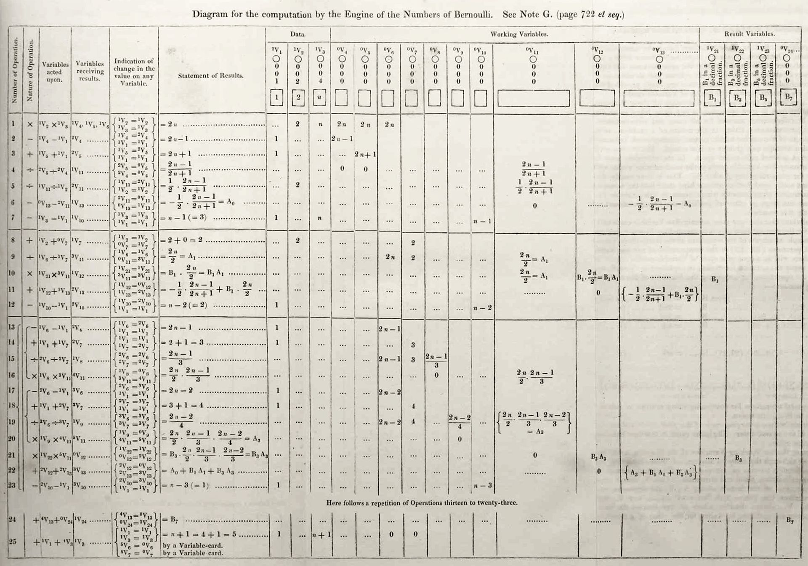
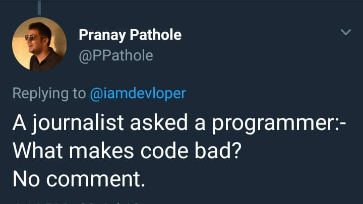

::: {.callout-note appearance="simple"}
## Resumen

Discutimos cómo usar `R` como si fuera una calculadora así como la lectura de datos, el directorio y la instalación de paquetes.
:::

::: callout-warning
Si aún no cuentas con una instalación de `R` y `RStudio` ve a la [sección de instalación](instalacion.qmd)
:::

# Primeros pasos con `R`

## Cálculos numéricos

`R` sirve como calculadora para las operaciones usuales. En él puedes hacer sumas,

```{r}
#Esto es una suma en R
12 + 31
```

```{r}
#| column: margin
#| fig-width: 3.5
#| fig-height: 3.5
#| cache: false
#| echo: false
#| message: false
#| out-width: "150px"
#| fig-cap:  "Ada Lovelace (1815-1852), la primera en diseñar un algoritmo computacional ¡y sin tener computadoras!"

```

restas,

```{r}
#Esto es una resta en R
3 - 4
```

multiplicaciones,

```{r}
#Esto es una multiplicación en R
7*8
```

divisiones,

```{r}
#Esto es una división en R
4/2
```

sacar logaritmos naturales $\ln$,

```{r}
#Para sacar logaritmo usas el comando log
log(100)
```

o bien logaritmos en cualquier base,[^1]

[^1]: Recuerda que un logaritmo base $a$ te dice a qué potencia $b$ tuve que elevar $a$ para llegar a $b$. Por ejemplo $\log_{10}(100) = 2$ te dice que para llegar al $100$ tuviste que hacer $10^2$.

```{r}
#Puedes especificar la base del logaritmo con base 
log(100, base = 10)
```

también puedes elevar a una potencia (por ejemplo hacer $6^3$),

```{r}
#Así se calculan potencias
6^3
```

calcular la exponencial $e$,

```{r}
#Para exponenciales puedes usar exp
exp(1)
```

o bien exponenciar cualquier variable $e^{-3}$,

```{r}
#O bien exponenciales específicas, e^-3
exp(-3)
```

también puedes usar el número $\pi$.

```{r}
#Cálculo de pi
pi
```

No olvides que `R` usa el orden de las operaciones de matemáticas. Siempre es de izquierda a derecha con las siguientes excepciones:

1.  Primero se evalúa lo que está entre paréntesis.

2.  En segundo lugar se calculan potencias.

3.  Lo tercero en evaluarse son multiplicaciones y divisiones.

4.  Finalmente, se realizan sumas y restas.

Por ejemplo, en la siguiente ecuación

$$
2 - 2 \cdot \frac{(3^4 - 9)}{(5 + 4)}
$$

se resuelven primero los paréntesis $(3^4 - 9) = 81 - 9 = 72$ y $(5 + 4) = 9$; luego se resuelve la división: $\frac{72}{9}=8$, se multiplica por el $2$: $2 \cdot 8$ y finalmente se hace la resta: $2-8 = -6$.

### Ejercicio (operaciones sin contexto)

Determina, sin evaluar, los resultados de los siguientes segmentos de código:

```{r}
#| eval: false
#Primer ejercicio 
(9 - 3)^2 * (2 - 1) - 6
```

```{r}
#| eval: false
#Segundo ejercicio 
6 * 2 / (7 - 3) * 5
```

```{r}
#| eval: false
#Tercer ejercicio 
2 * 3 ^ 2 * 2 / (5 - 4) * 1 / 10 
```

Evalúa para comprobar tus respuestas.

### Ejercicio (NNT)

El **número (de pacientes) que es necesario tratar (NNT)** se define como la cantidad total de pacientes a quienes es necesario darles tratamiento para evitar un resultado negativo (es decir a cuántos pacientes debo darles tratamiento para que al menos uno se beneficie).

::: callout-tip
### NNT perfecto

El **NNT** perfecto es cuando $NNT = 1$. ¿Por qué es éste el mejor escenario?
:::

Dada la siguiente tabla

|             |     | Resultado |     |
|-------------|-----|-----------|-----|
|             |     | Si        | No  |
| Tratamiento | Si  | A         | B   |
|             | No  | C         | D   |

para calcular el **NNT** es necesario calcular la tasa de los eventos en el grupo experimental **EER** y en el grupo control **CER** como sigue:

$$
EER = \frac{A}{A+B} \quad \text{y}\quad CER = \frac{C}{C+D}
$$

finalmente, el número necesario a tratar **NNT** se define como

$$
NNT = \frac{1}{|EER - CER|}
$$

> El ejercicio consiste en calcular en `R` el **NNT** para la siguiente tabla:
>
> |             |     | Resultado |      |
> |-------------|-----|-----------|------|
> |             |     | Si        | No   |
> | Tratamiento | Si  | 234       | 39   |
> |             | No  | 981       | 1040 |

#### Respuestas

```{r}
#| echo: false
eer <- 234/(234+39)
cer <- 981/(981 + 1040)
cli::cli_alert_info("NNT = {round(1/abs(eer - cer), 2)}")
```

### Ejercicio (círculos)

> Calcula en `R` el área y el perímetro de un círculo de radio 5.

Recuerda que la fórmula del área es $\pi \cdot r^2$ donde $r$ es el radio; mientras que la del perímetro es: $\pi \cdot d$ donde $d$ es el diámetro (= dos veces el radio).

#### Respuestas

```{r}
#| echo: false
r = 5
cli::cli_alert_info("Área = {round(pi*r^2,2)} y Perímetro = {round(pi*r*2,2)}")
```

### Ejercicio (R0)

El $R_0$ se interpreta como el promedio de casos nuevos que genera un infectado en una enfermedad infecciosa. En su forma [más sencilla](https://www.ncbi.nlm.nih.gov/pmc/articles/PMC3693038/) se puede modelar como:

$$
R_0 = \text{Transmisibilidad} \times \text{Promedio de tasa de contactos} \times \text{Duración del periodo infeccioso}
$$

donde la **transmisibilidad** es la probabilidad de contagio si hay un contacto entre un individuo infectado y uno susceptible, el **promedio de contactos** es el promedio de interacciones entre un infectado y un susceptible que ocurran y la **duración** es la cantidad de tiempo que un individuo infectado dura contagioso.

> Calcula en R el $R_0$ para una enfermedad con $10$ días de duración de periodo infeccioso, un promedio de $2$ contactos por día y una transmisibilidad de $0.07$.

#### Resultado

```{r}
#| echo: false
cli::cli_alert_info("R_0 = {round(0.07*10*2,2)}")
```

### Ejercicio a mano (orden de las operaciones)

::: callout-important
Este ejercicio es **a lápiz y papel**. Cierra `RStudio`, resuelve las siete operaciones a mano escribiendo *paso por paso* y **hasta el final** ábrelo para comprobar. La idea no es que le atines: es que sepas *por qué* `R` contesta lo que contesta.
:::

Copia esta tabla en tu cuaderno y llénala. La columna de "Mi respuesta" la escribes antes de tocar la computadora; la de `R` después:

| \#  | Operación             | Mi respuesta (a mano) | Lo que contestó `R` | ¿Coincidieron? |
|:---:|:----------------------|:----------------------|:--------------------|:---------------|
| a   | `10 - 2 * 3`          |                       |                     |                |
| b   | `(10 - 2) * 3`        |                       |                     |                |
| c   | `100 / 10 / 2`        |                       |                     |                |
| d   | `1 + 2 * 10^2`        |                       |                     |                |
| e   | `2^3^2`               |                       |                     |                |
| f   | `-3^2`                |                       |                     |                |
| g   | `(-3)^2`              |                       |                     |                |

::: callout-tip
### Pista para los incisos `e`, `f` y `g`

Estos tres son trampa y por eso vienen al final. Las potencias en `R` se resuelven **de derecha a izquierda** (no de izquierda a derecha como las sumas), y el signo de menos se aplica **después** de la potencia. Si tu respuesta a `f` y a `g` fue la misma, vuelve a pensarle.
:::

Cuando termines, responde: ¿en cuáles te equivocaste y por qué? Esos son justo los paréntesis que **sí** vale la pena escribir aunque `R` no te los exija.

### Ejercicio (encuentra el error)

Cada uno de los siguientes bloques **está mal escrito** y `R` va a devolver un error (o, peor, un resultado equivocado sin avisarte). Para cada uno:

1.  Escribe qué crees que está mal **antes** de correrlo.
2.  Córrelo y lee el mensaje de error completo.
3.  Corrígelo y verifica que ahora sí dé el resultado que se pide.

```{r}
#| eval: false
#a) Queremos sumar doce punto cinco más tres
12,5 + 3
```

```{r}
#| eval: false
#b) Queremos el logaritmo natural de 100
log 100
```

```{r}
#| eval: false
#c) Queremos calcular (3 + 4) por (2 - 1)
(3 + 4 * (2 - 1)
```

```{r}
#| eval: false
#d) Queremos el logaritmo base 10 de 1000
Log(1000, base = 10)
```

```{r}
#| eval: false
#e) Queremos multiplicar 6 por 3
6 x 3
```

```{r}
#| eval: false
#f) Queremos elevar e a la potencia 2
exp[2]
```

::: {.callout-note collapse="true"}
### Respuestas (no le piques hasta terminar)

a.  `R` usa **punto** decimal, no coma. La coma sirve para separar argumentos, así que `R` cree que le diste dos cosas. Correcto: `12.5 + 3`.
b.  A las funciones **siempre** se les ponen paréntesis. Correcto: `log(100)`.
c.  Falta cerrar un paréntesis (abriste dos y cerraste uno). Además el paréntesis está en el lugar equivocado para lo que se pide. Correcto: `(3 + 4) * (2 - 1)`. Cuando `R` se queda esperando un paréntesis, la consola te muestra un `+` en lugar del `>`; si te pasa, presiona `Esc`.
d.  `R` distingue **mayúsculas de minúsculas**: `Log` no existe, `log` sí. Correcto: `log(1000, base = 10)`.
e.  La multiplicación se escribe con asterisco. Correcto: `6 * 3`.
f.  Los corchetes `[ ]` no sirven para llamar funciones, sólo los paréntesis `( )`. Correcto: `exp(2)`.
:::

### Ejercicio (indicadores de salud pública)

Éstos ya son cálculos como los que haces en el trabajo. Resuélvelos en `R` **guardando cada paso en una variable** (no lo escribas todo en un solo renglón) y comenta cada línea con un `#`.

::: callout-warning
Todas las cifras de este ejercicio son **hipotéticas**, inventadas para practicar. No las cites como si fueran datos reales.
:::

1.  **Tasa de incidencia.** En un estado con `3,540,000` habitantes se notificaron `1,284` casos nuevos de dengue durante un año. Calcula la tasa de incidencia **por cada 100,000 habitantes**:

    $$
    \text{Tasa} = \frac{\text{casos nuevos}}{\text{población}} \times 100{,}000
    $$

2.  **Prevalencia.** En una encuesta a `1,730` personas adultas, `219` resultaron con hipertensión. Calcula la prevalencia **en porcentaje**.

3.  **Letalidad.** De `1,284` casos de dengue, `17` fallecieron. Calcula la tasa de letalidad en porcentaje. ¿Por qué esta tasa **no** se divide entre la población del estado?

4.  **Razón de momios (OR).** Para la siguiente tabla de un estudio de casos y controles sobre tabaquismo e infarto:

    |                 | Infarto (casos) | Sin infarto (controles) |
    |:----------------|:---------------:|:-----------------------:|
    | **Fumador**     |       182       |           104           |
    | **No fumador**  |       118       |           296           |

    calcula la razón de momios con la fórmula

    $$
    OR = \frac{a \cdot d}{b \cdot c}
    $$

    donde `a` = fumadores con infarto, `b` = fumadores sin infarto, `c` = no fumadores con infarto y `d` = no fumadores sin infarto. Interpreta en una frase el número que obtuviste.

5.  **Dosis por peso.** Un medicamento se administra a razón de `15` mg por kilogramo de peso, repartidos en `3` tomas al día. ¿Cuántos miligramos lleva **cada toma** para una persona de `68` kg?

::: {.callout-note collapse="true"}
### Respuestas

```{r}
#| echo: false
tasa  <- 1284 / 3540000 * 100000
prev  <- 219 / 1730 * 100
letal <- 17 / 1284 * 100
or    <- (182 * 296) / (104 * 118)
dosis <- 15 * 68 / 3
cli::cli_alert_info("1. Tasa de incidencia = {round(tasa, 1)} por 100,000 habitantes")
cli::cli_alert_info("2. Prevalencia = {round(prev, 1)}%")
cli::cli_alert_info("3. Letalidad = {round(letal, 2)}%")
cli::cli_alert_info("4. OR = {round(or, 2)}")
cli::cli_alert_info("5. Dosis por toma = {round(dosis, 1)} mg")

#Limpiamos para no ensuciar el listado del ambiente que se muestra más adelante
rm(tasa, prev, letal, or, dosis)
```

En el `3`, la letalidad mide qué tan grave es la enfermedad **una vez que la tienes**, por eso el denominador son los enfermos y no la población. En el `4`, un `OR` de `r round((182 * 296) / (104 * 118), 2)` quiere decir que los momios de haber fumado son alrededor de `r round((182 * 296) / (104 * 118), 1)` veces mayores entre quienes tuvieron infarto que entre quienes no.
:::

### Ejercicio con apoyo de una IA

Hoy es normal resolver dudas de `R` preguntándole a una inteligencia artificial (`ChatGPT`, `Claude`, `Gemini`, `Copilot` o la que uses). Es una herramienta buenísima **si sabes revisarle la tarea**, porque estos programas inventan cosas con toda seguridad y aplomo. Este ejercicio es para que practiques justamente eso.

::: callout-important
### Antes de empezar: datos de pacientes, nunca

No pegues en una IA datos personales identificables (nombres, CURP, expedientes, domicilios) ni bases de datos confidenciales de tu institución. Lo que escribes ahí sale de tu computadora y puede quedar almacenado en un servidor de otro país. Pega **el código y el mensaje de error**, no los datos.
:::

1.  **Pregunta y verifica.** Pídele a la IA: *"¿Cómo calculo la raíz cuadrada de 5566 en `R`?"*. Corre lo que te dé. Después comprueba tú misma o tú mismo el resultado de otra forma (por ejemplo elevando a la potencia `0.5`, que es lo mismo que sacar raíz). ¿Coinciden?

2.  **Que te explique un error.** Corre a propósito el inciso `b` del ejercicio de "encuentra el error" (`log 100`). Copia el mensaje de error **completo** y pégaselo a la IA pidiéndole: *"Explícame este error de `R` como si nunca hubiera programado y dime cómo lo arreglo"*. Compara su explicación con la respuesta que ya leíste arriba.

3.  **Cázala inventando.** Pídele: *"Dame la función de `R` de paquetería base que calcula la tasa de mortalidad estandarizada por edad"*. Es muy probable que se invente una función que no existe. Verifica **toda** función que te den escribiendo `?nombre_de_la_funcion` en la consola: si `R` te contesta `No documentation for ...`, esa función no existe en tu instalación (o vive en un paquete que no tienes). Escribe en tu cuaderno qué te inventó.

4.  **Que comente tu código.** Toma tu solución del ejercicio de indicadores de salud pública y pídele: *"Agrégale comentarios en español a este código de `R` explicando cada línea, sin cambiar los cálculos"*. Revisa línea por línea que **no** te haya modificado ningún número ni ninguna fórmula. Si te cambió algo, ése es exactamente el motivo por el cual hay que revisar.

5.  **Reflexiona.** Contesta en dos o tres renglones: ¿en cuál de los cuatro puntos anteriores te habría metido en problemas confiar sin verificar? Si tú fueras quien firma un informe de vigilancia epidemiológica, ¿de quién es la responsabilidad del número final?

### Variables

`R` es un programa orientado a objetos; esto quiere decir que `R` almacena la información en un conjunto de variables que pueden tener diferentes `clases` y opera con ellos según su clase. Por ejemplo, un conjunto de caracteres, entre comillas, es un `Character` (`R` lo piensa como texto)

```{r}
#Un conjunto de caracteres es un char
"Hola"
```

Un número (por ejemplo `2` tiene clase `numeric`)[^2]. Hay que tener mucho cuidado con combinar floats con `Strings`:

[^2]: Puede ser `float`, `int`, `double` pero no nos preocuparemos por eso.

```{r}
#Código que sí funciona porque ambos son números
2 + 4 
```

```{r}
#| column: margin
#| fig-width: 3.5
#| fig-height: 3.5
#| cache: false
#| echo: false
#| message: false
#| out-width: "150px"
#| fig-cap:  "El algoritmo diseñado por Ada Lovelace."

```

```{r}
#Código que no funciona porque uno es caracter
2 + "4" 
```

Si lo piensas, este último error ¡tiene todo el sentido! no puedes sumar un número a un texto. ¿O qué significaría `'Felices' * 4` ?

La magia de `R` comienza con que puedes almacenar valores en variables. Por ejemplo, podemos asignar un valor a una variable:

```{r}
#Asignamos x = 10
x <- 10
```

Hay dos formas de asignar valores, una es con la flecha de asignación $\leftarrow$ y otra con el signo de igual:

```{r}
#Podemos asignar valores con el signo de =
y = 6
```

Nota que, cuando realizamos operaciones, la asignación es la última que se realiza:

```{r}
#Aquí z = 106
z <- y + x^2
```

Los valores que fueron asignados en las variables, `R` los recuerda y es posible calcular con ellos:

```{r}
#Podemos realizar una suma
x + y

#O bien podemos realizar una multiplicación
3*y - x
```

Podemos preguntarnos por el valor de las variables numéricas mediante los operadores `==` (sí, son dos iguales), `!=` (que es un $\neq$) `>`, `>=`, `<=` y `<`:

```{r}
#Podemos preguntarnos si x vale 4
x == 4
```

::: callout-warning
El operador de asignación también se puede utilizar al revés $2 \rightarrow x$ pero no lo hagas, por favor.
:::

Nota que no estamos asignando el valor de `x`:

```{r}
x
```

Podemos preguntarnos por diferencia:

```{r}
x != 4 
```

Así como por mayores, menores incluyendo posibles igualdades (*i.e.* los casos $\geq$ y $\leq$)

```{r}
#Nos preguntamos si x > y
x > y

#Nos preguntamos si x >= 10
x >= 10

#Nos preguntamos si y < 6
y < 6

#O bien si y <= 6
y <= 6
```

En todos los casos los resultados han sido `TRUE` ó `FALSE`. La clase de variables que toma valores `TRUE` ó `FALSE` se conoce como booleana. Hay que tener mucho cuidado con ellas porque, puedes acabar con resultados muy extraños:

```{r}
#MALAS PRÁCTICAS, NO HAGAS ESTO
#Cuando lo usas como número TRUE vale 1
100 + TRUE

#MALAS PRÁCTICAS, NO HAGAS ESTO
#Cuando lo usas como número FALSE vale 0
6*FALSE
```

::: callout-warning
[Aquí](https://medium.com/mindorks/common-bad-programming-practices-7fb470ed74d2) puedes encontrar una lista de malas prácticas en computación a evitar.
:::

Finalmente, nota que es posible reescribir una variable y cambiar su valor:

```{r}
#Aquí x vale 10, como antes
x

#Aquí cambianos el valor de x y valdrá 0.5
x <- 0.5
x
```

### Ejercicios de variables (para confundir)

Determina el valor que imprime `R` en cada caso, sin que corras los siguientes pedazos de código. Después, verifica tu respuesta con `R`:

#### Ejercicios `R BÁSICO`

```{r, eval = FALSE}
#Primer ejercicio
x <- 100
y <- 3
x > y
```

```{r, eval = FALSE}
#Segundo ejercicio
z <- (4 - 2)^3
z <- z + z + z
z
```

```{r, eval = FALSE}
#Tercer ejercicio
x <- 3
y <- 2
z <- x * y
x <- 5
y <- 10
z
```

```{r, eval = FALSE}
#Cuarto ejercicio
variable1 <- 1000
variable2 <- 100
variable3 <- variable1/variable2 <= 10
variable3
```

```{r, eval = FALSE}
#Quinto ejercicio
"2" - 2
```

```{r, eval = FALSE}
#Sexto ejercicio
(0.1 + 0.1 + 0.1) == 0.3
```

#### Ejercicios `R` intermedio

Determina, sin correr el programa, qué regresa la consola en este caso

```{r, eval = FALSE}
x <- 2 
x <- 5 + x -> y -> x
x <- x^2
x
```

```{r, eval = FALSE}
x <- TRUE
if (x > FALSE){
  x <- x^(FALSE)^(TRUE)
} else {
  x <- x^(FALSE)^(TRUE)
}
x
```

Comprueba con la consola tus resultados; puede que encuentres respuestas poco intuitivas.

#### Ejercicio a mano: sigue el rastro de las variables

::: callout-important
Otra vez **a lápiz y papel**. La computadora se queda cerrada hasta el final.
:::

La computadora ejecuta tu programa **de arriba hacia abajo, un renglón a la vez**, y una variable siempre guarda *lo último* que le asignaste. Para convencerte, copia esta tabla en tu cuaderno y ve anotando cuánto vale cada variable **después** de ejecutar cada renglón. Si en ese renglón la variable todavía no existe, escribe una raya.

```{r}
#| eval: false
peso   <- 70      #renglón 1
altura <- 1.75    #renglón 2
imc    <- peso / altura^2   #renglón 3
peso   <- 80      #renglón 4
imc               #renglón 5
```

| Después del renglón | `peso` | `altura` | `imc` |
|:-------------------:|:------:|:--------:|:-----:|
| 1                   |        |          |       |
| 2                   |        |          |       |
| 3                   |        |          |       |
| 4                   |        |          |       |

> La pregunta importante es la del renglón `5`: ¿qué imprime `imc`, el índice de masa corporal de una persona de 70 kg o el de una de 80 kg? ¿Por qué?

Ahora haz lo mismo con este otro, que es el mismo error pero disfrazado:

```{r}
#| eval: false
casos_2025    <- 400
casos_2026    <- 500
incremento    <- casos_2026 - casos_2025
casos_2026    <- 600
porcentaje    <- incremento / casos_2025 * 100
porcentaje
```

> ¿Cuánto vale `porcentaje`? ¿Es el incremento correcto respecto a los `600` casos? Escribe en una frase cuál es la moraleja.

::: callout-tip
Ésta es una de las fuentes de error más comunes (y más difíciles de detectar) en el análisis de datos real: **corregiste un dato, pero no volviste a correr los cálculos que dependían de él**. Por eso conviene correr siempre el script completo de arriba a abajo antes de reportar un número.
:::

#### Ejercicio a mano: sigue un `if` paso a paso

::: callout-tip
### Cómo se lee un `if`

Un `if` es una bifurcación: `R` revisa la condición que va entre paréntesis y, **si es `TRUE`**, ejecuta lo que está entre las llaves `{ }` que le siguen; si es `FALSE`, se brinca ese bloque y pasa al siguiente `else if` (que significa "si no, entonces prueba con esto otro") o al `else` (que significa "si nada de lo anterior se cumplió, haz esto"). En cuanto una condición se cumple, `R` **ya no revisa las demás**: se sale del `if`. Ese detalle es el que hace que el orden de las condiciones importe muchísimo.
:::

Considera el siguiente código, que clasifica un resultado de glucosa en ayuno (en mg/dL):

```{r}
#| eval: false
glucosa <- 108

if (glucosa >= 126) {
  diagnostico <- "diabetes"
} else if (glucosa >= 100) {
  diagnostico <- "prediabetes"
} else {
  diagnostico <- "normal"
}

diagnostico
```

Sin correr nada, llena esta tabla escribiendo qué contesta `TRUE` o `FALSE` cada condición y con qué diagnóstico se queda la persona:

| `glucosa` | ¿`glucosa >= 126`? | ¿`glucosa >= 100`? | `diagnostico` |
|:---------:|:------------------:|:------------------:|:--------------|
| 108       |                    |                    |               |
| 99        |                    |                    |               |
| 100       |                    |                    |               |
| 126       |                    |                    |               |
| 300       |                    |                    |               |

::: callout-warning
Ojo con los renglones de `100` y `126`: están **exactamente** en la frontera. Ahí es donde se decide si el `>=` debía ser `>` y donde se cuelan los errores de clasificación en la vida real.
:::

Ahora la pregunta que de verdad importa. Alguien escribió esta otra versión, que se ve casi igual:

```{r}
#| eval: false
glucosa <- 150

if (glucosa >= 100) {
  diagnostico <- "prediabetes"
} else if (glucosa >= 126) {
  diagnostico <- "diabetes"
} else {
  diagnostico <- "normal"
}

diagnostico
```

> ¿Qué diagnóstico le da a una persona con glucosa de `150`? ¿Está bien? ¿Cuántas personas con diabetes clasificaría mal este código y por qué **nunca** puede entrar al bloque de `"diabetes"`?

#### Ejercicio a mano: sigue un `for` paso a paso

::: callout-tip
### Cómo se lee un `for`

Un `for` es una repetición. Cuando escribes `for (i in 1:4) { ... }`, `R` ejecuta lo que está entre llaves **cuatro veces**: la primera con `i` valiendo `1`, la segunda con `i` valiendo `2`, y así hasta el `4`. Si en vez de `1:4` pones `c(3, 7, 2, 8)` (la `c` de "combinar" arma una lista de valores), entonces la variable va tomando esos valores en ese orden. Al terminar todas las vueltas, `R` sigue con el renglón que está debajo del `for`.
:::

Éste también es **a mano**. Para cada código, llena una tabla con una fila por vuelta.

1.  ¿Cuánto vale `total` al final?

```{r}
#| eval: false
total <- 0
for (casos in c(3, 7, 2, 8)) {
  total <- total + casos
}
total
```

| Vuelta | `casos` | `total` **antes** | `total` **después** |
|:------:|:-------:|:-----------------:|:-------------------:|
| 1      | 3       | 0                 |                     |
| 2      | 7       |                   |                     |
| 3      | 2       |                   |                     |
| 4      | 8       |                   |                     |

2.  ¿Cuánto vale `poblacion` al final? (Es una población que crece 10% al año durante 3 años.)

```{r}
#| eval: false
poblacion <- 1000
for (anio in 1:3) {
  poblacion <- poblacion * 1.1
}
poblacion
```

3.  Éste es trampa. ¿Cuánto vale `contagios` al final y **cuántas vueltas** dio el `for`?

```{r}
#| eval: false
contagios <- 1
for (dia in 1:5) {
  contagios <- contagios * 2
}
contagios
```

4.  Y éste es más trampa todavía. ¿Cuánto vale `suma`? Fíjate bien en dónde está el `suma <- 0`.

```{r}
#| eval: false
for (i in 1:4) {
  suma <- 0
  suma <- suma + i
}
suma
```

::: {.callout-note collapse="true"}
### Respuestas

1.  `total` vale `20` (0+3=3, 3+7=10, 10+2=12, 12+8=20).
2.  `poblacion` vale `1331` ($1000 \times 1.1^3$). Nota que **no** son 1300: el crecimiento se aplica sobre el resultado de la vuelta anterior, no sobre los 1000 originales.
3.  `contagios` vale `32` ($2^5$) y el `for` dio **5** vueltas (`1:5` son cinco números: 1, 2, 3, 4 y 5). Es el clásico error de contar 4 porque "del 1 al 5 hay 4 de diferencia".
4.  `suma` vale `4`, no `10`. Como el `suma <- 0` está **adentro** de las llaves, se vuelve a poner en cero en cada vuelta y se borra lo acumulado. Sólo sobrevive la última vuelta (`i` = 4). Para que diera `10` el `suma <- 0` tendría que estar **antes** del `for`.
:::

#### Ejercicio: encuentra el error (variables)

Los siguientes renglones fallan al crear variables. Di qué está mal en cada uno, corrígelo y verifica:

```{r}
#| eval: false
#a) Queremos una variable llamada 2edad con valor 30
2edad <- 30
```

```{r}
#| eval: false
#b) Queremos guardar la edad de la persona
mi variable <- 5
```

```{r}
#| eval: false
#c) Queremos guardar un peso de 70 kilos
peso <- 70 kg
```

```{r}
#| eval: false
#d) Queremos asignarle a altura el valor 1.70
altura < - 1.70
```

```{r}
#| eval: false
#e) Queremos calcular el índice de masa corporal
peso   <- 70
altura <- 1.70
IMC    <- peso / Altura^2
```

```{r}
#| eval: false
#f) Queremos saber si la persona tiene 18 años
edad <- 25
edad = 18
```

::: {.callout-note collapse="true"}
### Respuestas

a.  Los nombres de variables **no pueden empezar con número**. Usa `edad2` o `edad_2`.
b.  Los nombres **no pueden llevar espacios**. Usa `mi_variable` o `mi.variable`.
c.  `R` no entiende unidades. Escribe `peso <- 70` y anota los kilos en un comentario: `peso <- 70 #kg`.
d.  El operador de asignación es `<-` **pegado**, sin espacio en medio. Tal como está, `R` entiende "¿altura es menor que negativo 1.70?".
e.  `Altura` con mayúscula no existe; la variable se llama `altura`. `R` distingue mayúsculas de minúsculas.
f.  Un solo `=` **asigna** (le cambia el valor a `edad` y lo deja en 18); para **preguntar** se usan dos: `edad == 18`. Éste es el error más peligroso de la lista porque no da error: modifica tus datos en silencio.
:::

#### Ejercicio con apoyo de una IA (variables)

1.  Toma el código del ejercicio del `if` mal ordenado (el de la glucosa de `150`) y pégaselo a una IA con esta instrucción: *"Este código de `R` clasifica mal a algunas personas. Explícame en español sencillo cuál es el error, sin darme el código corregido todavía."* Compara su explicación con la que tú escribiste a mano. ¿Encontró lo mismo que tú?

2.  Ahora pídele el código corregido. **Antes de correrlo**, vuelve a llenar tu tabla a mano con la versión que te dio, usando los valores `99`, `100`, `126` y `150`. ¿Su corrección funciona en las fronteras?

3.  Pégale el ejercicio `4` del `for` (el del `suma <- 0` adentro de las llaves) y pregúntale *"¿cuánto vale `suma` al final?"*. Verifica tú en `R`. Si la IA se equivocó, escribe cuál fue su error de razonamiento; si le atinó, pídele que te explique **por qué** y verifica que la explicación sea la misma que aparece en las respuestas de arriba.

4.  Pídele que te genere **tres ejercicios nuevos** de seguimiento de variables a mano, con sus respuestas en una sección aparte. Resuélvelos a mano, luego revisa en `R` si las respuestas que la IA dio eran correctas. Es muy común que se equivoque en éstos: encontrar su error es la mitad del ejercicio.

## Observaciones sobre la aritmética de punto flotante

Si hiciste el penúltimo ejercicio (el cual, obviamente hiciste y comprobaste con la consola) podrás haber notado una trampa. Analicemos qué ocurre; quizá hicimos mal la suma

```{r}
#Veamos si este lado está mal
(0.1 + 0.1 + 0.1)

#O si éste es el que tiene la trampa
0.3
```

Aparentemente no hay nada malo ¿qué rayos le pasa a `R`? La respuesta está [en la aritmética de punto flotante](https://www.youtube.com/watch?v=PZRI1IfStY0). Podemos pedirle a `R` que nos muestre los primeros 100 dígitos de la suma `0.1 + 0.1 + 0.1`:

```{r}
#| column: margin
#| fig-width: 3.5
#| fig-height: 3.5
#| cache: false
#| echo: false
#| message: false
#| out-width: "150px"
#| fig-cap:  "Réplica de la Z3, la primer computadora con punto flotante (1941)."

```

```{r}
#Veamos qué pasa con la suma
options(digits = 22) #Cambiamos dígitos
(0.1 + 0.1 + 0.1)    #Sumamos
```

::: callout-warning
El comando `options(digits = 22)` especifica que `R` debe imprimir en la consola `22` dígitos. No más. Si quieres devolverlo a como lo tenías haz `options(digits = 7)`.
:::

¡[Ahí está el detalle](https://www.youtube.com/watch?v=1jaCpeXg-gg)! `R` no sabe sumar. En general, ningún programa de computadora sabe hacerlo. Veamos otros ejemplos:

```{r}
4.1 - 0.1 #Debería dar 4
3/10      #Debería ser 0.3
log(10^(12345), base = 10) #Debería dar 12345
```

El problema está en cómo las computadoras representan los números. Ellas escriben los números en binario. Por ejemplo, 230 lo representan como `r DescTools::DecToBin(230)` mientras que el 7 es: `r DescTools::DecToBin(7)`. El problema de las computadoras radica en que éstas tienen una memoria finita por lo que números muy grandes como: $124765731467098372654176$ la computadora hace lo mejor por representarlos eligiendo el más cercano:

```{r}
#Nota la diferencia entre lo que le decimos a R
#y lo que resulta
x <- 124765731467098372654176
x
```

::: callout-warning
Un error de punto flotante en la vida real ocasionó en los años noventa, [la explosión del cohete `Ariane 5`](https://www.esa.int/Newsroom/Press_Releases/Ariane_501_-_Presentation_of_Inquiry_Board_report). Moraleja: hay que tener cuidado y respeto al punto flotante.
:::

No olvides cambiar la cantidad de dígitos que deseas que imprima `R` en su consola de vuelta:

```{r}
options(digits = 7) #Cambiamos dígitos
```

El mismo problema ocurre con números decimales cuya representación binaria es periódica; por ejemplo el $\frac{1}{10}$ en binario se representa como $0.0001100110011\overline{0011}\dots$. Como es el cuento de nunca acabar con dicho número, `R` lo trunca y almacena sólo los primeros dígitos de ahí que, cada vez que escribes `0.1`, `R` en realidad almacene el <code>`r sprintf(0.1, fmt = '%#.22f')`</code> que es *casi lo mismo* pero no es estrictamente igual. Hay que tener mucho cuidado con esta inexactitud de las computadoras (inexactitud estudiada por la rama de [Análisis Numérico](https://www.springer.com/gp/book/9781461484523)) pues puede generar varios resultados imprevistos.

### ¿Cómo checar un `if`?

En general lo que hacen las computadoras para comparar valores es que verifican que, en valor absoluto, el error sea pequeño. Recuerda que el valor absoluto de $x$, $|x|$, regresa siempre el positivo: 

$$
|4| = 4 \qquad \textrm{y} \qquad |-8| = 8
$$

Para verificar que algo es más o menos $0.3$ suele usarse el valor absoluto[^3] de la siguiente manera:

[^3]: En `R` el comando `abs` toma el valor absoluto.

```{r}
abs( (0.1 + 0.1 + 0.1) - 0.3 ) < 1.e-6
```

donde `1.e-6` es notación corta para `r sprintf("%f", 1.e-6)` (también escrito como $1\times 10^{-6}$). La pregunta que nos estamos haciendo es que si el error entre sumar $0.1+0.1+0.1$ y $0.3$ es muy pequeño $< 0.000001$: 

$$
| (0.1 + 0.1 + 0.1) - 0.3 | < 0.000001
$$

## Leer y almacenar variables en `R`

Para terminar esta sección, aprenderemos cómo guardar variables en `R`. Para eso, el concepto de directorio es uno de los más relevantes. En general, en computación, [el directorio](https://en.wikipedia.org/wiki/Working_directory) se refiere a la dirección en tu computadora donde estás trabajando. Por ejemplo, si estás en una carpeta en tu escritorio de nombre `Ejercicios_R` probablemente tu directorio sea `\~/Desktop/Ejercicios_R/` (en Mac) o bien `\~\\Desktop\\Ejercicios_R\\` en Windows[^4]. La forma de saber tu directorio (en general) es ir a la carpeta que te interesa y con clic derecho ver propiedades (o escribir `ls` en la terminal `Unix`).

[^4]: Windows usa backslash. Y hay [toda una historia detrás de ello](https://www.howtogeek.com/181774/why-windows-uses-backslashes-and-everything-else-uses-forward-slashes/)

`R` tiene un directorio `default` que quién sabe dónde está (depende de tu instalación, generalmente está donde tu `Usuario`). Usualmente lo mejor es elegir un directorio para cada uno de los proyectos que hagas. Para ello si estás en `RStudio` puedes utilizar `Shift+Ctrl+H` (`Shift+Cmd+H` en Mac) o bien ir a `Session > Set Working Directory > Choose Directory` y elegir el directorio donde deseas trabajar tu proyecto. Pensando que elegiste el escritorio (`Desktop` en mi computadora) notarás que en la consola aparece el comando `setwd("~/Desktop")` (o bien con '\\' si eres Windows). Mi sugerencia es que copies ese comando en tu `Script` para que, la próxima vez que lo corras ya tengas preestablecido el directorio.

```{r}
#| eval: false
#Si eres Mac/Linux
setwd("~/Desktop") 

#Si eres Windows
setwd("C:\Users\Rodrigo\Desktop") #Rodrigo = Mi usuario
```

Podemos verificar el directorio elegido con `getwd()`:

```{r}
#| eval: false
getwd()
```

::: callout-warning
En general es buena práctica en `R` establecer, hasta arriba del `Script`, el comando de directorio. Esto con el propósito de que, cuando compartas un archivo, la persona a quien le fue compartido el archivo pueda rápidamente elegir su propio directorio en su computadora.
:::

Probemos guardar unas variables en un archivo dentro de nuestro directorio. Para ello utilizaremos el comando `save`.

```{r}
#Crear las variables
x <- 200
y <- 100

#Los archivos de variables de R son rda
save(x,y, file = "MisVariables.rda")
```

Si vas a tu directorio, notarás que el archivo `MisVariables.rda` acaba de ser creado. De esta forma `R` puede almacenar objetos creados en `R` que sólo `R` puede leer (más adelante veremos cómo exportar bases de datos y gráficas). Observa que en tu ambiente (si estás en `RStudio` puedes verlas en el panel 3) deben aparecer las variables que hemos usado hasta ahora:

```{r}
#| echo: false
rm(cer, eer, r)
names(.GlobalEnv)[-which(names(.GlobalEnv) %in% c(".Random.seed", "escritorio","subDir","subcarpeta", "filedir",".main"))]
```

Podemos probar sumar nuestras variables y todo funciona súper:

```{r}
x + y #Funciona magnífico
```

Limpiemos el ambiente. El comando equivalente al `clear all` en `R` es un poco más complicado de memorizar:

```{r}
#| eval: false
#EL clear all de R
rm(list = ls())
```

```{r}
#| echo: false
rm(x,y)
```

Ahora, si vuelves a ver el ambiente, éste estará vacío: ¡hemos limpiado el historial! Nota que si intentamos operar con las variables, `R` ya no las recuerda:

```{r}
x + y #Error
```

::: callout-warning
Así como hay que lavarse las manos antes de comer, es buen hábito limpiar todas las variables del ambiente de `R` antes de usarlo.
:::

Podemos leer la base de datos usando `load`:

```{r}
#Leemos las variables
load("MisVariables.rda")

#Una vez leídas podemos empezar a jugar con ellas
x + y #Ya funciona
```

Por último, es necesario resaltar la importancia del directorio. Para ello crea una nueva carpeta en tu escritorio de nombre `"Mi_curso_de_R"`. Mueve el archivo `"MisVariables.rda"` dentro de la carpeta. Borra todo e intenta leer de nuevo el archivo:

```{r}
#| include: false
#Escondemos el archivo en una carpeta temporal para que el load de abajo
#falle igual que le va a fallar a quien siga las instrucciones del texto.
#Usamos tempdir() en lugar de una variable porque el rm(list = ls()) del
#siguiente bloque borraría la variable.
file.copy("MisVariables.rda", file.path(tempdir(), "MisVariables.rda"),
          overwrite = TRUE)
file.remove("MisVariables.rda")
```

```{r}
#| eval: true
#Borramos todo
rm(list = ls())

#Intentamos leer el archivo de nuevo
load("MisVariables.rda")
```

Este error es porque `R` sigue pensando que nuestro directorio es el escritorio y está buscando el archivo ahí sin hallarlo. Para encontrarlo hay que cambiar el directorio a través de `RStudio` (ya sea `Ctrl+Shift+H` o `Session >Set Working Directory > Choose Directory`) o bien a través de comandos en `R`:

```{r, eval = FALSE}
#| eval: false
#Si eres Mac/Linux
setwd("~/Desktop/Mi_curso_de_R") 

#Si eres Windows
setwd("C:\Users\Rodrigo\Desktop\Mi_curso_de_R") #Rodrigo = Mi usuario
```

```{r}
#| include: false
#Regresamos el archivo a su lugar para que el load de abajo sí funcione
file.copy(file.path(tempdir(), "MisVariables.rda"), "MisVariables.rda",
          overwrite = TRUE)
file.remove(file.path(tempdir(), "MisVariables.rda"))
```

```{r}
#Aquí sí se puede leer
load("MisVariables.rda")
```

### Ejercicio

Responde a las siguientes preguntas:

1.  ¿Qué es el directorio y por qué es necesario establecerlo?

2.  Si `R` me da el error `'No such file or directory'` ¿qué hice mal?

3.  En `RStudio`, ¿qué hace `Session > Restart R`? ¿cuál es la diferencia con `rm(list = ls())`?

4.  ¿Qué hace el comando `cat("\014")`? (*Ojo* puede que no haga nada). Si funciona, ¿cuál es la diferencia con `rm(list = ls())` y con `Restart R`?

## Instalación de paquetes

Un paquete de `R` es un conjunto de funciones adicionales elaboradas por los usuarios, las cuales permiten hacer cosas adicionales en `R`. Para instalarlos requieres de una conexión a Internet (o bien puedes instalarlos a partir de un archivo, por ejemplo, mediante una `USB`). El comando de instalación es `install.packages` seguido del nombre del paquete. Por ejemplo (y por ocio) descarguemos el paquete `beepr` para hacer reproducir sonidos en la computadora[^5]. Para ello:

[^5]: En los siguientes capítulos descargaremos paquetes más interesantes; pero no desprecies la utilidad de `beepr` yo lo he usado en múltiples ocasiones para que la computadora me avise que ya terminó de correr un código.

```{r}
#| eval: false
install.packages("beepr")
```

    [...]
    * DONE (beepr)

    The downloaded source packages are in
        ‘/algun/lugar/downloaded_packages’

Esto significa que el paquete ha sido instalado. Nos interesa usar la función `beep` que emite un sonido (`??beep` para ver la ayuda). Si la llamamos así tal cual, nos da error:

```{r}
beep(3)
```

`R` es incapaz de hallar la función porque aún no le hemos dicho dónde se encuentra. Para ello podemos llamar al paquete mediante la función `library` y decirle a `R` que incluya las funciones que se encuentran dentro de `beepr`:

```{r}
library(beepr)
beep(3) #Esto produce un sonido
```

El comando `library` le dice a `R` ¡hey, voy a usar unas funciones que creó alguien más y que están dentro del paquete `beepr`! De esta manera, al correr `beep(3)`, `R` ya sabe dónde hallar la función y por eso no arroja error.

### Ejercicios

**R BÁSICO**

1.  Instala el paquete `ggplot2` en `R` así como `ggformula`, `readr` y `readxl` (son 4 paquetes distintos).
2.  Con `ggplot2` haz lo necesario para que el siguiente bloque de código te arroje una gráfica:

```{r}
#Aquí tienes que hacer algo
#
# RELLENA AQUÍ
#

#Esto genera un histograma
set.seed(1364752)
mis.datos <- data.frame(x = rnorm(1000))

#Las siguientes funciones viven en el paquete ggplot2
ggplot(mis.datos, aes(x = x)) +  
  geom_histogram(bins = 50, fill = "deepskyblue3") +
  ggtitle("Histograma generado por el código")

```

3.  ¿Qué es un paquete para `R`?

**R INTERMEDIO**

1.  Instala el paquete `devtools` (para hacerlo probablemente necesites instalar más cosas en tu computadora; averigua cuáles)
2.  Usa `devtools` para instalar el paquete [`emoGG`](https://github.com/dill/emoGG) desde Github.
3.  Verifica que tu instalación fue correcta haciendo la siguiente gráfica:

```{r}
library(emoGG)
ggplot(mtcars, aes(wt, mpg)) + geom_emoji(emoji="1f697")
```

## Comentarios adicionales sobre el formato

Así como en el español existen reglas de gramática para ponernos todos de acuerdo y entendernos entre todos, en `R` también existen *sugerencias* a seguir para escribir tu código. Las sugerencias que aquí aparecen fueron adaptadas de las que [utiliza el equipo de `Google`](https://google.github.io/styleguide/Rguide.xml).

1.  No escribas líneas de más de 80 caracteres (si se salió de tu pantalla, mejor continúa en el siguiente renglón).

2.  Coloca espacios entre operadores `+,*,/,-,<-,=, <, <=, >, >=, ==` y usa paréntesis para agrupar:

```{r}
#| eval: false
#Esto no se ve muy bien
abs(3*5/(4-9)^2-60/100-888+0.1*8888-4/10*2) < 1.e-6

#Los espacios permiten distinguir el orden de las operaciones
abs( (3 * 5) / (4 - 9)^2 - 60 / 100 - 888 
      + (0.1 * 8888) - (4 / 10) * 2 ) < 1.e-6
```

3.  Intenta alinear la asignación de variables para legibilidad:

```{r}
#| eval: false
#Esto no tanto
altura <- 1.80
peso <- 80
edad <- 32

#Esto se ve bien
altura <- 1.80
peso   <- 80
edad   <- 32
```

4.  Utiliza nombres que evoquen la variable que representas

```{r}
#| eval: false
#Cuando regreses a esto no sabrás ni qué
x <- 10
y <- 2
z <- 3.14
W <- z * x^y #¿Qué calculé?

#Es mejor especificar la variable
radio        <- 10
potencia     <- 2
pi_aprox     <- 3.14
area_circulo <- pi_aprox * radio^potencia

```

5.  No utilices un nombre demasiado similar para cosas diferentes.

```{r}
#Aquí, seguro eventualmente te vas a equivocar
altura <- 10   #Altura del edificio
Altura <- 1.8  #Mi altura
ALTURA <- 2000 #La altitud de la CDMX

#Siempre elegir nombres claros, aunque largos
altura.edificio <- 10   #Altura del edificio
altura.Rodrigo  <- 1.8  #Mi altura
altura.CDMX     <- 2000 #La altitud de la CDMX
```

6.  Comenta:

```{r}
#| eval: false
#¿Qué hace esto?
x <- 168
x <- x/100
y <- 71.2
print(y/x^2) 
  
#Es mejor así
altura <- 168        #en centímetros
altura <- altura/100 #en metros
peso   <- 71.2       #peso en kg
print(peso/altura^2) #índice masa corporal
```

```{r}
#| column: margin
#| fig-width: 3.5
#| fig-height: 3.5
#| cache: false
#| echo: false
#| message: false
#| out-width: "150px"
#| fig-cap:  "Trad: Un periodista se acerca a un programador a preguntarle ¿qué hace que un código sea malo? -Sin comentarios."

```

7.  Siempre pon las llamadas a los paquetes y el directorio al inicio de tu archivo para que otro usuario sepa qué necesita.

Código limpio y legible:

```{r}
#| eval: false
#Asumiendo aquí inicia el archivo:
setwd("Mi directorio")

#Llamamos la librería
library(beepr)
library(tidyverse)

#Analizamos una base de datos de R
data(iris) #Base de datos de flores

#Agrupamos la base por especie
iris.agrupada <- group_by(iris, Species)

#Obtenemos la media por longitud de sépalo
iris.media    <- summarise(iris.agrupada, SL.mean = mean(Sepal.Length))

#Avisa que ya terminó
beep(5)
```

es siempre preferible a código escrito *con prisas* :

```{r}
#| column: margin
#| fig-width: 3.5
#| fig-height: 3.5
#| cache: false
#| echo: false
#| message: false
#| out-width: "150px"
#| fig-cap:  "Yo, leyendo mi código no comentado y con mala edición 6 meses después de haberlo hecho."

```

```{r}
#| eval: false
data(iris);setwd("Mi directorio")
library(tidyverse);x<-group_by(iris,Species  )
#Aquí hacemos esto
iris.means=summarise( x,SL.mean=mean(Sepal.Length));library(beepr);beep(5)#FIN
```

Siempre escribe tu código pensando que alguien más ([y ese alguien más puedes ser tú](https://www.redaccionmedica.com/virico/noticias/el-gato-de-schrodinger-y-por-que-no-abrir-la-puerta-cerrada-de-la-consulta-5188)) va a leerlo. ¡No olvides comentar!

## Continuación

¡Felicidades! Ya terminaste esta sección. Puedes ir a:

-   [Graficación con `ggplot2` parte 1](graficas-ggplot2-1.qmd).

## Ejercicios de cierre de la sección

1.  El siguiente código crea una variable que se llama `enfermedad` a la cual se le asigna el valor (caracter) `"Polio"`. Sin embargo el código no corre. Arréglalo para que funcione

```{r}
#| eval: false
enfermedad == POLIO
```

2.  ¿Cuál es la diferencia entre `R` y `RStudio`?

3.  Corre el siguiente código el cuál se encarga de generar una variable de nombre `viento`, crear un archivo `MIVIENTO.rda`, guardarlo en otro directorio y decirte en qué directorio lo guardó. Cambia el directorio con `setwd` y lee el archivo usando `load`

```{r}
#| eval: false
#Genera una variable viento y la guarda en un archivo rda. Córreme completo
set.seed(2734)
directorio <- tempdir() 
viento     <- rexp(1)
save(viento, file = file.path(directorio, "MIVIENTO.rda"))
rm(viento)
message(paste("Guardé MIVIENTO.rda en el directorio;",directorio))
#Ahora usa setwd para ir al directorio y leer "MIVIENTO.rda"
```

4.  El siguiente código se encarga de [clasificar los resultados de un test de `A1C`](https://www.cdc.gov/diabetes/managing/managing-blood-sugar/a1c.html) (porcentaje) de una persona en tres: `diabetes` (si `AIC` es mayor o igual a 6.5%), `prediabetes` (5.7 a 6.4%) y `normal` (menor a 5.7%). Sin embargo el código tiene varios errores y sin importar la persona a todos les dice que tienen diabetes. Corrige el código para que funcione

```{r}
#| eval: false
#Aquí cambia el usuario cambia el nivel de AIC según el resultado de cada persona:
nivel_AIC <- 5.4 

#Hacemos la clasificación:
clasif    <- "diabetes"
if (nivel_AIC > 6.5){
  clasif <- "diabetes"
} else if (nivel_AIC < 6.5 & nivel_AIC > 5.7){
  clasif1 <- "prediabetes"
} else {
  clasif2 <- "normal"
}

message(paste0("Sus niveles corresponden a ", clasif))
```

5.  ¿Qué significan los signos de `+` en el siguiente input de la consola?

```{r}
#| eval: false
x <- 
+  "Ho
+  la"
```

a.  El primer signo de `+` indica que a lo que estuviera en `x` se le agregan los caracteres `"Ho"`.
b.  El segundo signo de `+` indica concatenación de caracteres y está juntando el `Ho` con el `la` para formar un `Hola`.
c.  El segundo signo de `+` está dentro del caracter por lo que estamos escribirndo `Ho+la`.
d.  El signo de `+` le indica al usuario que hay un error en la línea previa.
e.  El signo de `+` le indica al usuario que la línea previa está incompleta.

<!-- -->

6.  ¿Qué es el directorio que ponemos con `setwd`?

<!-- -->

a.  Es la carpeta donde vive `R`.
b.  Es la carpeta donde viven los paquetes de `R`.
c.  Es la carpeta donde viven los archivos que estoy usando para mi proyecto actual en `R`.

```{=html}
<!-- -->
```
7.  Genera un `RScript` de nombre `IMC.R` en el cual las personas almacenen en una variable su `peso` (kilos), en otra su `altura` (metros) y les calcule su índice de masa corporal `IMC` con la siguiente fórmula:

$$
\text{IMC} = \frac{\text{Peso}}{\text{Altura}^2}
$$

8.  **Encuentra el error (script completo).** El siguiente script pretende calcular la cobertura de vacunación de una jurisdicción y avisar si está por debajo de la meta del 95%. Tiene **cuatro** errores distintos. Encuéntralos todos, corrígelo y verifica que para estos datos la cobertura sea `88.4%` y que el mensaje diga que **no** se alcanzó la meta.

```{r}
#| eval: false
#Cobertura de vacunación de la jurisdicción
dosis aplicadas <- 8840
poblacion.meta  <- 10000
cobertura       <- dosis aplicadas / poblacion.meta

if (cobertura > 95) {
  mensaje <- "Se alcanzó la meta"
} else {
  mensaje <- "NO se alcanzó la meta"
}

message(paste0("Cobertura: ", cobertura, "%. ", Mensaje))
```

::: {.callout-note collapse="true"}
### Pista

Los cuatro errores son de cuatro tipos distintos: uno es de **nombre de variable**, uno es de **mayúsculas**, uno es de **unidades** (la cobertura queda en proporción y se compara contra `95`) y uno es de **frontera**: la meta es "95% **o más**", así que una jurisdicción con exactamente 95% de cobertura sí la alcanzó. Los primeros tres tronarán o darán un resultado obviamente raro; el cuarto es silencioso y sólo se nota con los datos correctos.
:::

9.  **A mano: sigue el rastro.** Sin correr nada, di qué imprime este código y por qué. Después verifica.

```{r}
#| eval: false
casos       <- 100
defunciones <- 4
letalidad   <- defunciones / casos * 100
defunciones <- 8
letalidad
```

10. **Indicador propio.** Elige **un** indicador que uses en tu trabajo (razón de mortalidad materna, años de vida potencialmente perdidos, tasa de hospitalización, porcentaje de detecciones oportunas, el que sea). Escribe un `RScript` de nombre `mi_indicador.R` que:

    a.  Tenga hasta arriba un comentario con tu nombre, la fecha y qué calcula.
    b.  Guarde cada dato de entrada en su propia variable con nombre claro y con las unidades anotadas en un comentario.
    c.  Calcule el indicador en pasos separados (no todo en un renglón).
    d.  Imprima el resultado con `message` en una frase que se entienda sola, del estilo `"La razón de mortalidad materna es de X por cada 100,000 nacidos vivos"`.

    Guarda las variables con `save` en un archivo `mi_indicador.rda`, limpia el ambiente con `rm(list = ls())` y vuelve a leerlas con `load` para comprobar que quedaron bien guardadas.

11. **Con apoyo de una IA (cierre).** Toma el script que acabas de escribir en el ejercicio `10` y haz lo siguiente, **en este orden**:

    a.  Pídele a una IA: *"Revisa este código de `R`, dime si hay errores y si los nombres de las variables son claros. No me lo reescribas todavía."*
    b.  Anota cuáles de sus observaciones te parecen correctas y cuáles no.
    c.  Ahora pídele que te lo reescriba aplicando **sólo** las observaciones con las que estuviste de acuerdo.
    d.  Corre las dos versiones (la tuya y la suya) y **verifica que den exactamente el mismo número**. Si no coinciden, la que está mal no es necesariamente la tuya: averigua cuál.

    ::: callout-important
    El punto `d` no es opcional. Una IA puede "mejorar" tu código y de pasada cambiarte una fórmula, un denominador o un factor de 100. En un indicador de salud pública eso es la diferencia entre un reporte correcto y uno que te van a rebotar.
    :::

12. **Pregunta de reflexión.** Escribe tres renglones sobre esto: si le pides a una IA que te escriba un análisis completo y tú no entiendes el código que te dio, ¿puedes firmar los resultados? ¿Qué necesitarías saber para poder hacerlo?

## Sistema

```{r}
sessioninfo::session_info()
```
