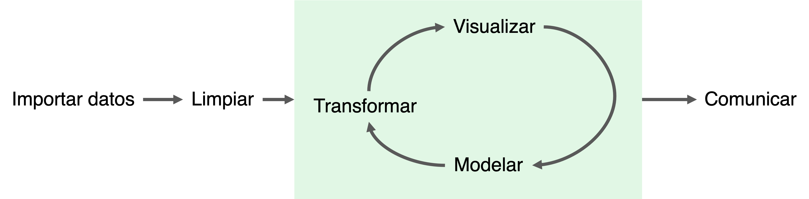

::: {.callout-note appearance="simple"}
## Resumen

Discutimos qué es un modelo (y por qué tú ya usas varios sin darte cuenta), cómo se clasifican los modelos matemáticos según lo que buscan lograr, y presentamos un flujo de trabajo para construirlos que sirve para cualquier tipo de modelo.
:::

```{r}
#| echo: false
#| message: false
library(tidyverse, quietly = TRUE)
```

::: callout-tip
Este capítulo es **conceptual**: casi no tiene código. Es el puente entre la
parte de análisis de datos y la de regresiones. Si te lo saltas, los capítulos
siguientes te van a funcionar igual, pero no vas a saber *qué* estás haciendo ni
*por qué*.
:::

## ¿Qué es un modelo?

Un modelo es cualquier **representación de la realidad que media entre una teoría
y las observaciones**. Es una idea mucho más amplia de lo que parece, y el punto
más importante de este capítulo es éste:

::: callout-important
## Tú ya usas modelos todos los días

No hace falta una ecuación para tener un modelo. Cuando dices *"esta paciente
tiene cuadro de dengue"* estás usando un modelo: una representación simplificada
de una enfermedad, con ciertos síntomas típicos, que **no** describe a ninguna
persona real con exactitud pero que sirve para decidir qué hacer.

Lo mismo pasa con los organigramas, la historia natural de la enfermedad, la
cadena epidemiológica, el modelo de determinantes sociales de la salud, un mapa
del metro o la frase *"la gente pobre se enferma más"*. Todos son modelos. Todos
son incompletos. Todos son útiles.
:::

Algunos modelos famosos que **no** son ecuaciones:

::: {layout-ncol=2}
{width="400"}

{width="400"}
:::

El dibujo de la célula no es una célula: ninguna célula real se ve tan ordenada,
tan coloreada ni tan bien etiquetada. Es una **abstracción**: tira todo lo que no
importa para lo que quieres explicar y se queda con lo demás. Y es enormemente
útil justamente por lo que tira.

Y algunos modelos que sí son ecuaciones:

```{r}
#| echo: false
#| fig-cap: "Una regresión lineal: una recta que resume una nube de puntos. También es un dibujo que tira información a propósito."
set.seed(4728)
x <- rexp(100)
y <- 10 * x + rnorm(100, sd = 10)

ggplot(tibble(x = x, y = y)) +
  geom_smooth(aes(x = x, y = y), method = "lm", formula = "y ~ x") +
  geom_point(aes(x = x, y = y)) +
  labs(x = "", y = "") +
  theme_bw()
```

Nosotros nos vamos a enfocar en los modelos matemáticos y menos en las primeras
dos opciones. Pero es importante entender que, al igual que el resto del
conocimiento científico, los modelos matemáticos son abstracciones **en nada
distintas** a las teorías sociales o a las explicaciones conceptuales de la
epidemiología [@morgan1999models; @frigg2006models]. No son más verdaderos por
tener números.

La definición que usaremos es la de @porta2018dictionary:

> Una representación de un proceso biológico, sistema o relación por medio de una
> ecuación matemática o conjunto de ecuaciones, muchas veces involucrando varias
> variables aleatorias.

Aunque extenderemos un poquito lo que es "ecuación" e incluiremos también
algoritmos y programas donde no necesariamente es *obvio* qué es una ecuación.

::: callout-warning
## La frase que hay que llevarse

**Todos los modelos están mal; algunos son útiles.** La pregunta correcta frente
a un modelo nunca es *"¿es verdad?"* (la respuesta siempre es no), sino
**"¿sirve para la decisión que tengo que tomar?"**. Un modelo que predice
razonablemente los casos de la próxima semana sirve para planear camas, aunque no
describa correctamente cómo se transmite el virus.
:::

### Ejercicio (a mano, para pensar)

Escribe en tu cuaderno **tres modelos que usas en tu trabajo y que no son
matemáticos**. Para cada uno responde:

a.  ¿Qué simplifica o qué deja fuera?
b.  ¿Qué decisión te ayuda a tomar?
c.  ¿En qué caso concreto lo has visto fallar?

::: {.callout-note collapse="true"}
### Si te cuesta arrancar, algunos ejemplos

Una **definición operacional de caso** (deja fuera a las personas con cuadros
atípicos, sirve para contar de forma comparable, falla en los brotes al inicio
cuando la definición todavía no captura la enfermedad nueva). Un **semáforo
epidemiológico** (reduce una situación con decenas de dimensiones a cuatro
colores, sirve para comunicar rápido a mucha gente, falla cuando dos estados muy
distintos caen en el mismo color). Una **pirámide poblacional**, un
**tabulador de riesgo**, la **historia natural de la enfermedad**.
:::

## Clasificación de los modelos

Nos enfocaremos en dos formas de clasificar los modelos matemáticos según sus
objetivos. Estas dos clasificaciones son **independientes**: un modelo tiene una
posición en cada una.

### Predicción vs inferencia

El objetivo de un **modelo de predicción** es, dada una cierta cantidad de
observaciones, construir un modelo que establezca cómo se comportará una
siguiente (nueva) observación.

Ejemplos de modelos de predicción:

a.  Modelos como @kuddus2021scenario buscan predecir qué pasaría con la
    tuberculosis en Bangladesh bajo distintos escenarios de intervención (como
    aumento en pruebas individuales, aumento en pruebas para susceptibilidad
    antimicrobiana, aumento en tratamientos).

b.  Modelos como @benedum2020weekly que buscan predecir cuántos casos de dengue
    habrá en las siguientes semanas en distintas poblaciones.

c.  Modelos como @placido2023deep que buscan predecir cáncer de páncreas según la
    historia clínica en las personas.

El objetivo de un **modelo de inferencia** es, dada una cierta cantidad de
observaciones, determinar un parámetro que explique o describa a una población.

Ejemplos de modelos de inferencia:

a.  La ENSANUT 2020 @vidana2021prevalence buscaba determinar la prevalencia de
    COVID-19 en la población.

b.  @chew2000risk estableció una asociación causal entre exposición al virus del
    Nipah en Singapur y cerdos importados de Malasia.

c.  Los costos de la atención a diabéticos en México (2010) establecidos por
    @rodriguez2010costos.

::: callout-important
## Por qué esta distinción te va a ahorrar problemas

Porque **cambia qué es un buen modelo**, y la gente los confunde todo el tiempo.

Si te interesa **predecir**, lo único que importa es que le atine a datos que
todavía no ha visto. Puede tener 200 variables, ser una caja negra impenetrable y
tener coeficientes sin ningún sentido biológico: si predice bien, sirve.

Si te interesa **inferir**, lo que importa es que el parámetro que estimas
signifique lo que crees que significa. Ahí sí te tienes que preocupar por qué
variables incluyes, por los factores de confusión y por el diseño del estudio.
Agregar variables "porque mejoran el ajuste" puede **arruinar** una inferencia:
es exactamente así como se sesga un efecto ajustando por una variable que no se
debía.

> Un modelo puede ser excelente para predecir y una fuente de conclusiones
> falsas si lo lees como si fuera de inferencia. El error clásico es interpretar
> los coeficientes de un modelo que sólo se construyó para predecir.
:::

### Clasificación vs regresión

Un **modelo de clasificación** busca determinar a qué grupo (o grupos) pertenece
una observación. En este caso un modelo de clasificación regresa etiquetas que
determinan a qué grupo pertenece cada observación. Como ejemplos:

a.  @placido2023deep buscaba determinar si un paciente desarrollaría cáncer
    (estaba en el grupo de riesgo de cáncer o no).

b.  @falasinnu2023problem determina factores que clasifican a los pacientes en
    riesgo de dolor crónico de alto impacto o no.

Un **modelo de regresión** busca determinar un valor (o múltiples) para una
observación. En este caso un modelo de regresión regresa un valor numérico
(continuo) y potencialmente puede regresar cuantos números se requieran. Como
ejemplos:

a.  La ENSANUT 2020 @vidana2021prevalence buscaba determinar la prevalencia de
    COVID-19 en la población (la prevalencia es un número).

b.  Modelos como @benedum2020weekly que buscan predecir cuántos casos de dengue
    regresan varios números continuos (es una regresión).

::: callout-tip
## La frontera es más borrosa de lo que parece

Casi todos los modelos de clasificación son, por dentro, modelos de regresión con
un corte encima. Una regresión logística te da una **probabilidad** (un número
entre 0 y 1, o sea una regresión) y sólo se vuelve clasificación cuando alguien
decide que arriba de `0.5` —o de `0.3`, o de `0.8`— la etiqueta es "positivo".

**Ese corte no lo decide la estadística: lo decides tú.** Y es una decisión de
salud pública, no técnica, porque define cuántos falsos positivos estás
dispuesta o dispuesto a aceptar para no dejar pasar un caso. En un tamizaje de
cáncer no cuesta lo mismo equivocarse en un sentido que en el otro.
:::

### Ejercicio (a mano): ubica cada modelo en las dos clasificaciones

Copia esta tabla y llénala. Para cada situación decide si es **predicción o
inferencia** y si es **clasificación o regresión**:

| Situación                                                                       | ¿Predicción o inferencia? | ¿Clasificación o regresión? |
|:--------------------------------------------------------------------------------|:--------------------------|:----------------------------|
| a. Estimar la prevalencia de anemia en menores de 5 años en el país             |                           |                             |
| b. Decidir a qué pacientes de urgencias hay que hacerles un electro             |                           |                             |
| c. Calcular cuántas dosis de vacuna va a necesitar una jurisdicción el mes que entra |                       |                             |
| d. Determinar si el consumo de bebidas azucaradas aumenta el riesgo de diabetes |                           |                             |
| e. Detectar en una radiografía si hay o no neumonía                             |                           |                             |
| f. Estimar cuánto le cuesta al sistema de salud un caso de dengue grave         |                           |                             |

::: {.callout-note collapse="true"}
### Respuestas

| Situación | Predicción / inferencia | Clasificación / regresión |
|:---|:---|:---|
| a. Prevalencia de anemia | **Inferencia** (describes a la población) | **Regresión** (es un número) |
| b. A quién hacerle el electro | **Predicción** (sobre pacientes nuevos) | **Clasificación** (sí / no) |
| c. Dosis del mes que entra | **Predicción** | **Regresión** |
| d. Bebidas azucaradas y diabetes | **Inferencia** (te interesa el efecto) | **Regresión** (el efecto es un número) |
| e. Neumonía en radiografía | **Predicción** | **Clasificación** |
| f. Costo de un caso grave | **Inferencia** | **Regresión** |

Fíjate en el contraste entre `b` y `d`. Los dos podrían usar una regresión
logística, pero **no se construyen igual**: en `b` sólo quieres atinarle, así que
metes lo que ayude; en `d` quieres un efecto interpretable, así que tienes que
pensar con cuidado por qué ajustas y por qué no.
:::

## El flujo de trabajo del modelaje

En el área de modelaje el flujo de trabajo **no es lineal**. Generalmente
suponemos que los datos ya están dados y nos ciclamos en un proceso de
transformación, visualización y modelaje. El primer modelo siempre será malo y de
ahí lo que resta es mejorar. El siguiente diagrama extraído de @wickham2023r
explica un poco el proceso:



El proceso de toma de decisiones está ahí dentro del proceso de hacer modelos.

### Un flujo de trabajo más detallado

El diagrama de arriba es correcto pero muy general. Existe una versión mucho más
detallada que viene del mundo de la estadística bayesiana, donde se le llama
*Bayesian workflow*. Aquí te la presentamos **adaptada para que sirva con
cualquier modelo matemático**, sea bayesiano o no: los mismos pasos aplican para
una regresión lineal hecha con `lm`, para un modelo de series de tiempo o para un
modelo por compartimentos.

La idea central es que **construir un modelo no es correr un comando**. Es un
ciclo, y la mayor parte del trabajo está en las revisiones, no en el ajuste.

```{mermaid}
%%| fig-cap: "El ciclo de trabajo del modelaje. Casi nunca se recorre una sola vez."
flowchart TD
    A["1. ¿Qué decisión<br/>tengo que tomar?"] --> B["2. El modelo más<br/>simple que podría servir"]
    B --> C["3. ¿Qué datos<br/>produce mi modelo?"]
    C -->|"produce disparates"| B
    C --> D["4. Ajustar el modelo<br/>a los datos reales"]
    D --> E["5. ¿De verdad<br/>se ajustó?"]
    E -->|"no convergió"| B
    E --> F["6. ¿Recupera lo<br/>que ya sé?"]
    F --> G["7. ¿Reproduce<br/>los datos?"]
    G -->|"no los reproduce"| H["8. Modificar<br/>o ampliar"]
    H --> C
    G --> I["9. Comparar con<br/>las alternativas"]
    I --> H
    I --> J["10. Comunicar<br/>y decidir"]
```

Vamos paso por paso.

**1. ¿Qué decisión tengo que tomar?** Antes de escribir una línea de código,
escribe en una frase qué vas a hacer distinto según el resultado. Si no hay
ninguna decisión que dependa del modelo, no necesitas el modelo. Éste es el paso
que más se salta y el que más tiempo ahorra.

**2. Escribe el modelo más simple que podría servir.** No el mejor: el más
simple. Una recta antes de una curva, una variable antes de diez. Vas a
necesitar algo funcionando para poder mejorarlo, y un modelo simple que sí
entiendes es infinitamente más útil que uno complicado que no.

**3. Antes de ver los resultados: ¿qué datos produce tu modelo?** Éste es el paso
que casi nadie hace y el que más errores atrapa. Toma tu modelo, invéntale
valores razonables a los parámetros y **simula datos**. Después pregúntate si
esos datos se parecen a algo que podría pasar en la realidad.

::: callout-tip
## Un ejemplo de por qué el paso 3 salva vidas (y reportes)

Supón que modelas el peso de personas adultas como una recta que depende de la
estatura. Antes de ajustar nada, simula: si tu modelo puede producir pesos
**negativos** o de 900 kg, tienes un problema *de planteamiento* que ningún dato
va a arreglar. Mejor cambiarlo ahora que descubrirlo cuando ya escribiste la
discusión.

En el mundo bayesiano esto se llama *prior predictive check*. En el mundo
clásico no tiene nombre elegante, pero se hace igual y sirve igual.
:::

**4. Ajusta el modelo a los datos reales.** Éste es el paso que en `R` suele ser
**un solo renglón** (`lm(y ~ x, data = datos)`). Es, con diferencia, la parte más
corta del trabajo. Si tu proceso de modelaje se acaba aquí, apenas empezaste.

**5. ¿De verdad se ajustó?** Los modelos fallan en silencio con una frecuencia
que sorprende. Lee **todas** las advertencias que te da `R`, no las ignores
porque "de todos modos dio un número". Señales de alarma: errores estándar
gigantescos, coeficientes absurdamente grandes, avisos de que el modelo no
convergió, o `NA` donde debería haber una estimación.

**6. ¿Tu modelo recupera lo que ya sabes?** Genera datos falsos **con parámetros
que tú elegiste** y ajústale el modelo. Si le das datos donde tú sabes que la
pendiente es `3` y el modelo te contesta `17`, el problema está en el modelo o en
tu código, no en la realidad. Es la forma más barata de encontrar un error de
programación.

::: callout-note
Esta idea de simular datos con la respuesta conocida para verificar que el
proceso la recupera es la misma que usaste en los ejercicios de "encuentra el
error": comprobar contra algo cuya respuesta ya conoces.
:::

**7. ¿El modelo reproduce los datos?** Compara lo que tu modelo predice contra lo
que realmente pasó. Aquí es donde caen los **residuales** y las gráficas de
diagnóstico que vas a ver en el capítulo de regresiones: son exactamente esto.
Si tu modelo se equivoca de forma *sistemática* (siempre se queda corto en los
valores altos, por ejemplo), le falta estructura.

**8. Modifica o amplía.** Con lo que aprendiste en el paso 7, cambia el modelo y
**regresa al paso 3**. Ésta es la parte cíclica y es normal recorrerla muchas
veces. No es que lo estés haciendo mal: así se hace.

**9. Compara con las alternativas.** Casi nunca tienes un solo modelo candidato.
Compáralos con criterios pensados para eso (`AIC`, `BIC`, validación cruzada) y
no sólo con cuál se ve más bonito o cuál te dio el resultado que esperabas.
Volveremos a esto con detalle en el capítulo de regresiones.

::: callout-warning
Elegir el modelo *después* de ver cuál te dio el resultado que querías tiene
nombre y es un problema serio de integridad científica. Si vas a probar varias
especificaciones, decide **antes** con qué criterio vas a elegir.
:::

**10. Comunica y decide.** Regresa a la frase del paso 1. Reporta el resultado
**y sus límites**: qué supuestos hiciste, en qué población aplica, qué no puede
contestar tu modelo. Un resultado sin sus límites es más peligroso que no tener
resultado, porque quien lo lea va a suponer límites más generosos de los reales.

### Ejercicio (a mano): ¿en qué paso falló?

Para cada situación, di **en qué paso del flujo** estuvo el problema y qué se
debió hacer:

a.  Un equipo ajustó un modelo, obtuvo un coeficiente de `-0.03` con un error
    estándar de `48000` y reportó que "no se encontró asociación".

b.  Un modelo de predicción de camas de hospital resultó excelente en los datos
    con los que se construyó, y desastroso al mes siguiente.

c.  Alguien reportó que su modelo de mortalidad predice, para el grupo de 0 a 4
    años, una esperanza de vida de 130 años.

d.  Un equipo probó 14 modelos y reportó el que dio significancia estadística.

e.  Un modelo se ajustó y publicó sin que nadie graficara nunca los datos.

::: {.callout-note collapse="true"}
### Respuestas

a.  **Paso 5.** El modelo no se ajustó de verdad: un error estándar de `48000`
    junto a un coeficiente de `-0.03` significa que el modelo no pudo estimar
    nada. Concluir "no hay asociación" a partir de eso es leer ruido. Había que
    revisar por qué falló (colinealidad, muy pocos datos, una variable
    constante).

b.  **Paso 7, y en el fondo el 9.** Nunca se evaluó el modelo contra datos que no
    había visto. Un modelo de predicción que sólo se evalúa en los datos con los
    que se construyó no está evaluado: está memorizando.

c.  **Paso 3.** Simular del modelo antes de ajustarlo habría mostrado de
    inmediato que el planteamiento permite valores imposibles.

d.  **Paso 9.** El criterio de selección se eligió después de ver los resultados.
    Había que fijarlo antes.

e.  **Paso 2, incluso antes.** Graficar los datos no es un adorno para el
    reporte: es cómo te enteras de que hay una variable con 40% de datos
    faltantes, un valor de peso de 700 kg, o dos poblaciones mezcladas.
:::

### Ejercicio con apoyo de una IA

::: callout-important
Como siempre: código y mensajes de error sí, datos identificables de pacientes
**nunca**.
:::

1.  **Que te explique un modelo ajeno.** Busca un artículo de tu área que use un
    modelo estadístico y pégale a una IA nada más la sección de métodos.
    Pregúntale: *"¿este modelo es de predicción o de inferencia? ¿de
    clasificación o de regresión? Justifica."* Después decide tú si estás de
    acuerdo. Si la IA y tú difieren, la interesante es la razón de la diferencia.

2.  **Que te haga la lista de supuestos.** Pídele: *"¿qué supuestos hace una
    regresión lineal y qué pasa si cada uno se viola?"* Guarda su respuesta.
    Cuando termines el capítulo de regresiones, regresa a esa lista y **táchale
    lo que esté mal o incompleto**. Es un ejercicio buenísimo porque en este
    tema las IA suelen dar respuestas que suenan bien y están a medias.

3.  **Cázala en el error clásico.** Descríbele un modelo de predicción con muchas
    variables y pregúntale qué significa uno de los coeficientes. Si te lo
    interpreta con toda confianza como si fuera un efecto causal ajustado, acabas
    de ver en vivo el error del que habla la advertencia de la sección de
    predicción vs inferencia. Escribe en dos renglones por qué su respuesta es
    inadecuada.

4.  **Que critique tu paso 1.** Escribe tú la frase del paso 1 para un análisis
    que de verdad tengas pendiente (qué decisión depende del modelo) y pídele que
    te señale qué le falta para ser accionable. Aquí la IA sí suele ayudar,
    porque es un problema de redacción y de claridad, no de estadística.

## Continuación

Ya sabes qué es un modelo y cómo se construye uno. Ahora vamos a hacerlo:

-   [Regresiones (parte 1)](regresiones-1.qmd), donde el modelo es una recta.
