::: {.callout-note appearance="simple"}
## Resumen

Un recorrido visual por lo que hace una regresión: qué son el intercepto y la pendiente, qué cambia al agregar una covariable categórica o una segunda continua, qué es una interacción, y por qué la regresión lineal, la Poisson y la logística son **el mismo modelo** con una distribución distinta. Sin código: puros dibujos y la idea detrás.
:::

::: callout-tip
Este capítulo va entre [Modelos](modelos.qmd) y las
[regresiones](regresiones-1.qmd). Ahí vas a escribir el código; aquí vas a
entender **qué está dibujando** ese código.

Todas las figuras usan el mismo ejemplo, que es el que trabajamos con datos
reales en el [capítulo de encuestas](analisis-encuestas.qmd): **presión arterial
sistólica (PAS) y edad**.
:::

## La línea y sus dos números

Una regresión lineal simple es una línea recta, y una línea recta queda
completamente descrita por **dos números**:

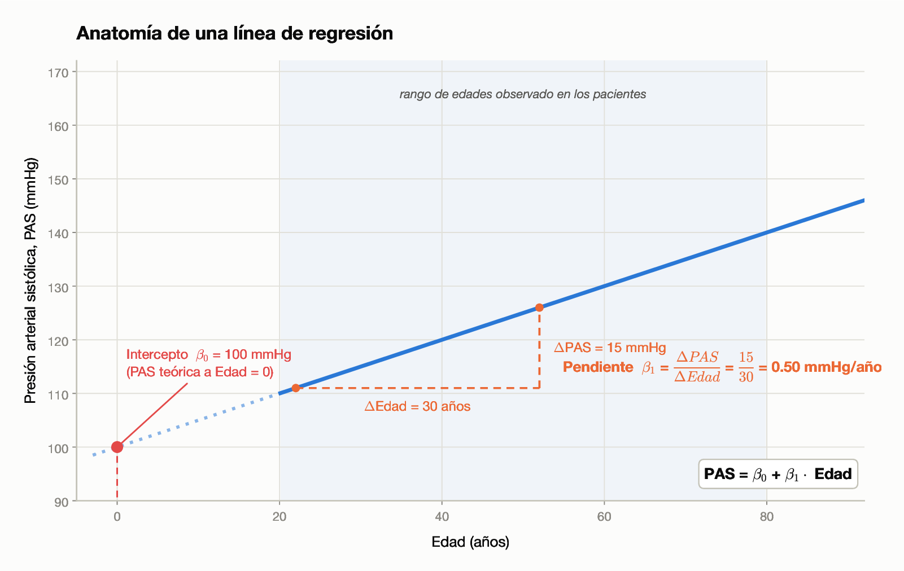

-   El **intercepto** ($\beta_0$) es dónde arranca la línea: el valor de la PAS
    cuando la edad vale cero.
-   La **pendiente** ($\beta_1$) es qué tanto sube la línea: cuántos mmHg cambia
    la presión por cada año más de edad.

::: callout-warning
## El intercepto casi nunca significa lo que parece

Fíjate en la zona sombreada de la figura: es el **rango de edades que realmente
se observó**. El intercepto está *fuera* de esa zona, en edad = 0.

O sea que $\beta_0 = 100$ mmHg es "la presión de un recién nacido según el
modelo", que es una extrapolación absurda: nadie midió recién nacidos y la
relación no es lineal hasta allá.

**El intercepto es un ancla matemática, no un dato clínico.** Por eso muchas veces
se centra la edad (restarle su promedio), y entonces el intercepto sí significa
algo: la presión de una persona de edad promedio.
:::

### Los dos números se mueven por separado

Dos poblaciones pueden tener **el mismo efecto de la edad** pero partir de
niveles distintos:

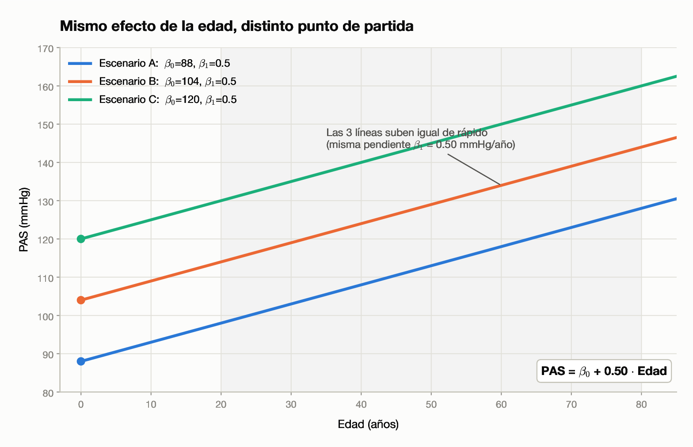

O pueden **partir del mismo lugar** y que la edad les pegue distinto:

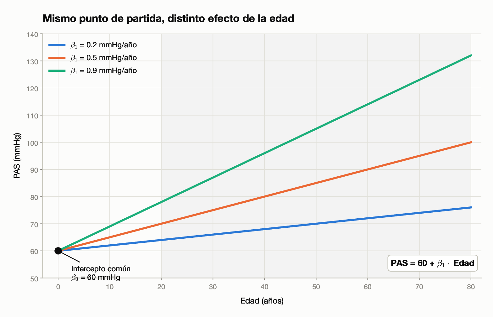

::: callout-important
Esta distinción es la que después vas a estar leyendo en las tablas de
coeficientes, y es la que más se confunde al interpretar resultados:

-   Un cambio en el **intercepto** es un problema de **nivel**: alguien está más
    alto o más bajo en general.
-   Un cambio en la **pendiente** es un problema de **velocidad**: a alguien la
    exposición le pega más fuerte.

En salud pública llevan a decisiones distintas. Si dos estados tienen la misma
pendiente pero distinto intercepto, el problema es basal y le toca a atención
primaria. Si tienen distinta pendiente, algo está acelerando el daño en uno de
ellos, y eso es una pregunta de investigación.
:::

## Agregar una variable categórica

¿Qué pasa cuando metemos el sexo al modelo? Geométricamente: **la línea se
duplica y una se desplaza hacia arriba o abajo**.

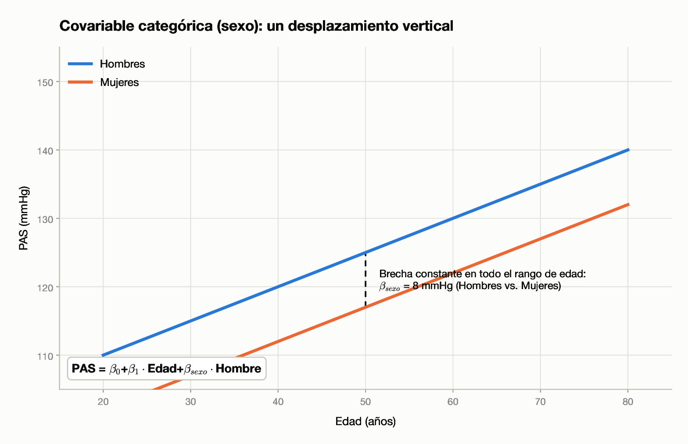

Las dos líneas son **paralelas**. Eso no es casualidad ni un resultado de los
datos: es lo que el modelo `PAS ~ edad + sexo` **supone por construcción**. Al
escribirlo así le estás diciendo a `R`: *"el efecto de la edad es el mismo en
hombres y mujeres; lo único que cambia es el punto de partida"*.

::: callout-note
El coeficiente de sexo es exactamente **la distancia vertical entre las dos
líneas**. Cuando en el [capítulo de encuestas](analisis-encuestas.qmd) el modelo
dio $-10.5$ mmHg para las mujeres, ese número es esta separación.
:::

## Agregar una segunda variable continua

Con dos variables continuas la línea deja de ser línea: se vuelve un **plano** en
tres dimensiones.

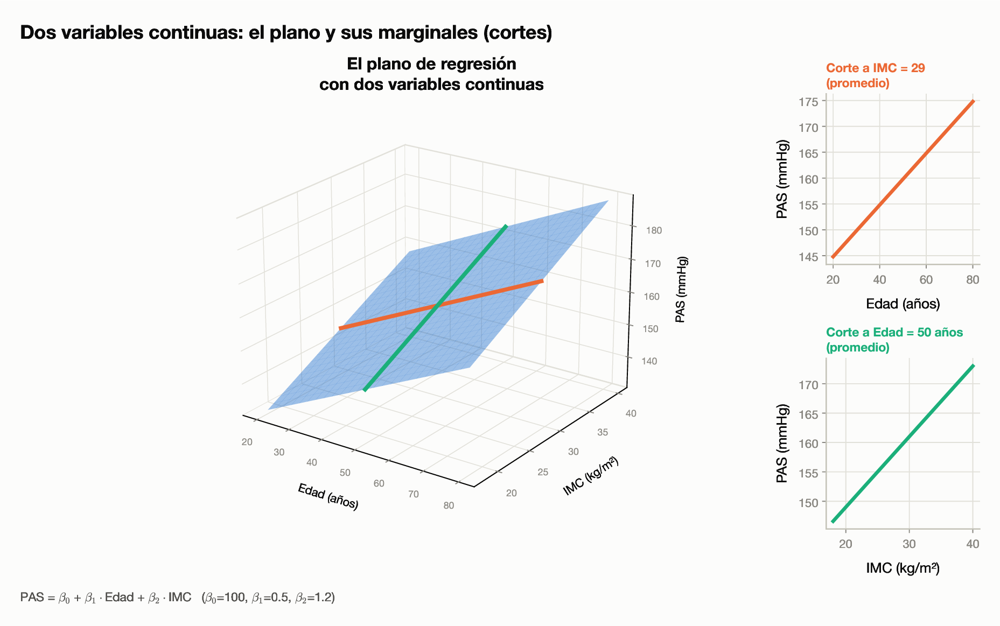

Cada coeficiente es **la inclinación del plano en una dirección**. El de la edad
es qué tanto sube el plano si caminas en el eje de la edad **sin moverte** en el
del IMC. Eso es, literalmente, el famoso *"manteniendo lo demás constante"*.

Y si además agregamos el sexo, tenemos **dos planos paralelos**:

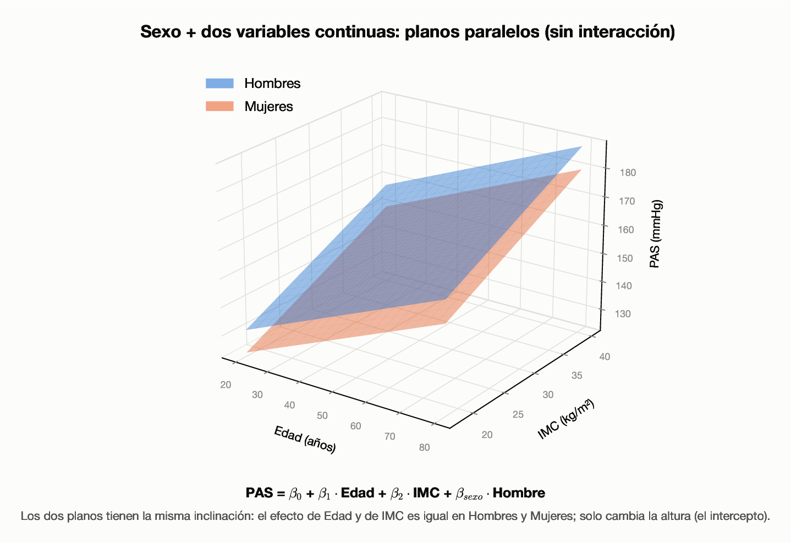

::: callout-tip
## Por qué esto importa aunque nunca dibujes un plano

Porque explica de dónde sale la interpretación de los coeficientes en regresión
múltiple, y por qué es tan fácil equivocarse.

Cuando reportas "el efecto de la edad ajustado por IMC", estás reportando la
inclinación de un plano en una dirección. Ese número **existe aunque el plano no
describa bien tus datos**. El modelo siempre te va a dar un coeficiente; que sea
interpretable es cosa tuya.
:::

## Interacción: cuando las líneas dejan de ser paralelas

Todo lo anterior supone paralelismo. Una **interacción** es justamente permitir
que las pendientes sean distintas:

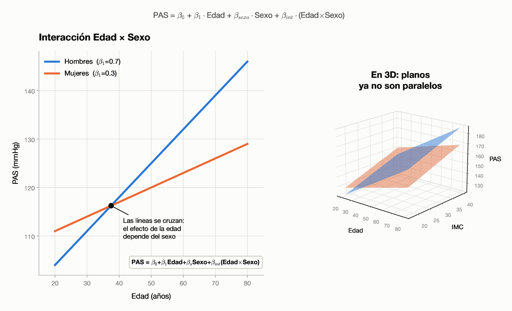

En fórmula, pasas de `PAS ~ edad + sexo` a `PAS ~ edad * sexo`. En el dibujo, las
líneas se cruzan o se abren en abanico.

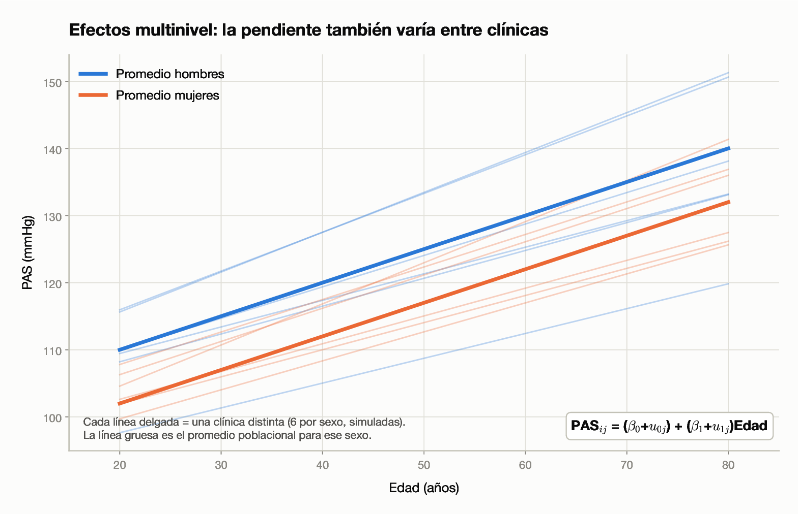

Cuando en vez de dos grupos tienes muchos (clínicas, municipios, jurisdicciones)
y quieres que **cada uno tenga su propia pendiente**, entras al terreno de los
**modelos multinivel**. La idea es la misma: dejar de imponer una sola línea para
todos.

::: callout-warning
## La interacción es una pregunta, no un adorno

Meter interacciones "por si acaso" es una de las formas más rápidas de encontrar
resultados falsos: con suficientes interacciones, alguna sale significativa por
azar.

La interacción se pone cuando **tienes una razón** para pensar que el efecto es
distinto entre grupos, y esa razón se escribe **antes** de ver los datos.
:::

## Cuando la relación no es una línea

¿Y si la presión no sube de forma constante con la edad, sino que se acelera? Se
agrega un término cuadrático (`edad²`). Lo bonito es que **el modelo sigue siendo
lineal**:

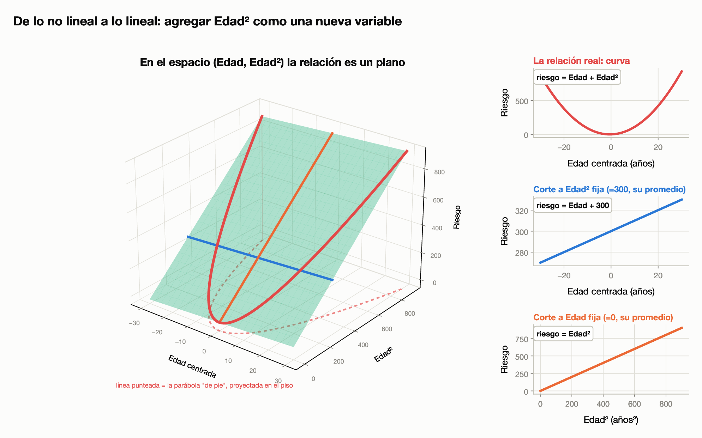

En el espacio de (edad, edad²) la relación vuelve a ser un plano. Por eso a estos
modelos se les sigue llamando *lineales*: **son lineales en los coeficientes**, no
necesariamente en las variables. Puedes meter logaritmos, cuadrados, raíces y
splines y seguir estando en una regresión lineal.

## Los residuales: lo que el modelo no explicó

El **residual** de una persona es la distancia vertical entre su dato y la línea:
qué tanto le erró el modelo a ella.

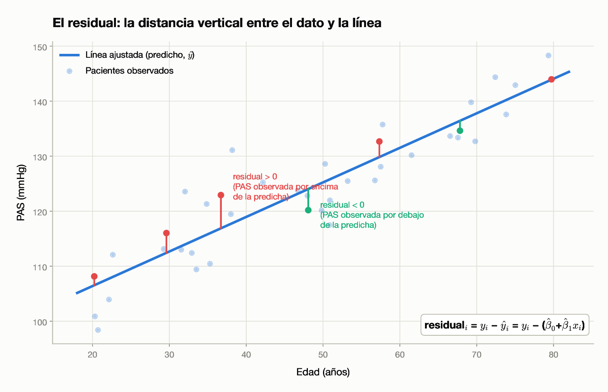

La regresión lineal elige la línea que hace esas distancias **lo más chicas
posible** (en realidad, la suma de sus cuadrados). Y hace un supuesto sobre ellas:

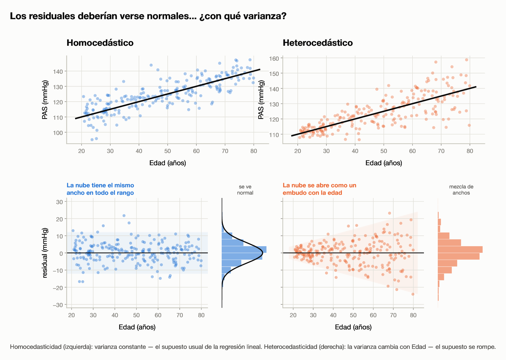

::: callout-important
## Homocedasticidad, en una frase

El panel izquierdo es **homocedástico**: el modelo se equivoca más o menos lo
mismo en gente joven que en gente mayor. El derecho es **heterocedástico**: el
error crece con la edad.

La regresión lineal clásica supone lo primero. Si tienes lo segundo, los
coeficientes siguen estando bien pero **los errores estándar están mal**, y con
ellos tus valores `p` e intervalos.

Esto es exactamente lo que buscas en la gráfica de escala-locación del
[capítulo de regresiones](regresiones-1.qmd), y lo que se corrige con errores
robustos o —como en la ENSANUT— con el diseño de encuesta.
:::

## El salto conceptual: la línea es el promedio de una distribución

Aquí viene la idea que convierte "la regresión" en "las regresiones". Hasta
ahora vimos la línea como *la predicción*. En realidad la línea es algo más
sutil: es **el promedio de una distribución que se mueve**.

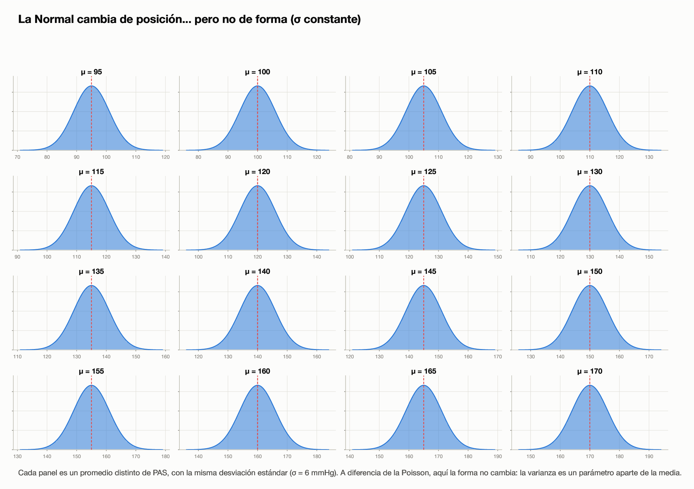

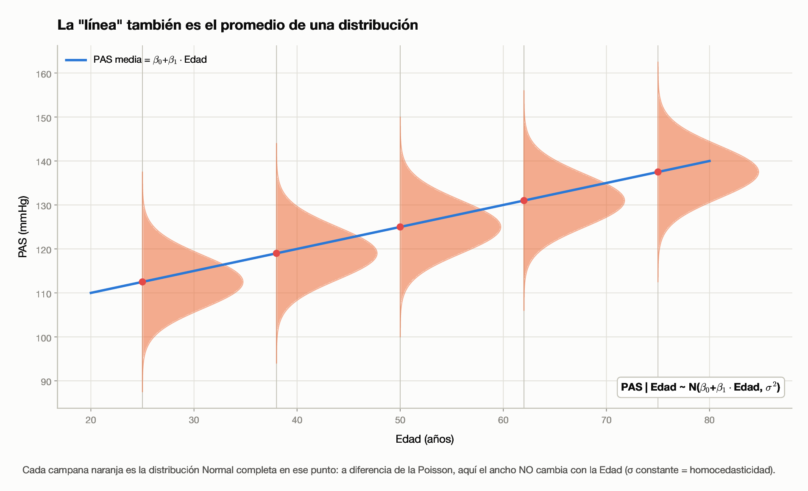

En cada edad no hay *un* valor de presión: hay **toda una distribución** de
presiones posibles. Lo que la línea dibuja es el centro de esa campana. Escrito
formalmente:

$$
\text{PAS} \mid \text{Edad} \sim \text{Normal}(\beta_0 + \beta_1 \cdot \text{Edad},\ \sigma^2)
$$

::: callout-note
Fíjate en un detalle de la segunda figura: **todas las campanas tienen el mismo
ancho**. Eso es la homocedasticidad otra vez, ahora dicha de otra forma: la
distribución **se mueve de lugar pero no cambia de forma**.
:::

## Cambia la distribución, cambia el modelo

Y aquí está el truco completo. Si en vez de una Normal pones **otra
distribución**, obtienes otra regresión. Nada más.

### Poisson: para conteos

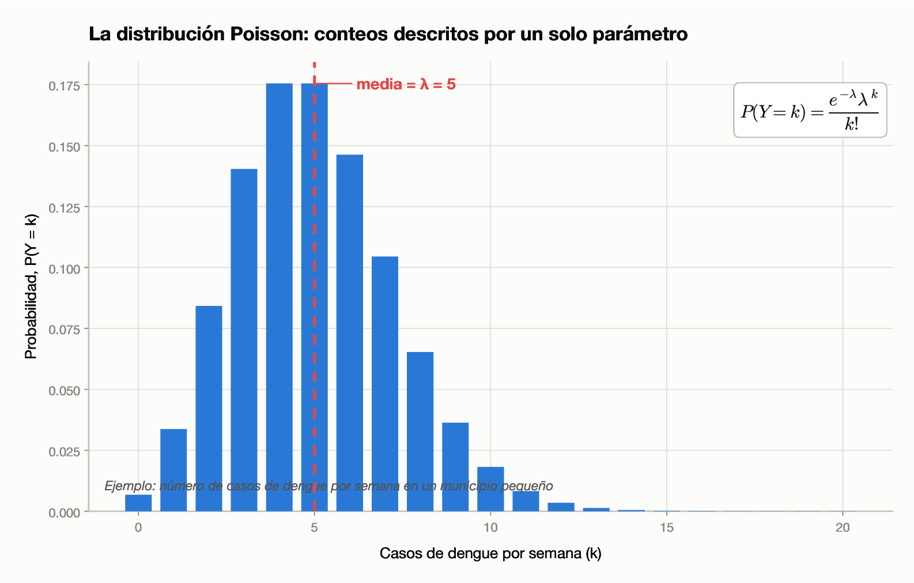

La Poisson describe conteos (0, 1, 2, 3…) con **un solo parámetro**: su promedio.
Y a diferencia de la Normal, cuando su promedio cambia, la distribución **cambia
de forma, no sólo de lugar**:

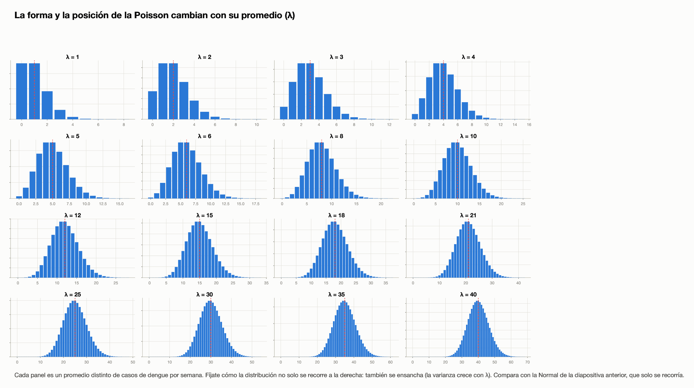

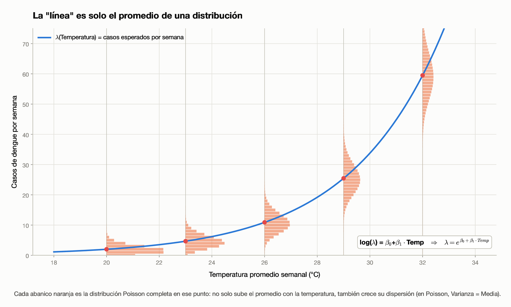

::: callout-important
## Por qué la Poisson tiene sobredispersión "de fábrica"

En la Poisson, **la varianza es igual a la media**. No es una opción: es parte de
la definición. Por eso, cuando tus datos varían más que eso, el modelo se queda
corto y hay que usar `quasipoisson` o binomial negativa.

Es exactamente lo que nos pasó en el [capítulo de encuestas](analisis-encuestas.qmd)
con las tomas de presión: la dispersión salió en 1.97 en lugar de 1.

Y fíjate en algo más de las figuras: como la Poisson vive en los enteros no
negativos, **nunca predice conteos negativos**. Ése es justo el problema que tuvo
el `ARIMA` con los casos de dengue en el
[capítulo de series de tiempo](series-de-tiempo-dengue.qmd), que sí los predijo.
:::

### Logística: para sí/no

Cuando el desenlace es binario, el promedio de la distribución es **una
probabilidad**, y las probabilidades tienen que quedarse entre 0 y 1. Ahí está el
problema: una línea recta se sale de ese rango.

La solución es transformar. Y esto genera la confusión más común de toda la
epidemiología, porque **el mismo modelo se ve distinto en tres escalas**:

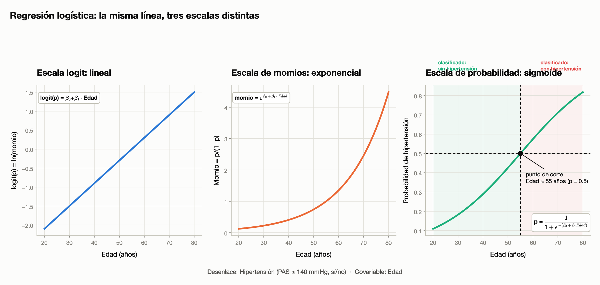

-   En escala **logit** (el logaritmo del momio) el modelo es **una recta**. Ahí
    viven los coeficientes que `R` te reporta.
-   En escala de **momios**, al exponenciar, es una **curva exponencial**. Ahí
    viven los `OR`.
-   En escala de **probabilidad** es una **sigmoide** (una S). Ahí vive lo que la
    gente quiere saber.

::: callout-important
## Las tres consecuencias prácticas

1.  **El `OR` es constante, el efecto en probabilidad no.** Un mismo `OR` mueve
    poquito la probabilidad en los extremos de la S y mucho en el centro. Por eso
    "el riesgo aumenta 40%" es una frase que depende de en qué parte de la curva
    estás.

2.  **El punto de corte lo pones tú.** La línea punteada en `p = 0.5` de la
    tercera figura no es estadística: es una decisión sobre cuántos falsos
    positivos aceptas. Es lo mismo que decíamos en
    [Modelos](modelos.qmd) sobre clasificación y regresión.

3.  **La sigmoide nunca llega a 0 ni a 1.** El modelo jamás va a decir "esta
    persona seguro tiene hipertensión". Siempre da una probabilidad.
:::

### Multinomial: para más de dos categorías

Si el desenlace tiene tres o más categorías (presión normal, elevada, alta), se
ajusta **una línea por categoría contra una de referencia**:

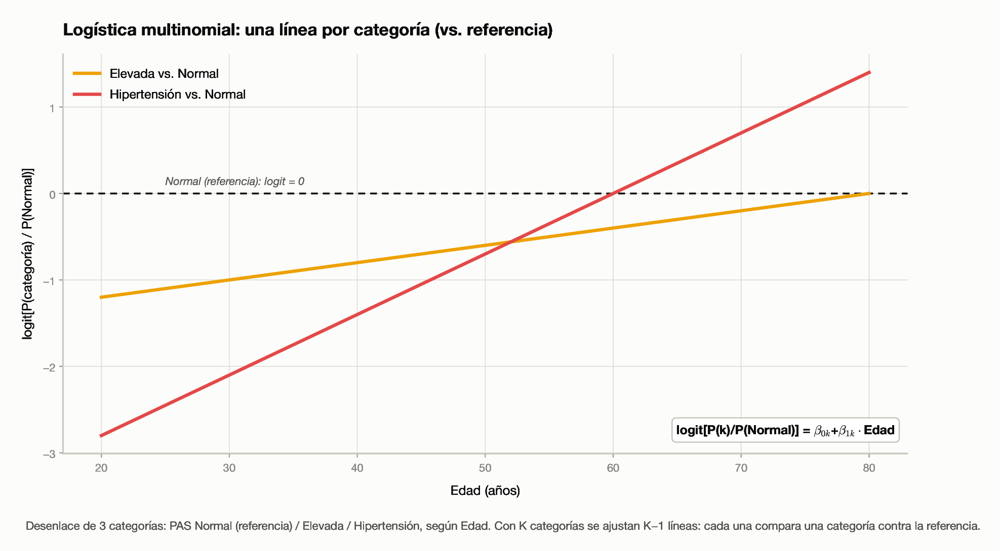

Y esas líneas se convierten en probabilidades que **siempre suman 100%**:

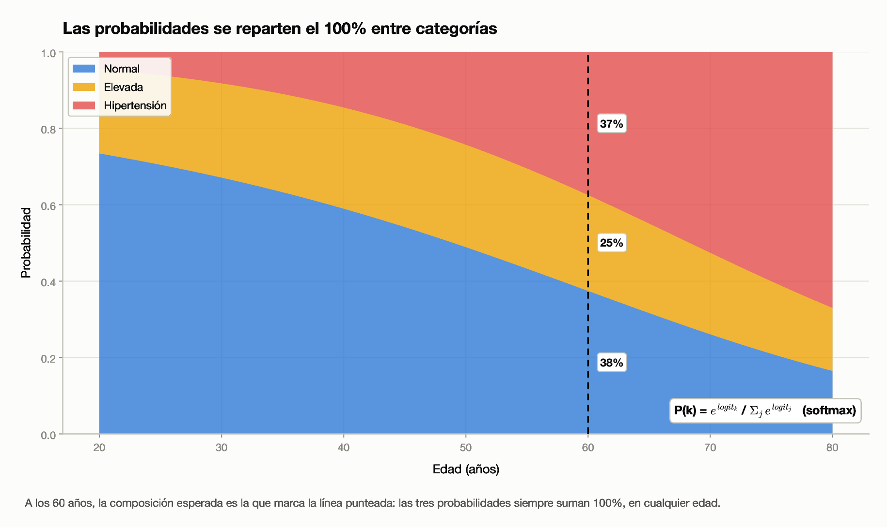

::: callout-note
Por eso una categoría es la **referencia** y no tiene coeficientes propios: si
conoces las probabilidades de las demás, la que falta queda determinada. Es la
misma razón por la que en la regresión con sexo sólo aparece `Mujer` y no
`Hombre`.
:::

## Y las series de tiempo también son esto

El último caso. Cuando los datos vienen ordenados en el tiempo, lo que se agrega
al modelo es **el pasado de la propia variable**:

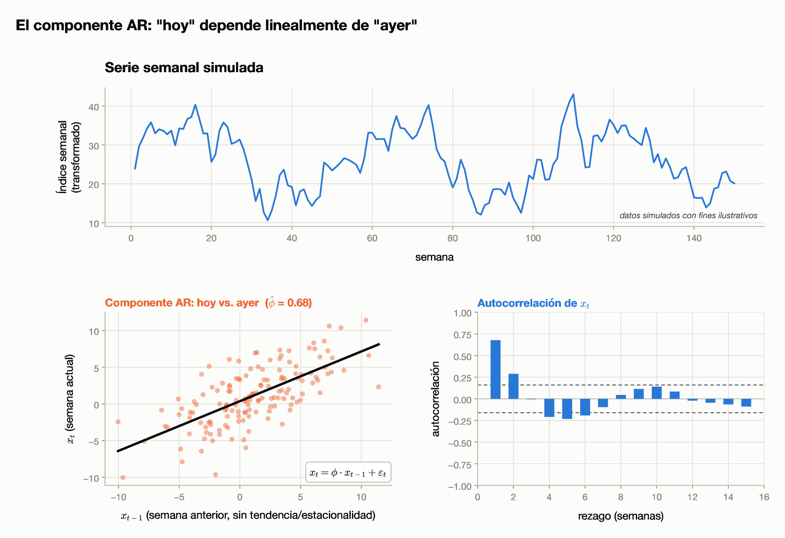

La parte **AR** (autorregresiva) es, literalmente, una regresión de la serie
contra sí misma corrida un periodo. Si le quitas ese componente a la serie, lo
que queda debe verse como ruido sin estructura:

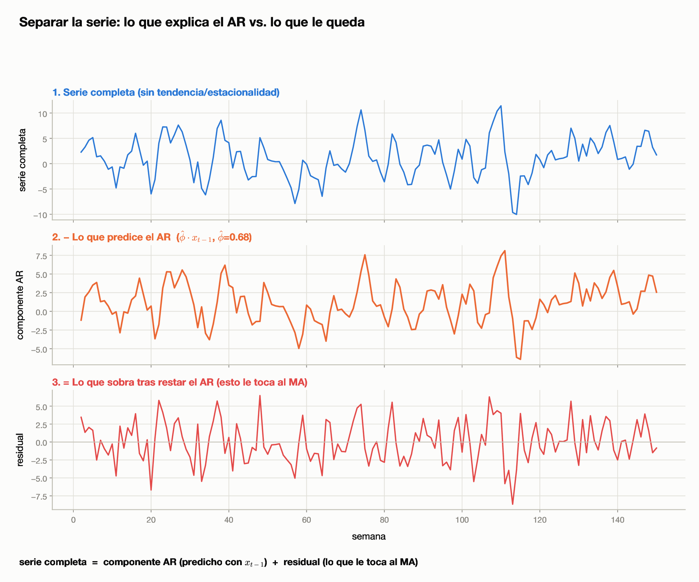

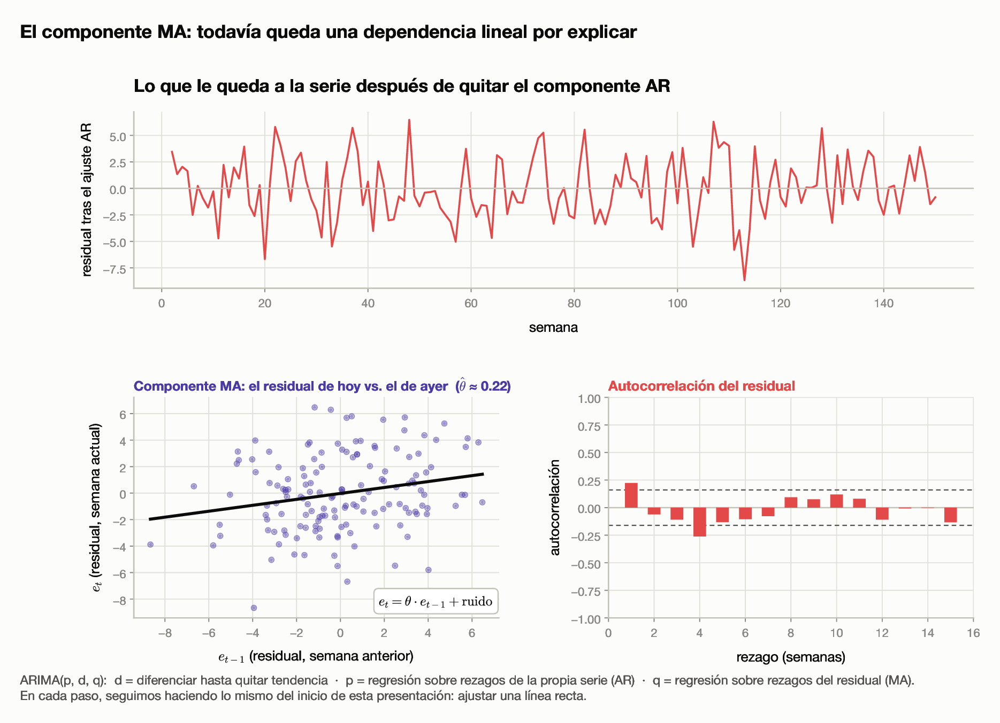

::: callout-tip
Compara la autocorrelación de la serie original con la del residual. Ése es
exactamente el diagnóstico que hicimos con el dengue: la autocorrelación pasó de
`0.95` a prácticamente cero, y eso fue la señal de que el `ARIMA` ya había
absorbido la dependencia.

El componente **MA** (medias móviles) hace lo mismo pero con los *errores*
pasados en vez de los valores pasados. Un `ARIMA` es la suma de las dos ideas.
:::

## El mapa completo

Todo lo que vas a ver en los siguientes capítulos es una variación de la misma
receta:

| Si tu desenlace es… | La distribución es… | El modelo se llama | Lo que reportas |
|:--------------------|:--------------------|:-------------------|:----------------|
| Una medición continua | Normal | Regresión lineal | Cambio en unidades |
| Un conteo | Poisson | Regresión de Poisson | Razón de tasas |
| Sí / no | Bernoulli | Regresión logística | `OR` o `RP` |
| Varias categorías | Multinomial | Logística multinomial | `OR` por categoría |
| Una serie en el tiempo | Normal + dependencia | `ARIMA` | Pronóstico e intervalo |

::: callout-important
## Lo único que hay que recordar de este capítulo

**Siempre es la misma estructura:**

$$
\text{desenlace} \sim \text{Distribución}\big(f(\beta_0 + \beta_1 x_1 + \beta_2 x_2 + \dots)\big)
$$

Lo que cambia entre un modelo y otro es qué distribución pones y qué función $f$
usas para que el promedio caiga en el rango correcto (positivo para conteos, entre
0 y 1 para probabilidades).

Si entiendes eso, no estás aprendiendo cinco modelos: estás aprendiendo uno con
cinco vestidos.
:::

## Ejercicios

Todos son de lápiz y papel: este capítulo no tiene código a propósito.

1.  **Dibuja.** En una hoja, dibuja los ejes de PAS contra edad y traza: (a) dos
    líneas con la misma pendiente y distinto intercepto, (b) dos con el mismo
    intercepto y distinta pendiente. Para cada caso, escribe una frase de salud
    pública que describa lo que significaría.

2.  **Traduce a fórmula.** Escribe la fórmula de `R` para cada situación:

    a.  La presión depende de la edad, igual para hombres y mujeres, pero
        arrancando en niveles distintos.
    b.  La presión depende de la edad y ese efecto es **más fuerte** en mujeres.
    c.  La presión sube con la edad, pero cada vez más rápido.

3.  **El intercepto.** Un modelo de peso contra estatura da un intercepto de
    $-95$ kg. ¿Está mal el modelo? ¿Qué significa ese número? ¿Cómo lo harías
    interpretable?

4.  **Escalas de la logística.** Con la figura de las tres escalas, contesta: si
    la probabilidad de hipertensión pasa de 0.10 a 0.20, ¿el cambio en la escala
    de probabilidad es mayor o menor que cuando pasa de 0.45 a 0.55? ¿Y en la
    escala logit? ¿Por qué la gente se confunde con esto?

5.  **Elige el modelo.** Para cada desenlace, di qué distribución usarías y por
    qué: (a) número de consultas en un año, (b) si la persona acudió o no a
    consulta, (c) el peso al nacer en gramos, (d) si el parto fue eutócico,
    cesárea o instrumentado, (e) casos semanales de dengue en un municipio.

::: {.callout-note collapse="true"}
### Respuestas del 2 y el 5

**2.** (a) `PAS ~ edad + sexo` · (b) `PAS ~ edad * sexo` · (c)
`PAS ~ edad + I(edad^2)`

**5.** (a) Poisson, es un conteo · (b) Bernoulli/logística, es sí-no ·
(c) Normal, es una medición continua · (d) Multinomial, son tres categorías sin
orden natural · (e) Poisson **y además** con estructura de serie de tiempo,
porque los casos de una semana dependen de los de la anterior. Ése es justo el
caso difícil del [capítulo de dengue](series-de-tiempo-dengue.qmd).
:::

## Continuación

Ya sabes qué está dibujando el modelo. Ahora vamos a escribirlo:

-   [Regresiones (parte 1)](regresiones-1.qmd), la lineal a detalle.
